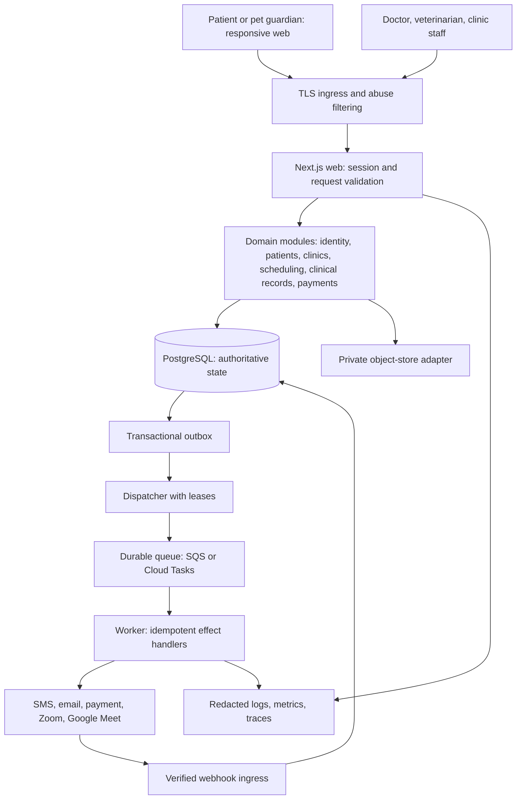
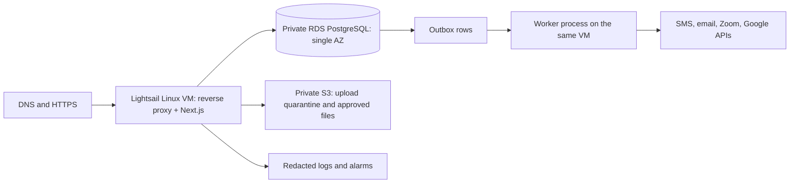
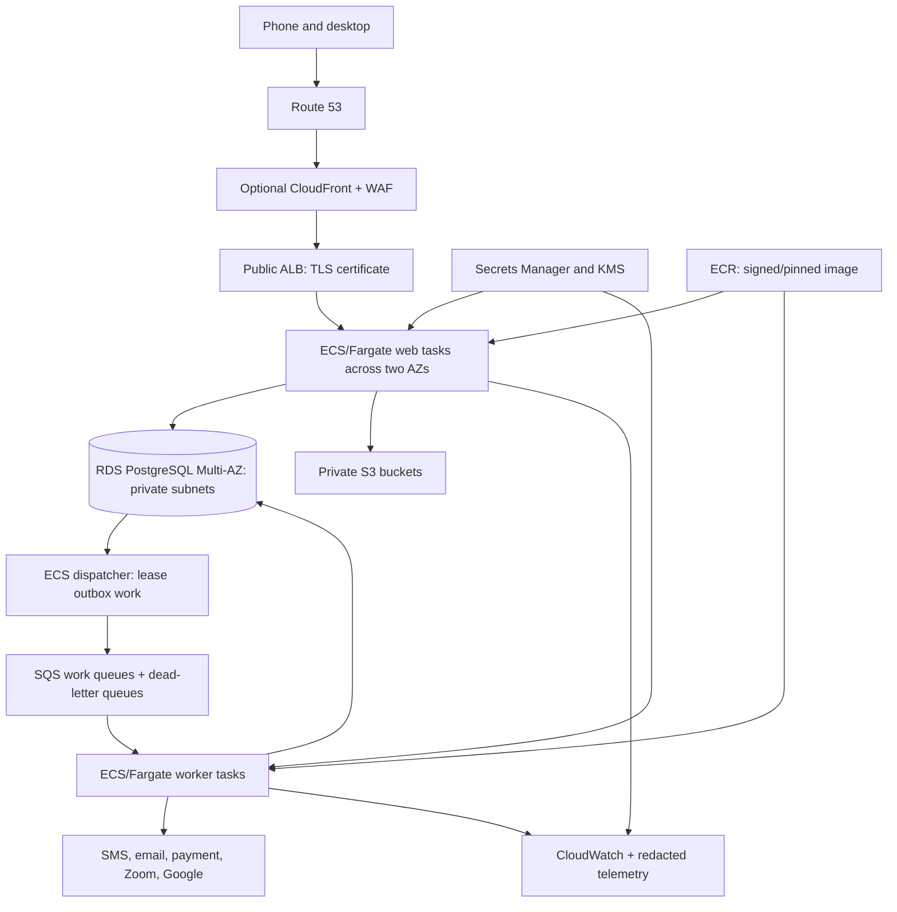
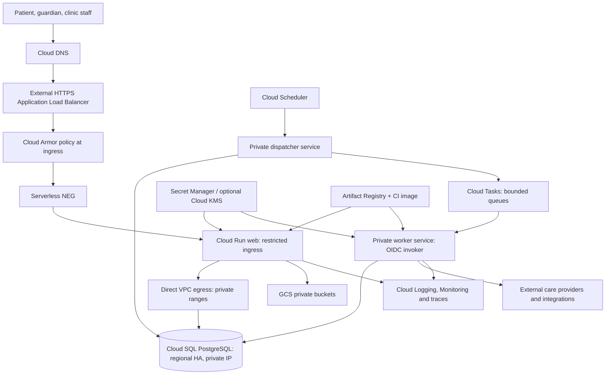

> 8 October 2026 update: LiveKit replaces Zoom API/Meeting SDK for local in-app calls. Google Meet remains optional. See [the LiveKit implementation and updated architecture](../implementation/LIVEKIT_LOCAL_VIDEO_IMPLEMENTATION.md). Earlier Zoom setup instructions below are historical and superseded.

# CareNest: detailed engineering design, AWS and Google Cloud architectures, and migration plan

**Prepared:** 6 October 2026. **Status:** Proposed infrastructure and backend design. **Audience:** founder, frontend developer, backend developer, and operations owner.

This document extends [the Practo comparison and implementation blueprint](./PRACTO_AND_CARENEST_IMPLEMENTATION_BLUEPRINT.md) and [the project audit](../audit/CARE_NEST_REVIEW_2026-10-06.md). It specifies how to implement the design, including field types, data structures, concurrency, rate-limit windows, cloud services, deployment settings, costs, and migration acceptance criteria. The diagrams describe future deployments. No AWS or Google Cloud account was provisioned and no production migration was performed.

The supplied mobile reference was used as visual inspiration. Its example names, ratings, patient counts, availability, and prices are not product requirements or evidence about CareNest. Public Practo material does not disclose its complete current production architecture; the previous document distinguishes documented components from inference.

## 1. Decisions you should make now

Build one TypeScript application with clearly owned modules, one PostgreSQL primary, private object storage, and a durable background-work path. Keep booking, slot ownership, encounter permissions, and payment reconciliation inside the same transactional database. Use separate web and worker entrypoints from the same repository. Start with responsive web; a native app can later call the same domain services through a versioned API.

Choose one cloud for the first deployment. Running AWS and Google Cloud simultaneously would add replication, identity, network, deployment, and incident complexity without solving the current booking bugs. Keep cloud-specific SDKs behind small adapters so a later migration is possible.

My recommendation is **Google Cloud Run plus Cloud SQL for the first managed deployment**, if you want less server maintenance and traffic is intermittent. **AWS Lightsail plus a small RDS PostgreSQL instance can be cheaper for a deliberately limited pilot**, especially with a custom domain. AWS ECS/Fargate is a good growth path if you already know AWS or have someone to operate it. At equivalent database size and resilience, neither vendor is automatically much cheaper; PostgreSQL, network design, and third-party communication can dominate the bill. Sections 23–24 give dated rates, worked arithmetic, and limitations.

Do not move the current implementation to a more complicated cloud and call that reliability. Its Neon HTTP driver is not a generic PostgreSQL connection driver. RDS and Cloud SQL need an appropriate PostgreSQL driver, verified TLS/authentication, bounded connection pooling, and transactions that stay on one connection. They also need migrations instead of request-time schema creation.

### ADR-CN-003: one portable application, one cloud at a time

**Status:** Proposed. **Deciders:** project owner and implementing engineer.

| Option | Complexity | Cost pattern | Assessment |
|---|---|---|---|
| Lightsail VM + RDS + private S3 | Low infrastructure count; you operate Linux and processes | Small fixed compute bill | Useful pilot option with explicit outage/maintenance limits |
| Cloud Run + Cloud SQL + Cloud Tasks | Moderate initial setup; little server maintenance | Usage-based web/worker; always-on SQL and load balancer | Recommended managed starting point |
| ECS/Fargate + RDS + SQS | More network, IAM, deployment and scaling configuration | Fixed minimum containers, SQL, ingress; optional NAT costs | Recommended AWS growth architecture |
| EKS/GKE microservices + Kafka | High operational burden | Additional control planes, nodes, brokers and observability | Defer until measured needs and an operations team justify it |
| Active-active AWS and GCP | Very high; distributed-write correctness required | Duplicated services plus inter-cloud traffic | Reject for the current stage |

Consequences: business rules remain portable, PostgreSQL skills transfer between clouds, and provider integrations can be tested without cloud access. The team still needs cloud-specific IAM/network knowledge and must periodically check cost and service limits. Cloud choice alone does not make clinical access safe.

## 2. Scope, scale assumptions, and launch gates

These are design inputs, not claims about current traffic. Replace them with measurements before buying capacity.

| Scenario | Monthly dynamic requests | Background deliveries | Initial scope | Availability posture |
|---|---:|---:|---|---|
| Controlled pilot | 100,000 | 2,000 | One locality/clinic cohort; manual support | Small single-zone database; scheduled maintenance accepted |
| Managed production example | 1,000,000 | 20,000 | Multiple clinics in one region | Regional database HA, redundant serving capacity, restore drills |
| Growth example | 5,000,000 | 100,000 | More clinics and search traffic | Load-test and resize; do not assume these counts fit starter resources |

Dynamic requests are requests reaching the application container, not users or bookings. One user can generate many requests. Static assets, bots, polling, failed retries, and previews also change costs. Requests per month do not specify peak load: one million uniformly distributed requests are about 0.38 requests/second; a campaign can create a much higher short peak.

Proposed initial objectives: ordinary cached public reads p95 under 500 ms at the application boundary; booking writes p95 under 1.5 seconds excluding interactive third-party payment; outbox age below 90 seconds during normal operation; zero observed duplicate active reservations; 99.9% monthly core booking availability as a goal, not a promise. Define monitoring and conduct failure tests before advertising an SLA.

Launch blockers remain the audit's P0/P1 items: OTP disclosure/fallback, admin bootstrap, patient-record authorization, stale-hold acceptance/release, household ownership, booking atomicity, provider suspension checks, unsafe account linking, and misleading success states. The frontend redesign does not repair all these backend findings.

## 3. Common architecture: the same product on either cloud



The database owns whether an appointment exists, who owns a slot, whether an encounter is open, whether a payment was reconciled, and whether an external effect was attempted. The queue transports work. Redis, when introduced, accelerates limited operations and is not the booking authority. Object storage owns bytes; PostgreSQL owns authorization and document metadata.

### Module boundaries and proposed repository layout

```text
app/                         pages, HTTP routes and server actions
components/                  responsive UI; no database credentials
src/domain/identity/         sessions, credentials, memberships
src/domain/patients/         humans, pets, guardian grants
src/domain/providers/        registration and capability verification
src/domain/scheduling/       availability, reservations, appointments
src/domain/clinical/         encounters, signed record versions
src/domain/payments/         orders, settlement, refund reconciliation
src/domain/consultations/    session provisioning and protected joining
src/domain/notifications/    preferences and delivery history
src/platform/postgres/      pg pool, transactions, repository implementations
src/platform/objects/       S3 and GCS adapters
src/platform/queues/        SQS and Cloud Tasks adapters
src/platform/limiting/      PostgreSQL first, Redis when measured
src/workers/                 dispatcher and handlers
db/migrations/              ordered, checked-in schema changes
infra/aws/                   future Terraform modules and environments
infra/gcp/                   future Terraform modules and environments
tests/integration/           production PostgreSQL tests with separate connections
```

This layout is a migration target, not a demand to move every existing file in one change. Wrap current services behind interfaces and move one feature at a time. A page must call a service that authorizes its actor; it must not query a generic document collection and filter private records in the browser.

## 4. AWS architecture A: the low-cost pilot



Proposed pilot: a $12/month 2 GB Linux bundle with a public IPv4 address; build the application in CI so the small VM does not compile Next.js under live traffic. Run the reverse proxy, web server, and worker under supervised processes or containers with restart policies. Reserve RAM for the OS and proxy. A small VM can run out of memory during image transforms, exports, or bursts; measure before adding those tasks.

Use private RDS networking via supported Lightsail VPC peering. Lightsail peering connects to the region's default VPC, so the RDS subnet-group and routing design must accommodate that constraint. It cannot be assumed to peer to any arbitrary custom VPC. RDS stays non-public and its security group allows only the required application sources. [AWS Lightsail peering documentation](https://docs.aws.amazon.com/en_en/lightsail/latest/userguide/lightsail-how-to-set-up-vpc-peering-with-aws-resources.html).

Alternative: Lightsail's encrypted managed database plans start at $30 standard / $60 HA. The $15 standard / $30 HA plans advertise no data encryption. A cheaper encrypted RDS micro can be possible, but adds peering, database setup, storage pricing, and connection management. [Lightsail pricing](https://aws.amazon.com/lightsail/pricing/).

The VM is a single point of failure. A reboot can stop both the website and notifications. Outbox work must remain recoverable in PostgreSQL so it resumes after a restart. A database snapshot is not a tested recovery procedure. Keep an off-VM image, deployment manifest, and a documented replacement process.

Lightsail instances do not provide the same instance-role workflow as an EC2 instance profile. Do not invent an automatically available task role. If secure temporary AWS credentials or instance-role policies are a requirement, use EC2 or ECS rather than quietly distributing long-lived unrestricted keys. Any pilot credentials must have narrowly scoped bucket/API permissions, be kept outside Git, and have an explicit rotation procedure.

Use this architecture only when a responsible person can patch Linux, review disk/RAM/process alarms, manage deployments, and handle maintenance. The dollar bill can be low while the human operations bill is high.

## 5. AWS architecture B: managed production



### Exact starting configuration to evaluate

| Component | Starting setting | Reason and change trigger |
|---|---|---|
| Region | `ap-south-1` Mumbai | Keep app, DB and document storage co-located; verify all chosen SKUs there |
| Web tasks | Two Linux tasks, each 0.5 vCPU / 1 GiB, port 8080 | Redundant serving baseline; validate Node memory and CPU under load |
| Web scaling | Minimum 2; maximum initially 6; target CPU around 60% plus latency/ALB requests | Bound database connections and cost; scale before saturation rather than promising unlimited capacity |
| Worker | Start 1 task, 0.25 vCPU / 0.5 GiB; scale cautiously | Separate memory/side effects from web; scale from oldest-message age and queue depth |
| RDS | Pilot micro/small only after load testing; production example uses 2 vCPU / 8 GiB Multi-AZ | HA and actual query/connection pressure determine size |
| SQL storage | Example 100 GB gp3, autoscaling ceiling set explicitly | Separate disk capacity from instance cost; monitor growth and I/O |
| Backups | PITR enabled; initial 14-day retention target; scheduled restore drills | Failover and backups solve different failures |
| SQS | Separate critical consultation/payment work from routine notifications | Slow SMS must not delay payment reconciliation |
| Retry DLQ | Bounded receive count, alarm on first critical dead letter | Manual replay must preserve original event/effect IDs |
| Registry | ECR image digests; rollback retains previous image | Reproducible releases and provenance |
| Secrets | Task-role access to only named secrets/buckets/queues | No application AWS admin key |
| Logs | JSON events, short operational retention, sensitive-field redaction | Control both exposure and ingestion cost |

These are initial settings, not demonstrated capacity. Two 1 GiB web tasks do not automatically serve a national healthcare marketplace. PDF rendering, SQL latency, and large payloads can materially change sizing.

### Network layout and its cost implications

Create at least two availability-zone subnet sets. The ALB receives HTTPS on 443. Web security groups accept port 8080 only from the ALB security group. Worker tasks accept no user ingress. RDS accepts 5432 only from the web, worker, and controlled migration sources. Do not expose PostgreSQL or a maintenance shell to the internet.

There are two legitimate egress choices:

1. **Lean configuration used in the worked cost example:** Fargate tasks use public-subnet ENIs with public IPv4 addresses, strict security groups, and no direct inbound access except ALB-to-web. RDS remains private. This avoids NAT gateways but charges for task and ALB public IPs. Public addressing does not grant permission to access a task when its security group rejects the traffic.
2. **Private compute configuration:** Fargate tasks have no public addresses and use private subnets. External SMS/Zoom/Google calls require suitable internet egress, usually NAT gateways. Two-AZ resilience usually means redundant egress rather than a single cross-AZ NAT dependency. Add NAT hourly/data-processing charges, public IPs, and any interface endpoints to the estimate. Do not omit them from a diagram that requires them.

S3 gateway endpoints can reduce unnecessary NAT traffic. Secrets Manager, ECR and other private service access may require endpoint-specific configuration and charges. A fixed provider allowlist IP may force NAT even when a cheaper egress path is otherwise available. [AWS VPC pricing](https://aws.amazon.com/vpc/pricing/).

### Request and worker lifetime

The web task commits booking + reservation + outbox + audit changes before returning success. The dispatcher uses a lease to send an event to SQS. If it crashes after send and before marking dispatch complete, it can send a duplicate; the consumer ledger must make the effect idempotent. The worker long-polls the queue, validates the envelope, claims an effect, performs a bounded external request, and acknowledges only after a durable result.

Standard SQS can redeliver messages, so database-side deduplication remains necessary. A FIFO queue is useful for a narrow ordering requirement, but its deduplication window does not turn an external payment or meeting API into an exactly-once operation. [SQS delivery semantics](https://docs.aws.amazon.com/AWSSimpleQueueService/latest/SQSDeveloperGuide/standard-queues-at-least-once-delivery.html).

## 6. Google Cloud architecture A: managed pilot

```mermaid
flowchart TD
  USER[Phone or desktop] --> LB[External Application Load Balancer: custom domain + TLS]
  LB --> WEB[Cloud Run web: scale-to-zero pilot]
  WEB --> DB[(Cloud SQL PostgreSQL: private IP)]
  WEB --> FILE[GCS: private documents]
  SCHED[Cloud Scheduler: authenticated every-minute invocation] --> DISP[Private Cloud Run dispatcher]
  DB --> DISP
  DISP --> TASKS[Cloud Tasks queues]
  TASKS --> WORK[Private Cloud Run worker: authenticated HTTP]
  WORK --> DB
  WORK --> EXT[SMS, email, Zoom, Google APIs]
```



The pilot may use shared-core Cloud SQL for non-critical validation, but it must be labelled as such. Shared-core Cloud SQL instances are outside the Cloud SQL SLA. Small machine types are not a substitute for production HA or load testing. [Cloud SQL pricing and machine notes](https://cloud.google.com/sql/pricing).

In Mumbai, Cloud Run is a Tier 1 region. Its native domain-mapping feature is not listed as supported there. For a real custom domain use a supported front door such as an external Application Load Balancer with a serverless NEG. A demo on the default `run.app` URL avoids that load-balancer baseline, but is a different configuration. [Cloud Run locations and domain mapping availability](https://docs.cloud.google.com/run/docs/locations).

This is why a tutorial saying “Cloud Run costs almost nothing” does not estimate the whole application. Cloud SQL keeps running when Cloud Run scales to zero, custom-domain ingress can carry a fixed charge, and documents/notifications have independent costs.

## 7. Google Cloud architecture B: managed production



| Component | Starting setting | Explanation |
|---|---|---|
| Region | `asia-south1` Mumbai | Same region for serving, SQL, queues and files where supported |
| Web CPU/RAM | 1 vCPU / 1 GiB; request-based billing | Measure actual memory; do not blindly copy Cloud Run's default concurrency |
| Web concurrency | Start around 20 concurrent requests/container | Bound SQL pool waiting and heavy handlers; 20 requests does not mean 20 database connections |
| Minimum instances | 0 pilot; 1 production example | Lower idle cost versus cold-start latency; the warm baseline has a price |
| Maximum instances | Initial target 10 with DB headroom | Protect SQL and cost; account for deployment overlap and documented overshoot |
| SQL | Enterprise edition, general-purpose 2 vCPU / 8 GiB example, regional HA | Storage and backup are separate; supported edition/machine availability must be checked |
| Worker | Separate Cloud Run service; 1 vCPU / 0.5 GiB example; low concurrency | Performs work during authenticated requests, not after they have finished |
| Dispatcher | Private service invoked every minute by Cloud Scheduler | Repairs any missed fast dispatch from committed outbox rows |
| Tasks | Per-provider queues with controlled concurrent dispatch and retries | Do not exhaust Zoom/Google/SMS quotas or overwhelm SQL |
| Secrets | Separate web/worker service accounts with named-secret access | No downloaded broad service-account JSON committed to the repository |
| Objects | Regional private GCS; uniform bucket-level access | All patient-document authorization is checked in the app |

Use Direct VPC egress to reach private SQL. Route private ranges through the VPC and ordinary external provider traffic through supported default egress unless a fixed public IP or stricter routing requirement makes Cloud NAT necessary. Direct VPC egress avoids the idle connector instances required by the older connector architecture; it does not make every network path free. [Direct VPC egress comparison](https://docs.cloud.google.com/run/docs/configuring/connecting-vpc), [networking best practices](https://docs.cloud.google.com/run/docs/configuring/networking-best-practices).

Restrict web ingress to the load-balancer path so a public default URL cannot bypass Cloud Armor. Public end users authenticate with CareNest sessions; they do not each need a Google Cloud IAM account. Separately, worker and dispatcher endpoints require cloud invoker authorization from their specific service accounts. Verify task/scheduler OIDC audience and effective permissions. Do not expose a worker endpoint protected only by an obscure URL.

Do not run a permanent polling loop inside a request-based Cloud Run web container. CPU allocation follows requests. Instead, await worker execution inside a task request; or choose instance-based billing for a genuinely continuous worker. Use a small HTTP dispatcher for every-minute scans rather than assuming every Cloud Run Job invocation is billed for only a one-second scan. [Cloud Run billing settings](https://docs.cloud.google.com/run/docs/configuring/billing-settings).

Maximum-instance settings are protective configuration, not a perfect financial or database hard stop. Platform behavior and revision overlap can temporarily exceed expectations. Add pool limits, queue concurrency, circuit breakers and billing alarms. [Cloud Run maximum instances](https://docs.cloud.google.com/run/docs/configuring/max-instances).

## 8. Database and API data-type rules

Every important entity needs a typed table. Keep JSONB for explicitly flexible, versioned metadata; do not use an unrestricted JSON object as the whole patient record, prescription, payment ledger, or appointment.

| Information | PostgreSQL | TypeScript/API | Why; important limits |
|---|---|---|---|
| New entity identifier | `uuid` | Branded `string` | App-generated UUID v4 is portable; do not assume every deployed PG version has a v7 generator |
| Existing CareNest identifier | Existing `text`, with mapping during migration | `string` | Preserve current prefixed IDs until references are migrated; no destructive blanket cast |
| Money | `bigint` paise + currency | Decimal integer string | No floating point arithmetic; `bigint` from `pg` is usually a string and JSON cannot serialize JS BigInt directly |
| Percentage/measurement | `numeric(p,s)` chosen per field | Decimal string at API boundary | Preserve exact meaningful precision; validate the range and unit |
| Appointment start/end | `timestamptz` | ISO 8601 UTC string | Store an instant, render using the clinic IANA timezone |
| Date of birth/vaccine calendar date | `date` | `YYYY-MM-DD` string | A birthday is not midnight UTC; do not derive it through timezone-shifting Date constructors |
| Clinic timezone | `text` validated against allowed IANA zones | `string` | `Asia/Kolkata` initially; retain explicit timezone for future regions |
| Local recurring opening time | `time without time zone` or integer minute-of-day | `{hour, minute}` or validated integer | Combine with a date and clinic zone when generating actual slots |
| Phone | `text`, normalized E.164 | `string` | Preserve `+` and formatting; validate India +91 policy separately; allow null for email-only identity |
| PIN code | `varchar(6)` with format validation | `string` | Identifier, not arithmetic; six digits when Indian PIN codes are accepted |
| Email | Normalized `text`, verification fields | `nullable string` | Case-normalization policy is explicit; editable email is not proof of external identity ownership |
| Short user text | `text` with length check | `string` | Set per-field maximums; database storage capacity is not an input policy |
| Status | `text` + `CHECK`/lookup table | Closed string union | Easier additive state migrations than casually changing a PostgreSQL enum |
| Flags | `boolean NOT NULL` | `boolean` | Avoid three-valued null ambiguity unless null has a defined meaning |
| Hashes/checksums | `bytea` or hex `text` | Encoded string | Never a raw OTP/session/access token in ordinary logs |
| Coordinates, if added | PostGIS `geography(Point,4326)` | Validated latitude/longitude numbers | Geodesic distance; install only after geo-query needs justify the extension |
| Flexible provider metadata | Versioned `jsonb` | Runtime-validated discriminated object | Document schema version, field limits and allowed keys |
| Private file | Object store bytes + typed metadata row | Opaque file ID | Do not store PDFs in the main SQL row or publish the bucket URL |

Proposed money policy: INR amounts within a documented business maximum, integer paise only, `currency='INR'` initially. For example, ₹650 is `65000` paise. Adding tax, discount, refund, or another currency requires exact integer/decimal arithmetic and reconciliation. The current integer `fee` values appear to represent rupees; migration must multiply intentionally and verify sample receipts, not silently reinterpret them as paise.

```ts
type EntityId<T extends string> = string & { readonly entity: T }
type Money = { currency: 'INR'; amountPaise: string }
type CareSubject =
  | { kind: 'human'; humanPatientId: EntityId<'human-patient'> }
  | { kind: 'pet'; petId: EntityId<'pet'> }
type AppointmentMode = 'clinic' | 'video' | 'home_visit'
type CreateAppointmentInput = {
  slotId: EntityId<'slot'>
  subject: CareSubject
  mode: AppointmentMode
  idempotencyKey: string
  consentVersion: string
}
// A TypeScript type is not validation of an incoming request.
// Parse unknown input; reject unsupported keys, invalid IDs, oversized text,
// unowned subjects, unsupported modes, inactive providers and stale slots.
```

## 9. Typed entity dictionary: identity, human and pet care

The following table names are proposed. Their field semantics are the important part; adapt names to the existing schemas during incremental migration.

### Identity and authorization tables

| Table | Fields and types | Constraints, index and purpose |
|---|---|---|
| `users` | `id uuid`; `display_name text`; `phone_e164 text NULL`; `email text NULL`; `email_verified_at timestamptz NULL`; `status text`; `created_at timestamptz`; `updated_at timestamptz` | Active contact identity required by policy; unique normalized verified identifiers where appropriate; no clinical role implied by sign-up |
| `external_identities` | `id uuid`; `user_id uuid`; `issuer text`; `subject text`; `linked_at timestamptz` | `UNIQUE(issuer,subject)`; link Google by verified issuer/sub; explicitly authorize any account merge |
| `sessions` | `id uuid`; `user_id uuid`; `token_hash bytea`; `issued_at timestamptz`; `expires_at timestamptz`; `revoked_at timestamptz NULL`; `last_seen_at timestamptz` | Unique token hash; expiry index; opaque cookie; current DB role/membership required for privileged operations |
| `otp_challenges` | `id uuid`; `contact_hash bytea`; `code_mac bytea`; `attempts smallint`; `expires_at timestamptz`; `consumed_at timestamptz NULL`; `next_send_at timestamptz`; `delivery_state text` | Five attempts/challenge proposal; hash/MAC with server-held pepper; lock/update atomically; never expose fallback code in production |
| `clinic_memberships` | `clinic_id uuid`; `user_id uuid`; `role text`; `status text`; `created_at timestamptz` | Composite PK; role is scoped to clinic; index `(user_id,status)`; membership changes revoke relevant access |
| `guardian_grants` | `id uuid`; `user_id uuid`; exactly one `human_patient_id uuid` or `pet_id uuid`; `relationship text`; `scope text`; `valid_from timestamptz`; `revoked_at timestamptz NULL` | Ownership/grant query checked for every booking and record access; family relation text is not permission |
| `consents` | `id uuid`; subject IDs; `actor_user_id uuid`; `purpose text`; `version text`; `captured_at timestamptz`; `revoked_at timestamptz NULL`; `evidence_file_id uuid NULL` | Separate treatment, record sharing, marketing, recording and AI purposes; immutable evidence/version |

### Patients and pets

| Table | Fields and types | Why it exists |
|---|---|---|
| `human_patients` | `id uuid`; `display_name text`; `dob date NULL`; `administrative_gender text NULL`; `created_at timestamptz`; `archived_at timestamptz NULL` | Patient entity is separate from login account; children or parents can have guardians without sharing passwords |
| `pets` | `id uuid`; `name text`; `species_code text`; `breed text NULL`; `dob date NULL`; `sex text NULL`; `neutered boolean NULL`; `microchip_id text NULL`; `created_at timestamptz`; `archived_at timestamptz NULL` | Pet identity and health history are separate from human demographics; species affects care and eligible providers |
| `pet_measurements` | `id uuid`; `pet_id uuid`; `weight_kg numeric(6,3)`; `measured_at timestamptz`; `recorded_by uuid`; `source text` | Keep time series rather than overwriting one current weight; plausible range/unit validation is species-aware |
| `pet_vaccinations` | `id uuid`; `pet_id uuid`; `vaccine_code text`; `administered_on date`; `next_due_on date NULL`; `batch text NULL`; `provider_id uuid NULL`; `record_file_id uuid NULL` | Actual administration versus reminder are distinct; imported records preserve source and validation status |
| `allergies` | `id uuid`; subject IDs; `substance text`; `reaction text NULL`; `severity text NULL`; `verification_status text`; `recorded_by uuid`; timestamps | Cross-species clinical interpretation remains distinct; never copy human drug advice to pets |
| `subject_contacts` | `subject_id`; `contact_type text`; protected contact fields; `priority smallint` | Emergency contact information requires explicit capture and authorization; do not invent a working emergency service |

Preserve unknown dates and clinical uncertainty. Do not fabricate age, weight, breed, or a vaccine date because a UI requires a value. A guardian can revoke access, a pet can change guardians, and a family member can later create their own account; records must survive those account changes with lawful access controls.

## 10. Typed entity dictionary: supply, booking and operations

| Table | Fields and types | Key rule |
|---|---|---|
| `clinics` | `id uuid`; `legal_name text`; `public_name text`; `timezone text`; `status text`; `address_id uuid`; timestamps | Public listing and operational approval are explicit states |
| `providers` | `id uuid`; `user_id uuid NULL`; `kind text` human/vet; `display_name text`; `status text`; `verification_state text`; timestamps | Role cookie is not evidence of verified provider status |
| `provider_registrations` | `id uuid`; `provider_id uuid`; `authority text`; `registration_no text`; `verified_at timestamptz NULL`; `expires_on date NULL`; `evidence_file_id uuid` | Human and veterinary registration workflows use their correct authorities |
| `provider_services` | `id uuid`; `provider_id uuid`; `clinic_id uuid`; `specialty_code text`; `mode text`; `duration_minutes smallint`; `fee_paise bigint`; `currency char(3)`; `active boolean` | Service row connects availability to actual capability, fee and location |
| `provider_species` | `provider_id uuid`; `species_code text`; optional `service_id uuid` | A veterinarian is not automatically qualified/offering every species in the UI |
| `availability_rules` | `id uuid`; `service_id uuid`; `weekday smallint`; `local_start time`; `local_end time`; `effective_from date`; `effective_to date NULL`; `version integer` | Validate intervals and duration; merge with holiday/leave exceptions |
| `availability_exceptions` | `id uuid`; `provider_id uuid`; `clinic_id uuid`; `date date`; `kind text`; optional local interval | Clinic holidays, leave, closures and special opening times |
| `appointment_slots` | `id uuid`; `service_id uuid`; `provider_id uuid`; `clinic_id uuid`; `starts_at timestamptz`; `ends_at timestamptz`; `capacity smallint`; `state text`; `version integer` | Initially capacity=1; do not bolt multi-capacity booking onto a single-owner slot |
| `reservations` | `id uuid`; `slot_id uuid`; `appointment_id uuid UNIQUE`; `state text`; `expires_at timestamptz NULL`; `version integer`; timestamps | Reservation identity belongs to the appointment, not just the user; active occupancy has a DB uniqueness constraint |
| `appointments` | `id uuid`; `booked_by_user_id uuid`; subject IDs; `provider_id uuid`; `clinic_id uuid`; `service_id uuid`; `slot_id uuid`; `mode text`; `state text`; `fee_paise bigint`; `currency char(3)`; `service_snapshot jsonb`; timestamps | Exactly one human/pet subject; server captures fee/capability; snapshot has versioned schema |
| `appointment_events` | `id uuid`; `appointment_id uuid`; `from_state text`; `to_state text`; `actor_id uuid NULL`; `reason_code text NULL`; `version integer`; `occurred_at timestamptz` | Append-only state history; unique appointment/version prevents contradictory transitions |
| `idempotency_requests` | `actor_id uuid`; `operation text`; `key text`; `request_hash bytea`; `resource_id uuid NULL`; `state text`; `response_code smallint`; `expires_at timestamptz` | Unique `(actor_id,operation,key)`; changed request with reused key returns conflict |
| `reviews` | `id uuid`; `appointment_id uuid`; `author_user_id uuid`; `provider_id uuid`; `rating smallint`; `body text`; `status text`; timestamps | Unique review per eligible attended appointment; no copied static counters as genuine reviews |
| `check_ins` | `appointment_id uuid`; `arrived_at timestamptz`; `source text`; `recorded_by uuid` | Queue operates on arrival/check-in, not every future booking |
| `queue_events` | `id uuid`; `clinic_id uuid`; `provider_id uuid`; `appointment_id uuid NULL`; `walk_in_id uuid NULL`; `kind text`; `occurred_at timestamptz` | Actual arrivals, call-in, start, finish, no-show and priority changes |

An appointment can exist while awaiting clinic approval, but its UI must say “request sent.” The provider/service must be rechecked during every write, not only when the doctor profile was first loaded. A public profile can become suspended between page view and submit.

## 11. Typed entity dictionary: clinical, integrations, finance and reliability

| Table | Fields and types | Required behavior |
|---|---|---|
| `encounters` | `id uuid`; `appointment_id uuid UNIQUE`; subject IDs; `provider_id uuid`; `clinic_id uuid`; `state text`; `opened_at timestamptz`; `closed_at timestamptz NULL` | Only assigned, currently authorized clinicians can create/write; record access is encounter/grant-scoped |
| `clinical_notes` | `id uuid`; `encounter_id uuid`; `version integer`; `author_provider_id uuid`; `content text`; `signed_at timestamptz NULL`; `supersedes_id uuid NULL` | Immutable signed versions and amendments; browser-submitted author name never determines author |
| `prescriptions` | `id uuid`; `encounter_id uuid`; `author_provider_id uuid`; `version integer`; `state text`; `issued_at timestamptz NULL`; `supersedes_id uuid NULL` | Draft versus signed records; validation differs for human and veterinary care |
| `prescription_items` | `id uuid`; `prescription_id uuid`; `medicine_code text NULL`; `display_name text`; `dose_value numeric`; `dose_unit text`; `route text`; `frequency_code text`; `duration_days smallint NULL`; `instructions text NULL` | Typed item list with maximum length; reject malformed JSON, impossible units and unsupported fields |
| `files` | `id uuid`; subject/encounter references; `storage_key text`; `mime_type text`; `size_bytes bigint`; `sha256 bytea`; `scan_state text`; `created_by uuid`; `created_at timestamptz`; `retention_class text` | Quarantine before download; opaque key; authorization and purpose audit before signed URL |
| `provider_connections` | `id uuid`; `owner_provider_id uuid`; `vendor text`; `external_account_id text`; `scopes text[]`; encrypted token fields `bytea`; `expires_at timestamptz NULL`; `state text` | Google login and calendar/Meet consent are separate; tokens encrypted and never returned to the client |
| `consultation_sessions` | `id uuid`; `appointment_id uuid`; `vendor text`; `external_meeting_id text NULL`; protected join/host references; `state text`; `generation integer`; `last_error_code text NULL`; timestamps | Unique appointment/generation; reconcile ambiguous creation; cancel stale generation |
| `payment_orders` | `id uuid`; `appointment_id uuid`; `gateway text`; `external_order_id text UNIQUE`; `amount_paise bigint`; `currency char(3)`; `state text`; timestamps | Server sets amount; browser “success” is not settlement |
| `payment_events` | `gateway text`; `external_event_id text`; `order_id uuid`; `event_type text`; `received_at timestamptz`; `verified_at timestamptz`; minimized payload `jsonb` | Unique gateway/event; verify signature on raw body; reconcile duplicate/out-of-order events |
| `refunds` | `id uuid`; `payment_order_id uuid`; `amount_paise bigint`; `reason_code text`; `external_refund_id text NULL`; `state text`; timestamps | Total successful refunds cannot exceed settled money; manual approval and reconciliation policy |
| `notification_preferences` | `user_id uuid`; `purpose text`; `channel text`; `enabled boolean`; `changed_at timestamptz` | Transactional care messages and marketing preferences are distinct |
| `notification_deliveries` | `id uuid`; `effect_id uuid UNIQUE`; `channel text`; `template_version text`; `provider_message_id text NULL`; `state text`; `attempt_count smallint`; timestamps | Provider accepted, delivered, bounced and failed are distinct states |
| `outbox_events` | `id uuid`; `aggregate_type text`; `aggregate_id uuid`; `aggregate_version integer`; `event_type text`; `payload_version smallint`; minimized `payload jsonb`; `available_at timestamptz`; `lease_token uuid NULL`; `lease_until timestamptz NULL`; `state text`; `attempts smallint`; error code | Written in the business transaction; stable event ID; bounded retries and explicit dead state |
| `effect_ledger` | `effect_id uuid`; `event_id uuid`; `handler text`; `dedupe_key text UNIQUE`; `state text`; `lease_token uuid`; `lease_until timestamptz`; protected result reference | At-most-one claimed effect at a time; external ambiguity is a state, not a reason to repeat blindly |
| `audit_events` | `id uuid`; `actor_id uuid NULL`; `tenant_id uuid NULL`; `subject_type text`; `subject_id uuid`; `action text`; `purpose text`; `result text`; `request_id uuid`; `occurred_at timestamptz` | Minimum necessary audit context; exclude note content, raw phones, OTPs and meeting secrets |

Financial status and appointment status are separate. A refund is not the same as appointment cancellation; a late payment is not permission to take a slot now owned by another appointment. Audit events should make that incident diagnosable without exposing the patient's full history.

## 12. Data structures and algorithms: what to use, where, and why

| Problem | Data structure/algorithm | Complexity and reason | What not to substitute |
|---|---|---|---|
| Patient/doctor lookup | PostgreSQL B-tree on primary/unique ID | Roughly logarithmic lookup; enforce identity uniqueness | Full-table JavaScript array scan |
| Listing pages | Composite index + keyset cursor | Stable traversal over matching order; cost grows with returned rows instead of deep offset | Unbounded `SELECT *`, then browser filtering |
| Slots for a doctor/day | Index `(service_id,starts_at,id)` | Date-range scan; ordered slots; actual interval checks | Saved strings such as “Today, 6 PM” |
| Active occupancy | Unique partial index + row lock | Database arbitrates competing writes | Redis lock with no database invariant |
| Overlapping resource use | Timestamp range + GiST exclusion, if needed | Correct interval overlap across rooms/providers; extension availability checked | Only `UNIQUE(provider_id,start)` when appointments can overlap at different starts |
| Slot display grouping | `Map<dateKey, Slot[]>` or a sorted linear pass | O(n) after SQL order; stable date keys include year | Group by localized text only |
| Species/language matching | Join tables; `Set` only for small already-authorized UI state | Normalized querying/indexing; O(1) average membership in local UI | CSV fields with whitespace-dependent matching |
| Nearby areas | Curated adjacency list + bounded breadth-first traversal | O(V+E) over a bounded locality graph | Claiming exact travel time from geographic distance |
| Text search | Stored/generated `tsvector` + GIN; optional trigram index for names | Indexed term matching; spell tolerances where measured | Elasticsearch/OpenSearch before SQL relevance is measured |
| Request deduplication | Unique indexed idempotency key + canonical request hash | Atomic identity of a requested operation | Client-only disabled button |
| Queue | Durable managed queue + SQL ledger | At-least-once work with explicit ownership | In-memory array inside Next.js |
| Outbox scheduling | Indexed `(available_at,id)` rows + leased batch | Efficient due-work scans, restart-safe | Daily sweep as the normal immediate-delivery mechanism |
| Rate limiter | Atomic token bucket; rolling counters for long budgets | Constant-size token state; bounded burst/refill | Per-process Map across horizontally scaled containers |
| Visit queue display | Arrival-ordered authoritative queue events | Match real arrivals and care completion | Heap of all future booking timestamps as the clinic queue |
| Clinical amendments | Append-only record versions linked to predecessor | Retain signed history and authorship | Overwriting signed note text |

Keep the existing locality adjacency design until measured queries need PostGIS. Distance is a location hint; it does not prove travel duration, appointment quality, or suitability. Use only public profile fields in discovery search, never clinical notes.

For list endpoints, encode a cursor containing the last sort key and ID; validate and sign it if needed. SQL uses `(sort_key,id) > (...)` or its descending equivalent. A cursor is not authorization: keep tenant, visibility and actor predicates in every query. Cap page size at 20 default / 30 maximum for the proposed provider endpoint. Sorting by rating must include a deterministic tiebreaker and a clear review-integrity policy.

## 13. Index and constraint specification

Start from measured queries, not an index on every column. Each index costs disk, cache space and write time. Run `EXPLAIN (ANALYZE, BUFFERS)` with representative data in staging, and inspect slow-query reports after launch.

| Query/invariant | Proposed index or constraint |
|---|---|
| Account by verified Google subject | Unique `(issuer,subject)` on external identities |
| Valid session lookup | Unique token hash; user/expiry and revocation indexes as query patterns require |
| Current clinic roles for a user | `(user_id,status,clinic_id)` |
| Guardian access to human/pet | Index on `(user_id,human_patient_id)` and `(user_id,pet_id)`, excluding revoked rows if beneficial |
| One active reservation per single-capacity slot | Unique partial index on `slot_id` for `HELD`/`REQUESTED`/`CONFIRMED` reservation states |
| Schedule range | `(provider_id,starts_at,id)`; service/clinic variant only if needed |
| Patient upcoming visits | Subject/starts ordering via appointment + slot join, or deliberately maintained appointment time snapshot |
| Clinic request inbox | `(clinic_id,state,created_at,id)` |
| Due outbox work | Partial index `(available_at,id)` for dispatchable state |
| Exactly one typed subject | `CHECK (num_nonnulls(human_patient_id,pet_id)=1)` plus foreign keys |
| Valid interval | `CHECK (ends_at > starts_at)` |
| Fee | `CHECK (fee_paise >= 0)` plus currency validation |
| Review eligibility/deduplication | Unique appointment/author policy; attended encounter verified in authorized service transaction |
| Event sequence | Unique `(aggregate_id,aggregate_version)` where version is authoritative |
| Webhook duplicate | Unique `(gateway,external_event_id)` |

Do not put `now()` in a uniqueness predicate or expect a row to change state automatically when time passes. An expired HELD row still matches a state-only unique index until an explicit transaction changes it. Do not use a `CHECK` to query another table for ownership; use foreign keys plus authorized transactions or an appropriate trigger. PostgreSQL explains these cross-row and immutability limits. [PostgreSQL constraints](https://www.postgresql.org/docs/current/ddl-constraints.html).

Illustrative migration fragment, requiring the referenced typed tables first:

```sql
ALTER TABLE appointments
  ADD CONSTRAINT appointment_subject_exactly_one
  CHECK (num_nonnulls(human_patient_id, pet_id) = 1);

ALTER TABLE appointment_slots
  ADD CONSTRAINT slot_has_positive_duration CHECK (ends_at > starts_at);

CREATE UNIQUE INDEX reservation_one_active_per_slot
  ON reservations(slot_id)
  WHERE state IN ('HELD','REQUESTED','CONFIRMED');

CREATE INDEX outbox_due_work
  ON outbox_events(available_at,id)
  WHERE state='PENDING';
```

This is proposed DDL, not a runnable migration for the current schema. Existing conflicting rows must be reconciled before the active-reservation index is installed. PostgreSQL concurrent index builds have transaction restrictions and can leave invalid indexes on failure; write an operational migration procedure rather than calling DDL during a request.

## 14. Booking transaction: exact lifecycle and race handling

```mermaid
sequenceDiagram
  participant P as Patient or guardian
  participant API as Booking service
  participant DB as PostgreSQL transaction
  participant W as Worker
  P->>API: slot, owned subject, mode, idempotency key
  API->>DB: Begin on one checked-out connection
  API->>DB: Claim idempotency row; lock provider/service and slot
  API->>DB: Validate provider state, capability, future time, subject grant
  API->>DB: Expire prior reservation for this slot if its own lease elapsed
  API->>DB: Create appointment + reservation + history + audit + outbox
  API->>DB: Commit
  API-->>P: Request sent or confirmed, with authoritative ID
  W->>DB: Claim committed outbox event
  W-->>P: Transactional notification through selected channel
```

Recommended steps, in a documented lock order:

1. Authenticate from the current session and read the user's current permissions. Validate payload shape and reject oversized input before expensive work.
2. Claim `(actor,operation,idempotencyKey)` in the transaction. A completed identical request returns its existing resource. Reuse with a different canonical request hash returns 409. A still-running request has a controlled retry policy.
3. Lock/check provider and service state using the same lock order used by suspension/capability changes. Then lock the slot. Provider status and schedule changes must participate in this protocol so they cannot race a booking decision.
4. Check the guardian grant to the selected human or pet. Validate that the service treats the subject species, supports the requested mode, belongs to the selected clinic/provider, and is bookable within clinic lead-time rules.
5. If another reservation is expired, transition that exact reservation and its appointment according to policy before creating a replacement. If it is active, return a conflict. Do not clear occupancy by slot ID alone.
6. Create an appointment and reservation with server-set fee, time and service snapshot. Save all events/audit/outbox rows in the same transaction. Any failure rolls back the reservation too.
7. Commit before displaying success. Return the actual state: `REQUESTED` while waiting for clinic approval, `CONFIRMED` only after the relevant transaction succeeds.

Use PostgreSQL `READ COMMITTED` with explicit row locks and constraints for the initial protocol; use `SERIALIZABLE` where the invariant requires it and implement bounded retries for serialization failures. SQL errors, deadlocks, and uniqueness conflicts are controlled application errors, not a reason to retry an external side effect within the database transaction.

### Accept, decline, expire, cancel and reschedule

Every transition specifies both appointment and reservation IDs, expected state/version, current actor authority, and time validity. If A expires and B takes the same slot, accepting or declining A must leave B untouched. The update checks affected row count; zero is a conflict, not silent success. A user ID is insufficient because the same account can create multiple appointment requests.

Proposed checkout hold: 5 minutes where a payment/confirmation step needs a temporary reservation. Proposed manual clinic request window: up to 30 minutes where an operational response process exists. Automatic-confirmation clinics can bypass a manual-request wait once payment and policy requirements are satisfied. These are product proposals; choose them with clinic operations. A 120-minute unanswered hold, as currently present, can make inventory appear unavailable for too long and still does not solve ownership bugs.

Expiration timestamps are enforced during booking and acceptance transactions. A minute-level sweep cleans stale rows, but correctness cannot depend on the sweep running on time. Remaining time is displayed from an absolute server timestamp; browser clocks do not authorize acceptance.

Rescheduling locks both old/new slots in deterministic ID order, validates the new service/subject, transfers occupancy and appointment history atomically, and creates notification/cancellation work. If the new slot is unavailable, the old appointment remains unchanged. Cancellation releases only the current appointment's reservation and schedules any refund/room cleanup as separate idempotent effects.

### PostgreSQL connection and timeout budget

Start by reserving at least 20 connections for maintenance/failover and other trusted jobs. If the measured/configured database limit is 100, use no more than 60 as a combined ordinary app target, leaving headroom beyond the minimum reserve. For example: up to 10 web instances × pool max 4 = 40; up to 4 worker instances × pool max 3 = 12; one dispatcher × 2 = 2; deployment/migration allowance 6 = 60. Actual managed database limits vary by memory/configuration; verify them rather than assuming this example is the product default.

Proposed pool checkout timeout 2 seconds; lock timeout 1 second for interactive booking; SQL statement timeout 3–5 seconds for ordinary interactive transactions; whole transaction timeout around 5 seconds. Bulk exports and migrations need separate budgets/roles/entrypoints. Release the checked-out connection in `finally`, rollback on any error, and never execute `BEGIN`/`COMMIT` through unrelated HTTP requests.

External payment, SMS and meeting calls occur after commit in workers. Holding SQL locks while waiting on a third-party API increases contention, creates timeout cascades and makes ambiguous retries harder to reconcile.

## 15. Rate limiting: exact starting policies, algorithms and reasons

These are **proposed launch settings**, not proof that the current application enforces them. Tune them from legitimate clinic traffic, abuse evidence and vendor quotas. Existing OTP/administration limits are reviewed in the earlier audit; changing their numbers alone does not repair non-atomic counters or permission failures.

Rate limiting protects availability, controls fraud and bounds vendor spend. Authorization decides whether an actor may access a resource. Both must run. A person making only one unauthorized request must still be rejected.

### Proposed policy table

| Operation | Primary keys and starting limit | Algorithm/window | Why this duration/limit | Failure behavior |
|---|---|---|---|---|
| Public doctor search | Account or anonymous installation: burst 30, refill 1 token/sec; IP: 300/5 min; installation/account budget: 120/5 min | Atomic token bucket plus rolling budget | Burst accommodates navigation; five minutes detects sustained scraping without counting a whole day of normal browsing | 429 with Retry-After; bounded cached public reads may serve during limiter outage under an edge cap |
| Public doctor profile | Installation/account burst 40, refill 2/sec; IP 600/5 min | Token bucket + rolling IP budget | Multiple profile comparisons are normal; a hospital/mobile carrier may share one IP | Bounded public read degradation; no private fields in cache |
| Send login OTP | Phone: 3/15 min, 5/hour, 10/day; one send/60 sec; IP: 20/hour; installation: 10/hour | Rolling windows + atomic cooldown | Cooldown stops repeat delivery charges; short and long budgets limit immediate and sustained harassment | Fail closed before sending if authoritative limiter unavailable; generic registered/unregistered response |
| Verify OTP | Challenge: 5 wrong attempts during 5-minute life; IP/installation: 30/15 min; phone has escalating temporary backoff | Atomic challenge attempt count + rolling budget | A six-digit secret needs a small attempt budget; expiry limits captured-code usefulness; IP alone does not stop distributed guessing | Consume attempt atomically, invalidate exhausted challenge, never issue session on ambiguous result |
| Privileged/password login, if added | Account identifier: 5 failures/15 min; IP: 30/15 min; extra challenge after threshold | Rolling failures, escalating delay | Slows guessing without permanently locking an account an attacker names | Generic error; stronger authentication for privileged actions |
| Create booking | Account: 5/min, 20/hour; max 3 simultaneously pending appointments as separate product rule; IP 100/hour | Sliding window + transaction-checked pending count | Minute budget accommodates retries; hour budget catches sustained inventory holding | Fail closed; replay of an already-created idempotent request does not consume a new booking quota |
| Cancel/reschedule | Account: 10/10 min, 30/day; transitions independently checked | Rolling window | Allows family changes while slowing notification abuse/churn | Fail closed for new mutation; show existing state |
| Payment intent/refund request | Actor: 5/10 min; appointment: one active intent per revision | Rolling window + unique business constraint | Prevents repeated charge intents; rate limits cannot guarantee one charge | Return prior identical idempotent result; fail closed for new effect |
| Video create/join | Actor: 10/min; appointment join-ticket: 20/10 min; room creation unique per appointment/revision/provider | Token bucket + idempotency | Reconnection is normal on mobile networks; room creation must not duplicate | No new room when integration outcome is uncertain; join grant still requires current authorization |
| Upload initialization | Account: 10/min, 100/day; per-file 10 MiB initially; separate account bytes quota | Rolling count + bytes quota | Request count alone does not prevent a storage bill | Fail closed; quarantine unscanned content |
| Review submission | One published review per completed appointment; account 5/hour | Unique constraint + rolling count | Authenticity comes from attended appointment | Reject duplicate reviews; edits do not fabricate a new appointment |
| Admin export | Admin: 2/hour; tenant: 5/hour; one running export per tenant | Rolling budget + job uniqueness | Exports are expensive and expose large data sets | Fail closed; require reason, scope-filter and audit |
| Signed vendor webhook | Generous vendor-route edge ceiling; process known event IDs once; verify signature/body size | Edge cap + durable inbox deduplication | Vendors legitimately burst/retry; a low IP ceiling can lose financial events | Acknowledge only durable verified acceptance; reconcile provider state |

Limits apply to **all relevant keys**. A request allowed by phone but denied by IP must not partially consume inconsistent state. Normalize identifiers before hashing. Store HMAC-derived keys such as `rl:v1:otp-phone:<digest>` rather than raw phone numbers, with a documented key-rotation overlap. Do not put phone numbers, raw IPs or symptoms in metric labels.

### Algorithms, expiration and concurrency

For a token bucket, persist `tokens` and `updated_at_ms`; calculate `min(capacity, tokens + elapsed_ms * refill_per_ms)` using an authoritative clock. Spend the request weight only when every relevant policy allows it. A Redis Lua script performs refill/check/update atomically. Separate GET and SET operations let simultaneous requests overspend the same token.

A capacity-30 bucket refilling one token/second becomes full after 30 seconds. Expiring an inactive bucket after about 60 seconds is consistent with that model. A 24-hour rolling budget must retain its state at least 24 hours plus cleanup/clock margin. Applying the short bucket TTL to the daily budget would reset abuse history too early.

For low-volume OTP and booking mutations, an initial PostgreSQL limiter can lock state rows using a single checked-out connection, keep bounded timestamp arrays/buckets, and persist challenge attempts. Lock multiple policy rows in deterministic order. Fixed hourly counters permit twice the budget around a boundary; do not describe them as a rolling hour. A Redis sorted-set sliding log removes timestamps older than the window, counts remaining events and inserts a unique request ID atomically. Its memory is O(events retained). A weighted sliding-counter approximation costs less memory but needs a documented approximation. Edge controls prevent bots from turning the PostgreSQL limiter itself into a write bottleneck.

Return HTTP 429, a stable error code, and Retry-After equal to the **longest wait among blocked policies**, rounded up. Explain cooldown without exposing account existence. Limits are versioned configuration; retain old state during rollout long enough to prevent a free reset.

Configure the trusted proxy chain. Arbitrary client `X-Forwarded-For` is not identity. Read the documented ALB/Cloud Run chain and discard untrusted additions. IP is secondary because carriers/offices/families share addresses; IPv6 rotation weakens IP-only controls. Device identifiers are resettable and cannot authorize patient access.

During limiter outages, fail closed for OTP sends, new bookings, payments and privileged writes; return a retryable error. Public discovery may degrade to bounded cached public data under the edge ceiling. Alert with low-cardinality metrics. Never bill a vendor before deciding whether a paid request is allowed. See [Redis atomic rate-limiter guidance](https://redis.io/docs/latest/develop/use-cases/rate-limiter/).

## 16. Timeouts, expiration, retention and caching are different controls

| Control | Proposed starting value | Reason / implementation |
|---|---|---|
| OTP expiry | 5 minutes | Server expiry, hashed code, challenge ID and atomic attempts; expiry checked during verification |
| OTP resend cooldown | 60 seconds | Controls repeat delivery cost; independent of existing code validity and aggregate budgets |
| Checkout hold | 5 minutes | Inventory lease checked under slot lock; UI timer cannot authorize booking |
| Manual clinic response | Up to 30 minutes when staffed | Requires escalation/operations; do not leave inventory blocked indefinitely |
| Ordinary session | Proposed 30-day absolute maximum | Consumer convenience; server checks revocation/current role; explicit rotation policy |
| Privileged session | Proposed 8-hour absolute life, 30-minute idle lock | Limits unattended console exposure; re-authenticate high-risk actions |
| Signed file URL | 5 minutes | Resolve actual resource grant before issuance; no public caching of signed URLs |
| OAuth token | Provider-issued expires_at, refresh ahead with jitter | Do not assume every provider uses one-hour tokens; serialize refresh to preserve rotated refresh tokens |
| Worker claim | 60 seconds for work expected under 20 seconds | Lease does not prove old worker stopped; fence updates and reconcile duplicate effects |
| External request timeout | Example 3-second connect / 10-second total | Adjust to API; honor documented Retry-After; timeout can mean unknown outcome |
| Public search cache | 30–60 seconds | Sanitized results keyed by filters/location/language/version; live booking decisions bypass cache |
| Public profile cache | 1–5 minutes with reliable invalidation | Suspension/registration changes invalidate listings promptly |
| Slot listing | Live or only a few seconds with freshness label | Advisory only; transaction rechecks occupancy |
| Private HTTP response | `Cache-Control: private, no-store` | Sessions, records, appointments, pets/family, financial data and join tickets |
| Transient retry | Exponential from ~5 seconds, cap 15 min, bounded attempts/age | Jitter avoids synchronized retries; expired/permanent effects stop |
| Idempotency retention | Booking at least 24 hours; financial effects longer per reconciliation policy | Deleting too early permits duplicate processing; money uniqueness cannot vanish with a generic cache TTL |

Retention is a policy by record category, purpose, rights and applicable obligations. Do not invent a universal medical-record deletion period. Proposed nonclinical defaults: redacted raw logs 14–30 days; detailed limiter events 1–7 days unless investigating abuse; transient processed queue payloads removed promptly; aggregated metrics without personal identifiers; failed-delivery metadata 30 days pending reconciliation. Clinical records, prescriptions, invoices, consent and security-audit retention need specific qualified review. Document deletion/hold exceptions and tested erasure/export behavior; human and veterinary requirements need separate assessment.

## 17. Durable events, workers and delivery semantics

Committing a booking and publishing a queue message are different operations. Insert a transactional outbox row with UUID ID, aggregate ID/type, event type/version, minimal JSONB payload, occurred_at, available_at, attempt_count, state and lease token **inside** the booking transaction. Claim due rows with `FOR UPDATE SKIP LOCKED` in short transactions. A crash between queue publication and progress update duplicates delivery; workers must tolerate it.

In AWS a worker can dispatch and consume SQS; empty long polls still affect queue request usage. In Cloud Run, an authenticated minute-level Scheduler invocation can dispatch Cloud Tasks to an authenticated worker endpoint. Interactive start-now events may need a faster post-commit path, with the durable sweep as recovery. Minute dispatch does not promise five-second delivery.

Key an effect ledger by `(event_id,effect_type,recipient_or_target)` and use a stable vendor idempotency reference where supported. Lease/fencing tokens stop a stale worker from updating work claimed by a successor. Check appointment revision and validity before sending obsolete messages or creating rooms. Cancellation/rescheduling supersedes old intents.

Vendor accepted and delivered-to-person are distinct states. Persist receipt IDs and reconcile callbacks. A network timeout on payment/meeting creation means **unknown outcome**, not known failure. Reconcile the saved reference before retrying. If there is neither provider idempotency nor reliable lookup, use an operational review state instead of blindly duplicating effects.

Unknown event versions enter quarantine with an alert; acknowledging them silently loses work. Permanent errors stop retries. Transient errors get bounded exponential backoff/jitter. Dead-letter jobs retain minimal necessary metadata and have a safe audited replay tool. SQS documents [at-least-once delivery](https://docs.aws.amazon.com/AWSSimpleQueueService/latest/SQSDeveloperGuide/standard-queues-at-least-once-delivery.html); also assume duplicate task execution on Google Cloud.

Monitor oldest outbox age, retry/dead-letter count, expired claims, delivery ratio, room provisioning duration and financial discrepancies. Alert on sustained backlog or failed effects, not every harmless duplicate.

## 18. Zoom and Google Meet integration design

The appointment is the clinical/business record; the room is a replaceable communication resource. Use a small adapter boundary:

```ts
interface VideoAdapter {
  createSession(input: {
    appointmentId: string; revision: number; effectId: string;
    startsAt: string; durationMinutes: number; hostConnectionId: string;
  }): Promise<{ externalId: string; patientJoinUrl: string; hostReference: string }>
  reconcileSession(effectId: string): Promise<'missing' | 'present' | 'unknown'>
  cancelSession(externalId: string): Promise<void>
}
```

This is a proposed interface, not a functioning integration. Separate platform-owned rooms from clinician-connected accounts. Own Zoom-account automation can use an appropriate internal server-to-server app. Operating on unrelated clinicians' accounts requires their authorized OAuth connection and the appropriate app distribution/review path. Check licenses, account settings and simultaneous-host capacity. Cloud hosting estimates do not include video subscriptions.

### Zoom workflow

1. Clinician connects via OAuth with session-bound state/nonce and, where applicable, PKCE. Bind connection to the current provider identity; request only scopes required by the workflow.
2. Encrypt tokens using KMS-managed envelope encryption. Save scopes, account/host identifiers, expires_at and connection status. Never ship vendor tokens in a browser bundle or plain export.
3. Confirmation of a VIDEO appointment emits an event. Worker checks current provider authority, connection health, appointment revision and host capacity before provisioning.
4. Use a neutral topic with an opaque reference, not diagnosis, phone or family details. Configure waiting room/passcode according to service policy; recording is disabled by default.
5. Save protected room metadata. The join API checks current participant authorization, join window and cancellation state and issues a short-lived grant.
6. Meeting SDK embedding has its own authentication requirements; API access tokens and SDK signatures are different credentials. Patients never receive clinician host/start credentials. Start with authorized external join if embedding would delay a safe launch.
7. Verify webhook signature/timestamp, persist inbox ID, deduplicate and reconcile. Missing webhook is not sufficient evidence of patient no-show.

Check precise scopes/app/signing requirements in the [Zoom meeting API](https://developers.zoom.us/docs/api/meetings/) and [Meeting SDK authentication](https://developers.zoom.us/docs/meeting-sdk/auth/).

### Google Meet workflow

Choose one provisioning path. A clinician-connected Calendar event can request a conference with `conferenceDataVersion=1` and a unique conference requestId; creation may remain pending and needs reconciliation. The separate Meet REST API can create a space when account capabilities/scopes allow. Calling both for one appointment just because a response is slow can create two rooms.

Calendar orchestration requires event ownership, time zone, cancellation updates, attendee privacy, reminders and the clinician connection. A Meet space alone does not schedule a doctor or prove availability. Avoid sensitive reasons in event descriptions and unrelated household invitations. The REST API creates/manages resources; it does not provide an equivalent embedded experience to Zoom's Meeting SDK. Begin with an authorized Meet join link, and test actual connected-account admission, browser media permissions and identity requirements.

See [Calendar conference creation](https://developers.google.com/workspace/calendar/api/guides/create-events), [Meet spaces.create](https://developers.google.com/workspace/meet/api/reference/rest/v2/spaces/create), and [Meet authorization](https://developers.google.com/workspace/meet/api/guides/authenticate-authorize).

### Room state and recovery

Use `NOT_REQUIRED`, `PENDING`, `PROVISIONING`, `READY`, `FAILED`, `CANCEL_PENDING`, `CANCELLED` separately from appointment state. A room that finishes after cancellation must be reconciled and disabled/deleted. A version check prevents saving obsolete READY state but does not clean the already-created external resource; retain its ID for cleanup.

Fallback requires explicit service policy and patient agreement, with a recorded mode change. Do not silently convert paid video to telephone. Add camera/microphone checks, weak-network recovery, failed-session/refund flow and clear emergency boundaries. Recording/transcription are separate projects requiring consent, access, retention and vendor assessment.

## 19. Human and pet care: common platform, separate clinical rules

One account can be a human patient, guardian or pet owner/carer. Every appointment refers to exactly one subject and a service explicitly eligible for that subject. Human clinicians and veterinarians need different registration checks and practice scopes. A cardiologist must not appear eligible for dogs simply because the family owns a pet.

Pet fields include species lookup, nullable breed, sex with unknown option, neuter status, DOB or estimated age, dated weight/unit, optional microchip identifier, current owner/carer grants, vaccination product/batch/given/due dates, parasite prevention, allergies, diagnoses and attachments. Preserve measurement provenance/canonical units. Human normal ranges or medicine rules cannot be inherited as pet defaults.

Model supported species as service eligibility relations. Prescription storage primitives may be shared, but use separate templates/validation and issuer scope. AI routing must not prescribe, claim diagnostic certainty or recommend human medicines for pets. Species-specific emergency operations require verified local services; a marketing card does not create 24/7 emergency capacity.

Pet MVP order: verified local veterinary supply → real searchable listings → owner-authorized pet CRUD → subject/service-valid booking → notes/attachments → vaccination reminders → commercial additions. Grooming/boarding are nonclinical services with different verification/scheduling requirements. Share identity, booking, billing and notification foundations while separating vocabulary and eligibility.

The current `/pets` page remains a product placeholder. The new home/navigation gives it a reachable entry point; it does **not** implement veterinary care.

## 20. API contracts and access matrix

Use versioned DTO schemas validated at the boundary and before domain mutation. Do not expose entire SQL rows. Bound strings, enum values, arrays, bytes, date ranges and pagination. Server assigns actor/tenant IDs, fee snapshots, states, clinical issuer and event timestamps.

| Contract | Request highlights | Response / permission |
|---|---|---|
| `GET /api/v1/providers` | q ≤120 chars; city/service/species/mode; page size ≤30; opaque cursor | Sanitized published listings; no credential scans/private contacts |
| `GET /api/v1/services/:id/slots` | Valid date range ≤14 days and clinic time zone | ID/instant/advisory availability; no other patient's details |
| `POST /api/v1/appointments` | serviceId, slotId, subject union, mode, idempotency key | Actual REQUESTED/CONFIRMED resource state; current subject grant |
| `POST /appointments/:id/reschedule` | New slot, expected revision, idempotency key | Atomic transfer or 409; patient grant or clinic scheduling authority |
| `POST /appointments/:id/accept` | Expected revision, no arbitrary patient/fee override | Correct clinic/provider and active reservation |
| `GET /appointments/:id/join` | No vendor token input | Participant grant + join window + active appointment; private/no-store |
| `POST /uploads` | Purpose, declared MIME and bytes | Authorized short-lived upload grant, quarantine |
| `GET /files/:id/download` | Opaque file ID | Resolve subject/encounter scope, audit, short-lived URL |
| `POST /integrations/:vendor/connect` | Provider connection intent | Privileged identity + session-bound OAuth state |
| `POST /webhooks/:vendor` | Raw bytes and documented signature headers | Verified/deduplicated durable inbox acknowledgement |

Paths after the first three rows abbreviate the same `/api/v1` prefix. Validate opaque cursors as sort keys, not SQL. Bind query values; allowlist sort columns. Enforce body limits at proxy and application. Cookie-authenticated mutations need appropriate CSRF/origin controls and secure cookies. GET requests must not mutate state.

| Actor | Access boundary |
|---|---|
| Patient | Own records/appointments and explicitly granted dependent/pet access |
| Guardian/owner | Current permission-specific grant; separate consent for sharing |
| Clinician/veterinarian | Assigned care relationship, correct professional scope and active clinic membership |
| Receptionist | Clinic scheduling and necessary contact/demographics; no default full clinical notes |
| Clinic administrator | Membership/operations/approved reporting; clinical access still purpose-bound |
| Platform support | Minimal operational metadata; audited exceptional sensitive-access workflow |
| Integration worker | Effect-specific resource and minimum credential scope, not broad admin token |

Every scoped query includes actor/clinic/subject relationships. Do not fetch all records then filter in React. Current suspension/membership changes must override stale cookie claims on subsequent requests.

Files use generated keys, actual content validation, scanning before publication, byte/count quotas and audited download grants. Block active inline content unless safely transformed. Public S3/GCS is not a clinical-record store. Platform operations access is not permission to read every family's documents.

Indian healthcare/privacy launch requirements need current qualified review for actual operations and vendor contracts. This supplies engineering controls, not legal certification. Revalidate the earlier blueprint's regulatory references/effective dates before launch.

## 21. Cache, search and privacy boundaries

The redesigned homepage is currently dynamic because it can show an account's appointment. Do not place that complete RSC/HTML response in a public CDN cache. Later split the cacheable public discovery shell from an authenticated private appointment endpoint/fragment. Private content uses no-store and must not enter shared response caches, service-worker caches or static exports.

Search indexes contain only publishable provider/service fields. PostgreSQL full-text search with GIN indexes is a sensible first implementation; add dedicated search infrastructure when measured relevance/geospatial/ranking needs justify it. Search is eventually consistent, so booking always reads current provider/service eligibility and occupancy from PostgreSQL. Suspensions need fast removal/invalidation.

Normalize Indian city/locality aliases and support spelling/transliteration only with measured examples. Locality selection should use stable IDs/coordinates with consent; do not advertise exact distance without a geospatial calculation. Store coordinates with appropriate precision and restrict exact home locations. In the current UI, a typed search is passed through `q` and area through `area`; arbitrary symptom text in URLs can leak through logs/history/referrers. A future sensitive symptom flow should avoid third-party analytics/full-query logging and choose a privacy-aware request contract.

The homepage currently uses a remote public general-care photograph. It is not a verified named provider portrait. Current provider cards use initials; replace them only with authorized actual provider media. Next images currently remain unoptimized according to repository config; choose responsive sizes, controlled transformations and local/authorized storage before scaling. Never proxy protected clinical attachments through a public image CDN.

## 22. Deployment, schema migration and operational recovery

Use one container image for web and explicit separate worker/dispatcher entrypoints. Pin runtime and dependencies, scan artifacts, run type checking independently, and test a production build. Next currently ignores TypeScript build errors in its config, so a successful build alone cannot prove type safety. Resolve the known dependency/security findings from the earlier audit rather than assuming a fresh layout repairs them.

For managed PostgreSQL, implement a transaction-capable driver (for example `pg`) and bounded pool behind a repository interface before migration. The current Neon HTTP/PGlite path is not an RDS/Cloud SQL connection implementation. Changing DATABASE_URL is insufficient. Use managed TLS/certificate configuration, least-privilege app role and a distinct migration role. Remove request-time DDL in favor of checked-in ordered migrations. Do not grant ordinary web requests ALTER TABLE permissions.

Choose Next standalone output only with an actual container build/deployment rehearsal; this document does not change production configuration. Serve through a documented reverse proxy/load balancer. Configure health/readiness, graceful termination, deployment overlap, session signing keys and Next cache behavior across replicas. Secrets go through managed injection/IAM, not copied `.env` files or baked images. CI's deployment identity uses short-lived federation and scoped infrastructure permissions.

Terraform state can contain secrets and resource metadata: use an encrypted locked backend and restricted identities. Production/staging use separate accounts/projects or equivalent strong boundaries, databases, buckets and credentials. Do not clone raw patient data into development. Provide synthetic fixtures. Budget alerts are not a hard spending limit; enforce application quotas and service caps as well.

### Failure/recovery matrix

| Failure | Response | Recovery proof required |
|---|---|---|
| Database unavailable | Fail closed for writes; bounded public discovery cache; clear retry UI | Reconnect with bounded backoff, no duplicate booking after retry |
| Queue/dispatcher unavailable | Booking can commit outbox; show truthful notification state | Backlog drains idempotently; alert oldest event age |
| SMS outage | Do not fake OTP delivery | Alternate authorized channel/policy, delayed receipt reconciliation |
| Video vendor outage | Provisioning FAILED/PENDING, support/refund policy | Reconcile unknown creation before another room |
| App revision broken | Roll back image where schema compatible | Expand/contract schema migrations; old version smoke test |
| Region/database disaster | Controlled restore, verified integrity and access controls | Recorded restore drill and measured RPO/RTO |
| Credential leak | Revoke/rotate, incident investigation and scope assessment | Test revoked token access rejection; restore safe operations |

Proposed pilot recovery targets might be RPO ≤24 hours and RTO ≤4 hours where daily backups are the selected design; production could target much smaller RPO with PITR and RTO ≤1 hour. These are targets requiring measured drills, not cloud-provider promises. Database HA handles certain instance/zone failures; it is not backup, region failover or protection from accidental deletion. Back up objects and database references coherently, test encrypted restore with the required keys, and document deletion/retention policy. Cross-region replication needs explicit residency/privacy assessment and extra cost.

## 23. Cost model: inputs, current Mumbai unit rates and reproducibility

Prices researched **6 October 2026**. Use AWS `ap-south-1` and Google Cloud `asia-south1` (Mumbai), USD list rates, 730 hours/month, Linux on-demand compute, no tax, no credits/commitment discounts. Rates can change; rerun captures and vendor calculators before purchase. Region-specific rates matter: the default US database rate on a pricing page is not the Mumbai rate.

Research artifacts alongside this document:

- [AWS public regional SKU capture](aws-mumbai-price-capture.json): ECS/Fargate, PostgreSQL RDS and ALB products, publication dates and prices.
- [Google Cloud Mumbai SQL table capture](gcp-mumbai-sql-price-capture.json): raw official regional tables with edition/context. General-purpose Enterprise, N4, shared-core, storage and SQL Server rows must not be mixed.
- [Offline calculation script](cloud-cost-model.mjs), [generated comparison](CLOUD_COST_ESTIMATES.md), and [inputs/full arithmetic](CLOUD_COST_ESTIMATES.json).
- Capture scripts [AWS](pricing-research.mjs) and [Google Cloud SQL](capture-gcp-pricing.mjs) fetch fresh public data by default. `--cache` uses previously downloaded OS-temp captures; do not represent such a rerun as a fresh vendor verification. Parsers fail if expected tables/products are ambiguous rather than silently using a different region/edition.

Run from repository root:

```powershell
node docs/architecture/pricing-research.mjs
node docs/architecture/capture-gcp-pricing.mjs
node docs/architecture/cloud-cost-model.mjs
```

These scripts only read public pricing and write local files; they require no cloud credentials and provision nothing. Manually reverify the model's Cloud Run/Lightsail/IPv4/LB constants against their linked official pages when refreshing; SQL/ECS/RDS/ALB values are read from the captured files. GCP pricing HTML contains structured JSON; the parser reads it as data and never evaluates vendor scripts.

### Selected rates

| Unit | AWS Mumbai / published product rate | Google Cloud Mumbai / applicable product rate |
|---|---:|---:|
| Linux x86 container CPU | $0.04256/vCPU-hour | Request-active CPU $0.000024/vCPU-second |
| Container memory | $0.004655/GB-hour | $0.0000025/GiB-second, request billing |
| Linux ARM container CPU/RAM | $0.02383/vCPU-hour; $0.00261/GB-hour | Not assumed as an equivalent discounted SKU |
| Small pilot SQL compute | RDS t4g.micro $0.021/hour (1 GiB, burstable) | Shared-core db-g1-small $0.042/hour (1.7 GiB) |
| 2-vCPU/8-GiB single-zone SQL | RDS t4g.large $0.167/hour | Enterprise general-purpose `(2×0.0496 + 8×0.0084)`/hour |
| 2-vCPU/8-GiB HA SQL | RDS t4g.large Multi-AZ $0.334/hour | `(2×0.0991 + 8×0.0168)`/hour |
| SSD single-zone capacity | gp3 $0.131/GB-month | SSD $0.204/GiB-month |
| SSD HA capacity | gp3 Multi-AZ $0.262/GB-month | HA SSD $0.408/GiB-month |
| Used SQL backup storage | Within stated miscellaneous allowance for modeled AWS footprint; extra applicable backup charges separately | $0.096/GiB-month |
| HTTPS load-balancer base | ALB $0.0239/hour + $0.008/LCU-hour | Global forwarding first-five tier $0.025/hour; processing/traffic extra |
| Public IPv4 | $0.005/IP-hour where separately charged | Not modeled as an AWS-style per-Cloud-Run-instance public IP fee |
| Cloud Run minimum idle instance | Not relevant to provisioned Fargate billing | CPU $0.0000025/vCPU-second + memory $0.0000025/GiB-second |
| Cloud Run HTTP requests | Not a separate Fargate per-request fee | $0.40/million before free credits |

AWS compute/storage/ALB numbers are from the exact Mumbai public catalogs, not US examples: [ECS catalog](https://pricing.us-east-1.amazonaws.com/offers/v1.0/aws/AmazonECS/current/ap-south-1/index.json), [RDS catalog](https://pricing.us-east-1.amazonaws.com/offers/v1.0/aws/AmazonRDS/current/ap-south-1/index.json), [ELB catalog](https://pricing.us-east-1.amazonaws.com/offers/v1.0/aws/AWSELB/current/ap-south-1/index.json). Other primary references: [Lightsail](https://aws.amazon.com/lightsail/pricing/), [IPv4/VPC pricing](https://aws.amazon.com/vpc/pricing/), [Cloud Run pricing](https://cloud.google.com/run/pricing), [Cloud SQL pricing](https://cloud.google.com/sql/pricing), [Cloud Load Balancing pricing](https://cloud.google.com/load-balancing/pricing).

Cloud Run Mumbai is a Tier 1 region for the modeled pricing. The SQL table selected here is **Enterprise general-purpose**, not Enterprise Plus or N4. Shared-core SQL is a pilot trade-off and does not have the same SLA as supported dedicated configurations; adding HA to shared-core does not make it a production capacity/SLA equivalent. AWS T4g is burstable/ARM while the modeled Google SQL allocation differs in CPU characteristics. Equal nominal CPU/RAM does not prove equal throughput. AWS CPU credit charges, PostgreSQL version support charges where applicable, backup/WAL usage, storage autosizing and regional networking need a workload-specific quote.

### Workload and billing assumptions

| Input | Pilot | Managed production model | Growth sensitivity |
|---|---:|---:|---:|
| Dynamic HTTP requests/month | 100,000 | 1,000,000 | 5,000,000 |
| Mean web duration used | 0.3 sec | 0.3 sec | 0.3 sec |
| Effective billed concurrency used | 1 | 1 | 1 |
| Worker deliveries/month | 2,000 | 20,000 | 100,000 |
| Worker time per delivery | 2 sec | 2 sec | 2 sec |
| Dispatcher invocations | 43,800 | 43,800 | 43,800 |
| Dispatcher time | 1 sec/invocation | 1 sec/invocation | 1 sec/invocation |
| Cloud Run web minimum instances | 0 | 1 | 1 |
| SQL data storage | 20 GB/GiB | 100 GB/GiB | Held at 100 for sensitivity only |
| Miscellaneous allowance | $10 | $40 | $40, not a bandwidth growth guarantee |

Cloud Run bills instance wall time under the chosen billing mode, not “each request independently uses exactly 0.3 CPU seconds.” We estimate active instance seconds as `requests × mean duration ÷ effective billed concurrency`. The conservative baseline uses concurrency 1 despite deployment concurrency 20, because real overlap is unknown. Measure actual instance-seconds from a representative trace/load test and replace this estimate. Longer duration, cold starts, more min instances, low useful concurrency or instance-based billing changes the result.

The dispatcher line prevents the common omission of background invocations. Minute scheduling is 730×60 = 43,800 calls/month; each scan is assumed one second and each delivery two seconds. Worker HTTP request fees are included; Cloud Tasks/Scheduler/SQS operations, log ingestion, object storage, DNS, secrets, low egress, security controls and AWS backup extras are in an **explicit rough allowance**, not a vendor-certified price. Large downloads/video recordings or frequent task retries can exceed it. Queue jobs typically involve multiple billable operations. Do not multiply jobs by a single queue price without accounting for send, receive/delete, attempts, payload chunks and empty polls.

## 24. Worked monthly cost comparisons

### Early pilot: lower bill versus lower operational burden

| Item | AWS budget pilot | Google Cloud managed pilot |
|---|---:|---:|
| Web host/compute | Lightsail 2 GB IPv4 bundle: $12.00 | Cloud Run 100k requests, 30k active seconds: $0.84 |
| Worker/dispatcher | Same VM, within its capacity; no separate host | $1.23 |
| Small SQL compute | `0.021 × 730` = $15.33 | `0.042 × 730` = $30.66 |
| 20 GB/GiB SSD | `20 × 0.131` = $2.62 | `20 × 0.204` = $4.08 |
| Used backup | Included within rough allowance for modeled footprint | `20 × 0.096` = $1.92 |
| Custom-domain HTTPS front end | Reverse proxy on VM; no ALB | Global forwarding base `0.025 × 730` = $18.25 |
| Miscellaneous allowance | $10.00 | $10.00 |
| **Calculated total** | **$39.95/month** | **$66.97/month** |

AWS's lower number buys one manually operated web/worker VM and a small single-zone database. It needs patching, process supervision, certificates, backup checks and restore drills. The two pilots are deliberately **different operating/capacity models**, so this is a budget choice, not a claim that equivalent Google infrastructure costs 68% more. Upgrading AWS from RDS micro to small adds $15.33/month using captured rates, bringing that pilot to $55.28. Additional headroom/security/availability can raise either bill.

The Google pilot includes a custom-domain HTTPS load-balancer base because native Cloud Run domain mapping is not available in Mumbai in the inspected support list. Using a default run.app URL or another explicitly priced supported front end changes that line. Removing it is not an honest custom-domain Mumbai cost comparison. The extremely small db-f1-micro has a lower compute price, but is not the recommended clinical launch database and does not prove production reliability.

Lightsail's $15 database tier is unencrypted in its published plan table. Do not select it for clinical data merely to claim a smaller bill. An encrypted Lightsail database alternative starts at the higher published tier; the model above instead uses encrypted RDS and requires the documented Lightsail-to-default-VPC peering configuration and private database security groups.

### Managed production baseline

AWS compute layout: two web tasks, each 0.5 vCPU/1 GB; one worker task 0.25 vCPU/0.5 GB; x86 Linux Fargate. PostgreSQL t4g.large Multi-AZ, 100 GB gp3. Average ALB capacity 0.25 LCU. This lean modeled network uses public task ENIs with restrictive security groups, private RDS, and no NAT gateway; **five** charged public IPv4 addresses cover two ALB addresses and three tasks. A private-task/NAT variant has different fixed and data-processing costs.

Google layout: Cloud Run web 1 vCPU/1 GiB, request billing, one minimum instance; worker 1 vCPU/0.5 GiB, min zero; dedicated general-purpose SQL 2 vCPU/8 GiB HA, 100 GiB HA SSD, 50 GiB used backups; global HTTPS front end. Use Direct VPC egress with private-range routing for SQL while keeping required public provider APIs reachable; an all-traffic NAT design must add its costs.

| Item | AWS | Google Cloud |
|---|---:|---:|
| Web/worker compute | $47.33 provisioned | Web $19.99 + worker/dispatcher $2.14 |
| Load-balancer base/assumed LCU | $18.91 | $18.25 base; processing in allowance |
| Charged public IPv4 | $18.25 | Included differently; no matching per-instance line assumed |
| HA SQL compute | $243.82 | $242.80 |
| HA SQL capacity | $26.20 | $40.80 |
| Used SQL backup storage | Applicable excess in allowance | $4.80 |
| Miscellaneous allowance | $40.00 | $40.00 |
| **Calculated total** | **$394.51/month** | **$368.78/month** |

Totals sum unrounded values; displayed line rounding can differ by one cent. Database compute dominates both. Google is about $25.73/month cheaper in this particular baseline (~6.5%), a modest difference compared with operations/support cost. This is not a benchmark showing that either database sustains your target traffic.

Formula examples: AWS total Fargate = `730 × [2×(0.5×0.04256 + 1×0.004655) + (0.25×0.04256 + 0.5×0.004655)]`. Google active web = `300,000 × (0.000024 + 0.0000025)` = $7.95; requests $0.40; idle minimum-instance time `(2,628,000 − 300,000) × 0.000005` = $11.64, total $19.99. Production worker/dispatcher = `(20,000×2 + 43,800)×(0.000024 + 0.5×0.0000025) + (20,000+43,800)×0.0000004` = $2.14147.

### Sensitivity and choice

| Change | Modeled implication |
|---|---|
| AWS compatible ARM images, same task allocations | Captured ARM rates reduce production model to $373.69; gap to Google becomes ~$4.91 |
| Google min web instances 0 instead of 1 | Saves modeled idle $11.64 but increases cold-start exposure |
| Google growth to 5M requests/100k deliveries | $400.25 with same DB/allowance only to isolate web sensitivity; actual DB and egress can need increases |
| Two private AWS NAT gateways | Adds gateway-hour/data/IP costs; obtain Mumbai quote and include cross-zone routing before comparing |
| More Cloud Run useful concurrency | Can reduce active instance seconds; database connections and tail latency must remain bounded |
| Longer SQL/query/request times | Raises serverless active time and concurrency pressure; tune indexes/queries before simply buying larger compute |
| Rich media/recording/AI | Separate storage, transfer, processing/vendor costs; these can dominate the modeled app bill |

**Cheaper recommendation:** for a tiny pilot where you can operate Linux competently, AWS Lightsail plus a correctly configured managed database can have the lower cash bill. For an intermittently used managed container application, Google Cloud Run is a strong default and may have lower app-compute cost. At HA production level, the modeled totals are close enough that workload measurements, team skill, negotiated/committed discounts and networking should decide. Choose one primary cloud; do not pay for active-active AWS+Google before a verified requirement.

Keep estimates in USD. If you want a budgeting conversion, multiplying by an explicitly chosen planning rate (for example ₹90/USD) is arithmetic only, **not a verified current FX rate**. Account credits are temporary and excluded. Taxes, card conversion, domain purchase, clinical operations, professional verification, support staff, legal review, SMS/WhatsApp/email subscriptions, video licenses and payment gateway fees are additional. Set 50%, 80%, 100% and anomaly budget alerts, plus hard app quotas for uploads, OTPs and paid API calls; an alert does not stop spend.

## 25. Migration later: ordered cutover and rollback playbook

The target is **one primary cloud and one authoritative transactional database**, not simultaneous AWS+Google writes. Both architecture options are alternatives. Do foundational repairs while the current application is small; migrate after a realistic staging rehearsal and an explicit operational readiness decision.

### Stage A — inventory and correctness

1. Inventory the current production runtime, DB engine/driver, data volume, domains, secrets, integrations, cron jobs, file locations, database schema version and retention obligations. Distinguish actual deployed data from local PGlite fixtures.
2. Close the launch-blocking findings: authoritative permissions, booking occupancy ownership, revoked provider access, clinical document scope, safe outbox replay, payment idempotency, OTP delivery/limiting and truthful states. Keep the previous audit's F01–F40 as the evidence register, not a forgotten document.
3. Implement the PostgreSQL transaction/pool adapter and migrations. Run independent-connection race tests against real managed-like PostgreSQL, not only a serialized PGlite harness.
4. Define mapping for old TEXT IDs to new UUID IDs where chosen. Keep a durable mapping table and foreign-key checks. Alternatively preserve opaque TEXT identifiers initially to reduce cutover risk; UUID standardization is not worth breaking references.
5. Convert rupee fees to bigint paise explicitly (`old_fee × 100`) and validate every amount. Do not reinterpret existing integer values as already-paise. Handle historical mode/service snapshots and patient references without guessing missing facts.
6. Backfill reservation IDs/appointment revisions. Conflicting occupancy, ambiguous family ownership and unsupported veterinary data go into a reconciliation queue reviewed by an authorized operator. Do not silently label every old request confirmed to make migration totals match.

### Stage B — isolated target and rehearsal

7. Create infrastructure definitions for the chosen design: region, network, security groups/IAM, encrypted database/bucket, managed secrets, worker queue/identity, backups, budget alerts and monitoring. Use staging first. Definitions need peer review and an actual plan output; this document does not create them.
8. Rehearse synthetic data migration, object copying, MIME checks, schema application, permission checks and restore. Then rehearse an authorized masked/limited real-data process if required. Test video/payment integrations with sandbox or controlled authorized accounts.
9. For Neon PostgreSQL, use supported PostgreSQL export/restore or a carefully configured replication/cutover method. PGlite's local storage directory is **not** a `pg_dump` archive and cannot be mounted as RDS/Cloud SQL data. Export via its supported SQL/data facilities or an explicit validated migration script. Validate large objects, sequences, timestamps, JSON, bytea and extensions.
10. Measure migration duration and verify checksums/counts by table and relationship, not just total users. Verify sums by currency, no orphan grants/files, exact appointment times, active reservations, clinical issuer references and actor-scoped sample access.
11. Exercise production container startup/readiness, graceful termination and rollback with the migrated schema. Rehearse connection saturation, task retries, secrets refresh and vendor timeouts. Test backups by restoring to a separate restricted database.

### Stage C — final copy and switch

12. Choose a maintenance window or a tested replication plan. For an early project, a short controlled write freeze is usually safer than building ad hoc dual writes. Stop mutating endpoints/jobs, drain or safely checkpoint outbox work, and record high-water marks.
13. Apply final database/object changes and verify deltas. Ensure there is only one active dispatcher/cron authority. Reusing old task receipts without preserving effect IDs can send duplicate SMS or duplicate rooms.
14. Switch application traffic/domain after readiness and scoped smoke tests. Preserve session keys only where the new validation model supports them safely; otherwise plan a clearly communicated sign-in reset. Reconfigure OAuth callback URLs, provider webhooks and payment callbacks with verified ownership and overlap controls.
15. Monitor error rate, booking conflicts, outbox age, connection utilization, OTP delivery, financial reconciliation and sensitive access. Keep the old source restricted/read-only with a retention deadline, not publicly accessible forever.

### Stage D — rollback decisions

Before target accepts writes, rollback can return traffic to the unchanged source. **After target accepts writes**, switching DNS back alone can lose appointments and create two histories. Stop writes, reconcile/replay the target delta into the source through a tested procedure, verify IDs/effects, then switch. If no tested reverse-delta path exists, the rollback strategy is to fix forward while safely constraining writes, not pretend a DNS toggle restores data.

Define named decision owners, thresholds, escalation contacts, maximum degraded duration and evidence to resume. Keep encrypted migration artifacts tightly scoped and destroy them according to policy. Disable old cron/webhook identities only after required overlap/reconciliation completes. Recheck counts and access a day later and after the first backup cycle.

## 26. Implementation backlog with order and acceptance criteria

This table complements all 40 repair tasks in the [previous blueprint](PRACTO_AND_CARENEST_IMPLEMENTATION_BLUEPRINT.md). Estimates are relative effort hints, not delivery promises. A feature is done when its acceptance evidence exists, not when its button is visible.

| Order | Work / likely code area | Acceptance evidence | Indicative effort |
|---|---|---|---|
| 0 | Preserve/audit current data and remove misleading production claims | Verified deployment inventory, backup restore, list of static/demo surfaces | 1–3 days |
| 1 | Transaction adapter and migrations: `lib/db/client.ts`, `lib/db/schema.ts` | BEGIN/COMMIT on one connection; rollback proof; no request-time DDL; old-driver compatibility plan | 3–7 days |
| 2 | Appointment/reservation state: `lib/db/slots.ts` and booking actions | Simultaneous contenders produce one owner; stale A cannot cancel/accept B; failures leave no orphan hold | 4–8 days |
| 3 | Current-role/scoped permissions: `lib/auth.ts`, middleware and all practice/admin actions | Suspended provider denied immediately; cross-clinic/subject request rejected; receptionist restricted | 3–7 days |
| 4 | Human/pet guardian grants: `lib/db/family.ts` plus proposed subject module | Arbitrary member ID rejected; explicit pet ownership; exactly-one-subject constraint | 3–7 days |
| 5 | Clinical records/files: `lib/db/docs.ts`, document actions | Encounter/issuer scope; quarantine; private storage; audited download; no public clinical URL | 5–10 days |
| 6 | Outbox effects: `lib/db/outbox.ts`, cron/worker routes | Unknown event quarantined; duplicate/reordered delivery harmless; cancellation cleanup; stale lease fencing | 3–7 days |
| 7 | OTP delivery, current session/CSRF and atomic limiter | Paid sends budgeted before vendor call; five-attempt concurrency test; revoked sessions denied; no fake success | 3–7 days |
| 8 | Provider verification/onboarding and real clinic schedule | Registration checked operationally; unpublished provider cannot receive booking; exception calendars respected | 1–3 weeks |
| 9 | Request/confirmation/account lifecycle | UI/API use actual state; reschedule atomic; clinic response operations measured | 4–8 days |
| 10 | Reviews and ranking integrity: `lib/db/docs.ts`, provider queries/profile | Only eligible appointments produce review; aggregate matches actual published review records | 3–6 days |
| 11 | Pet records and eligible veterinary booking | Owner-scoped CRUD, species eligibility, real verified veterinarian supply, separate clinical template | 1–3 weeks |
| 12 | Zoom integration adapter and operations | Real connected clinician test; token encryption; no patient host credential; duplicate/late room recovery | 1–2 weeks |
| 13 | Meet/Calendar adapter and account requirements | Pending conference reconciled; one provisioning path; correct cancellation/time zone/admission | 1–2 weeks |
| 14 | Payments/refunds if online collection launches | Signed durable callbacks; amount/currency server-owned; reconciliation; no duplicate charge/refund | 1–3 weeks |
| 15 | Durable reminders/queue: `lib/db/queue.ts` | Time/state reality; privacy scope; stale polling stops; missed delivery visible to operations | 3–7 days |
| 16 | Production driver/container/cloud IaC staging | Scoped IAM, encrypted network/storage, tested health/backup, bounded pool, reproducible bill estimate | 1–2 weeks |
| 17 | Launch gate and limited-city pilot | No unresolved critical security/booking finding, trained clinics/support, incident/restore rehearsal | Depends on prior gates |
| 18 | Search/localization/accessibility/performance optimization | Measured mobile funnel, no horizontal page overflow, keyboard/screen-reader flows, honest rankings | Continuous after correctness |

Assume overlapping roles: backend/data engineer, product/frontend engineer, clinician/veterinary operational owner, security reviewer and platform operator. One developer can sequence this work but cannot replace professional verification/clinical governance with UI code. Do not set a nationwide launch date by simply summing optimistic implementation days.

Do later: insurer integrations, ABDM production participation, lab/pharmacy commerce, AI-generated clinical content, subscriptions, nationwide supply acquisition and microservice extraction. Implement only with verified partner processes and specific requirements. A broad catalogue of inert cards is weaker than one city with consistently completed appointments.

## 27. Design specification based on your supplied reference

Reference: attached screenshot of Muhammad Farhan's Dribbble doctor-consultation mobile design. Use the layout/color hierarchy as inspiration; its doctor faces, dates, fees and claimed outcome statistics are not CareNest data. The redesign uses local provider records, real account appointment lookup and honest empty states.

### Visual tokens and responsive behavior

| Element | Implemented starting specification | Reason |
|---|---|---|
| Primary action | Blue #0866d9; gradient bright-blue CTA; white text | Matches reference hierarchy and gives one dominant action |
| Background | #f8faff / pale-blue hero; white cards | Keeps dense phone content light and legible |
| Text | Dark navy; muted labels; restrained orange ratings | Separates navigation/action from descriptive information |
| Corners | Approximately 16–24 px cards; rounded search/chips | Reference's soft card language without reducing click targets |
| Desktop container | Max ~1240 px; hero text/photo; split content | Reuses phone modules in a useful wide layout |
| Phone | <640 px compact welcome/search, scrollable specialties/provider strip | Avoids squeezing four desktop cards into unreadable columns |
| Tablet | 640–1023 px responsive content, mobile bottom navigation | Keeps navigation reachable while widening cards |
| Desktop navigation | ≥1024 px header links/account; bottom bar hidden | Space supports explicit navigation |
| Bottom navigation | Home, Visits, Find care, Pets, Profile; safe-area padding | Implements reachable main destinations instead of inactive favorites |
| Forms/interaction | Visible focus; labels; ≥44 px main touch actions; reduced motion | Supports keyboard/touch and accessible operation |
| Dark mode | Navy backgrounds, lighter blue controls, same content hierarchy | Uses existing user theme preference without reverting to old violet scheme |

Home: compact account welcome → doctor/area search → actual upcoming appointment or invitation to search → specialty chips → discovery cards → larger fee/mode/experience cards → video exploration and provider entry. Desktop adds a generic care photograph and pet promotion; mobile retains the Pets destination without a large promo displacing doctors.

Search: same search language and palette; real `q` query, area and existing filter/sort behavior; explicit result count/empty state; no exact proximity claim without calculation. Profile: real identity/initials, fee/location/qualification, availability/about/reviews anchors, published slot picker. Booking: selected slot flows through sign-in, is revalidated against current open slots, and the form sends a **request**, not a falsely guaranteed confirmation.

### What changed in code this turn

- `app/page.tsx`: database-backed discovery home and next appointment card.
- `components/discovery-search.tsx`, `components/provider-card.tsx`: reusable search/chip/provider layout.
- `components/mobile-navigation.tsx`, `components/site-header.tsx`, `components/site-footer.tsx`, `components/logo.tsx`, `app/layout.tsx`, `app/globals.css`: responsive navigation/theme/design system.
- `app/search/page.tsx`, `components/doctor-results.tsx`: revised results layout and previously ignored typed-name query fix.
- `app/doctor/[slug]/page.tsx`, `components/availability-picker.tsx`: profile/actual published availability layout.
- `app/book/[slug]/page.tsx`, `components/booking-form.tsx`: date/slot presentation, safe initial selection, selection preserved through authentication and request wording.
- `lib/db/home.ts`: next future requested/confirmed appointment selected by slot time for the current account only.
- `tests/home-appointment.test.mjs`: actual-service test covering past/other-account/cancelled/declined appointments and appointment chronology.

### Still required for a polished release

Actual authorized provider portraits; verified clinical credentials; evidence-backed reviews; properly synchronized published clinic calendars; genuine pet flows; room integrations; loading/error/retry states across remaining legacy screens; keyboard focus behavior for every drawer/modal; screen-reader testing; Hindi/other chosen languages; low-bandwidth image budgets and clinic operational response times. Global colors/header/footer apply broadly, but every account/practice/admin page has not been redesigned into a new screen composition.

Do not copy the reference's “success rate” badge without a defensible measurement. Retain real qualification/registration disclosure and distinguish listed credentials from independently verified status. Current seeded ratings/review counts remain an audit concern; this UI work does not validate them. Existing request-success handling and other backend state bugs in the audit still need the transaction/state repairs above.

## 28. Validation evidence and tests required before launch

### Checks performed for this change

See [the final validation note and saved previews](UI_AND_CLOUD_PLAN_VALIDATION.md) for command results, measured viewport widths, screenshots and the production-runtime limitation.

- Full repository regression suite: **132 tests passed, 0 failed**, including the new actual-service appointment lookup test. [Saved output](UI_REGRESSION_TEST_RESULTS.txt).
- TypeScript checked independently of the Next build setting; final result recorded in the accompanying validation note.
- Production build checked; output saved in [build results](UI_PRODUCTION_BUILD_RESULTS.txt). The build proves bundle/build viability, not database permission or production load guarantees.
- Browser checked at phone/desktop sizes: home rendering, no page-width overflow, visible bottom navigation, doctor-name search returning the correct match, provider navigation and guest booking sign-in handoff. Additional final viewport/theme evidence is recorded in the validation note.
- Offline cloud model executes against captured vendor data, rejects ambiguous/missing selected rates and generates the comparison. No cloud deployment or live video/payment account integration occurred.

### Required backend acceptance matrix

| Area | High-value scenario | Pass condition |
|---|---|---|
| Slot race | 20 simultaneous booking attempts on independent PostgreSQL connections | Exactly one reservation owner; other requests controlled conflict; no leaked holds |
| Expiry race | A expired, B reserved, then A accepted/declined/cancelled | B remains untouched; A transition rejected or handled safely |
| Authorization | Suspended provider, foreign family member, cross-clinic receptionist | Denied server-side on every relevant query/action |
| Idempotency | Same key/same body; same key/different body; crash/retry | Same resource once; conflict for different body; no duplicate effect |
| OTP | Concurrent wrong guesses/resends; boundary windows; limiter outage | Attempt/send budgets atomic, correct cooldown/expiry, no session on exhausted challenge |
| Limiter | Multi-key denial and rolling-window boundary, NAT sharing, IPv6 | All-key decision consistent; documented windows; fair legitimate access |
| Outbox | Crash after publication; stale worker; unknown event version | Durable work replayed safely; stale update fenced; unknown data quarantined |
| Video | Creation timeout, cancel during provisioning, token revoked | Reconcile unknown state; late room cleanup; authorized private join only |
| Payments | Repeated/out-of-order callbacks, wrong amount, refund retry | Correct immutable ledger/reconciliation; no duplicate monetary action |
| Files | Foreign file ID, active content, oversized upload, expired URL | Access denied/scanned/limited; expired grant unusable |
| Time zones | UTC boundary, clinic holiday, user abroad, offset change | Correct instant/local display; no slot generated in closed interval |
| Database saturation | Deployment overlap + autoscaling + slow SQL | Combined pools within measured budget, bounded queueing, safe failure |
| Backups/cutover | Restore DB/objects/keys; target writes then rollback | Verified referential integrity and tested delta reconciliation |
| Accessibility/mobile | Small screens, zoomed text, keyboard, assistive technology | Reachable actions, visible focus, no obstructed fields/navigation |

Existing tests and the new UI do not establish these unimplemented guarantees. Keep the 13 actual-service audit reproductions as regression candidates when fixing those defects; do not describe the application as launch-ready just because a build passes.

## 29. Practo comparison and final architectural decision record

The [Practo/CareNest blueprint](PRACTO_AND_CARENEST_IMPLEMENTATION_BLUEPRINT.md) separates public evidence from proposed reconstruction: first-party Ray hosting/product statements and public Tipoca/worker-scaling repositories support specific claims, not a complete current private Practo topology. This document does not invent Practo's patient database schemas, rate limits, production regions or current costs.

CareNest's recommended improvement is measurable correctness: real availability, verified supply, correct guardian/clinic permissions, durable effects, usable mobile booking, integrated follow-up and a carefully separated veterinary offering. A larger microservice diagram does not prove a better healthcare product.

**ADR-CN-003 — proposed decision:** keep a modular TypeScript/Next application, transactional PostgreSQL and separately operated durable worker; select one Indian-region cloud after staging benchmarks. Prefer Cloud Run for low operational burden/intermittent managed workloads; consider the AWS budget design where a competent VM operator and lower pilot cash cost matter. Use dedicated HA database configurations for stronger production availability, then extract a service only when independent scale/team/availability needs justify its network and operational costs.

Review this decision when real CPU/instance-seconds, pool contention, provider supply, appointment completion, support load, bill line items and recovery tests exist. Cloud choice remains proposed; this change implements the visual direction and documentation, with foundation repairs and migration as explicit outstanding work.
