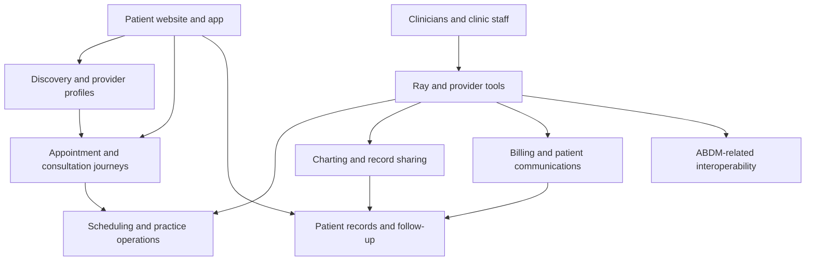
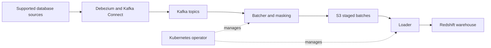
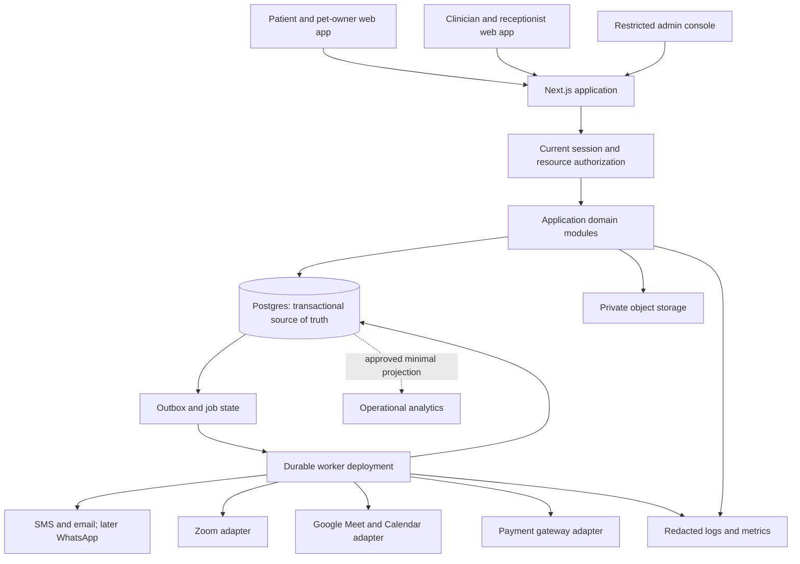
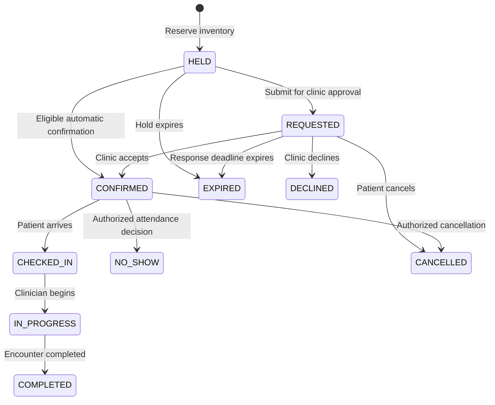
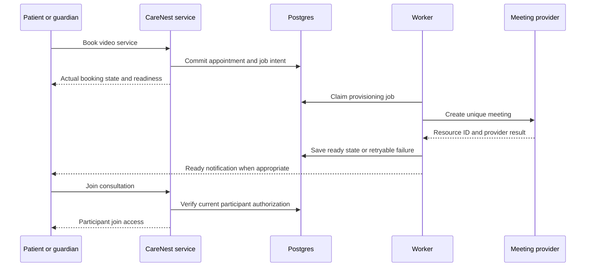

> 8 October 2026 update: LiveKit replaces Zoom API/Meeting SDK for local in-app calls. Google Meet remains optional. See [the LiveKit implementation and updated architecture](../implementation/LIVEKIT_LOCAL_VIDEO_IMPLEMENTATION.md). Earlier Zoom setup instructions below are historical and superseded.

# Practo architecture evidence and the CareNest implementation blueprint

**Date:** 6 October 2026\
**Status:** Proposed architecture and implementation plan; application changes are not implemented by this document.\
**Project:** `C:\Users\champ\Desktop\carenest`\
**Inputs:** local code audit, 13 audit reproductions, 131 passing existing tests, and primary public sources.

## 1. The decision you should make

Build CareNest as **one modular TypeScript application with a transactional Postgres database, private document storage and a durable worker**. Share infrastructure across human and veterinary care, but separate clinical records, permissions and treatment rules.

Your first objective is a reliable completed appointment: discovery → authorized booking → actual confirmation → consultation → correct record → follow-up. The current project has enough technology to start this; it does not yet enforce the necessary guarantees.

The proposed design is stronger than the current CareNest implementation and suited to your goals. It is not evidence that it is universally superior to Practo's private production architecture. Do not spend months copying enterprise infrastructure while your booking state and prescription permissions are still unsafe.

Use this document as the implementation backlog. Unchecked items are outstanding. The detailed evidence for F01–F40 remains in the [original audit](../audit/CARE_NEST_REVIEW_2026-10-06.md), with [validation results](../audit/validation-results.md) and the [reproduction script](../audit/reproduce.mjs).

## 2. What Practo publicly documents

### 2.1 Evidence limits

Practo does not expose a complete, verified diagram of its current production platform in the sources examined. We can verify specific public products and engineering projects, but cannot infer its entire current stack from those projects. Public repository code also does not prove every component is currently deployed.

Practo's [verified GitHub organization](https://github.com/practo) owns the engineering repositories below. Third-party Practo clones, interview answers, scraped stack lists and job advertisements are not proof of its production architecture and are excluded.

| Area | Public evidence | What it establishes | What it does not establish |
| --- | --- | --- | --- |
| Hosting | [Ray's public plans/FAQ](https://www.practo.com/providers/clinics/ray/plans) describes Amazon Cloud hosting and backups | A first-party hosting/security statement | Exact regions, current topology, isolation or an independently verified compliance assessment |
| Clinic product | The same page lists scheduling, billing, charting, messaging and record sharing | Product capabilities relevant to the competitor comparison | Individual backend services or database boundaries |
| Data engineering | [Tipoca Stream](https://github.com/practo/tipoca-stream) documents AWS, Kafka, Kafka Connect, Debezium and a Redshift sink | A published data-pipeline design | The transaction architecture for appointments or payments |
| Data loading | [RedshiftSink documentation](https://github.com/practo/tipoca-stream/blob/master/REDSHIFTSINK.md) describes Kubernetes batcher/loader pods and S3 staging | Specific warehouse ingestion mechanisms | Whether all health records follow this pipeline today |
| Data transformation | [Masking documentation](https://github.com/practo/tipoca-stream/blob/master/MASKING.md) describes field transformation controls | Published masking functionality | That masking alone guarantees anonymous or unrestricted data |
| Background workers | [Worker Pod Autoscaler](https://github.com/practo/k8s-worker-pod-autoscaler) scales Kubernetes workers using queue metrics and supports SQS/Beanstalkd | A published worker-scaling approach | That every background task currently uses either queue |
| Security controls | [Ray product page](https://www.practo.com/providers/clinics/ray) advertises MFA, IP allowlisting and backup controls | Features claimed by the vendor | Exact cryptographic architecture or operational effectiveness |
| Interoperability | [Practo's May 2023 ABDM announcement](https://blog.practo.com/practo-joins-abdm-ecosystem-with-ray-press-release-practo/) | A dated first-party announcement about Ray | CareNest certification or present support for every ABDM workflow |

The public sources support a design with distinct clinic workflows, background processing and analytical infrastructure. They do **not** establish that Practo's booking service uses Kafka, that its entire backend is microservices, or that its search uses Elasticsearch. Its complete primary-database layout, cache design, API gateway, deployment topology and video provider remain unverified here.

### 2.2 Practo's logical product architecture

**This diagram is an inferred functional model, not a leaked deployment diagram.** Its boxes represent publicly offered capabilities and the relationships a competing product needs to address.



Your competitor is a connected marketplace and clinic workflow, rather than just a doctor directory. This is an architectural inference from the public product features, not a claim about hidden service boundaries.

### 2.3 Practo's documented data-engineering pattern

The following reflects Tipoca Stream's published design: supported database sources feed CDC into Kafka; batching and loading deliver data through S3 to Redshift, with masking support. Kubernetes operators manage the processing pods. [Tipoca Stream](https://github.com/practo/tipoca-stream), [RedshiftSink](https://github.com/practo/tipoca-stream/blob/master/REDSHIFTSINK.md).



This is an analytical data path. Do not copy it into the appointment confirmation path. CareNest should initially produce minimal operational metrics from its database or a read projection; add CDC/warehouse infrastructure only when analytics workload, history or organizational access makes it necessary.

### 2.4 Lessons to adopt

- Keep slow delivery and integration work outside booking requests.
- Scale workers from job age, throughput and backlog, rather than only application CPU.
- Separate analytical access from the clinical transaction database.
- Minimize and transform data before giving analytical users access.
- Treat clinic software, onboarding and support as part of the product.

The Kubernetes autoscaler repository demonstrates queue-driven worker scaling; it is not a reason CareNest needs Kubernetes during the pilot. [Worker Pod Autoscaler](https://github.com/practo/k8s-worker-pod-autoscaler).

## 3. How CareNest should compete

Start in one serviced area, initially Navi Mumbai based on the existing locality data. Verify and maintain real participating clinics and vets. Build a receptionist-friendly workflow that combines online appointments and walk-ins, with accurate prices, actual confirmation and useful follow-up.

Pets are a worthwhile product direction, but not a unique category: Practo announced veterinary teleconsultations in March 2021. Differentiation must come from depth, local availability and execution. [Practo's veterinary announcement](https://blog.practo.com/practo-launches-online-veterinary-consultations/).

| Outcome to improve | Proposed CareNest feature | Evidence to collect |
| --- | --- | --- |
| Appointment certainty | Actual inventory, clear pending/confirmed states, response deadline | Conflicting active bookings, unfulfilled confirmed visits, clinic response time |
| Clinic adoption | Receptionist roles, walk-ins, absences, one daily queue | Weekly staff use and visits managed without developer help |
| Household usefulness | Authorized parent/child/caregiver access | Repeat family bookings and record-access correctness |
| Veterinary continuity | Pet records, weight timeline, vaccination follow-up | Repeat vet visits and reminder completion |
| Teleconsultation reliability | Protected joins, provider recovery, same-practitioner follow-up | Provisioning failures, join success and completed encounters |
| Trust | Verified credentials, measured claims, actual support | Verification turnaround, unresolved cases and response quality |

Do not promise faster waits, better privacy or cheaper consultations until measurements support the comparison. Do not sell emergency response through placeholder numbers. A maintained urgent-care directory can be a later feature; emergency medical advice needs appropriate clinical ownership.

## 4. Architecture decision record

**ADR-CN-002: Modular monolith with transactional scheduling and separate workers**\
**Status:** Proposed\
**Decision owner:** CareNest project owner; technical implementation owner to be assigned.

### Context

The project already uses Next.js, TypeScript, Postgres-compatible SQL, PGlite locally, Neon for deployment and a database outbox. Current failures are authorization and multi-write consistency, mixed demonstration/real data and incomplete workflows. There is no measured need for many separately deployed services.

### Options and trade-offs

| Option | Benefit | Cost or limitation | Decision |
| --- | --- | --- | --- |
| Continue pages directly calling generic database helpers | Quick small changes | Inconsistent authorization, duplicated logic and broken transactions | Replace incrementally |
| Modular application, one Postgres, separate worker process | Clear ownership and atomic transactions with modest operations | Requires discipline; web deployment remains shared | Adopt now |
| Separate API backend immediately | Useful for independently developed clients or API lifecycle | Another deployment, auth boundary and network hop | Introduce only when there is a concrete need |
| Full microservices/Kafka/Kubernetes/warehouse | Independent teams and advanced workload isolation | High operations cost, distributed transactions and more failure modes | Defer |

### Consequences

Use the same code repository for a web deployment and a worker deployment. Application modules can be extracted later because their contracts are explicit. Keep one database for now, with schema and access boundaries; this retains foreign keys and transactions. Shared database access must remain controlled, not become a license for every module to update every table.

Next.js routes and server actions should validate transport input, obtain the current principal, call a service and translate its result. The service authorizes the resource and coordinates the transaction. The repository executes scoped, parameterized queries. Integrations sit behind adapters.

## 5. Target system diagram and module ownership



| Module | Owns | Must not do |
| --- | --- | --- |
| Identity | Verified identifiers, OTP challenges, sessions, account links | Trust editable contact email as proof of account ownership |
| Clinic tenancy | Clinics, locations, staff membership, permission scopes | Treat state/region or the doctor role as clinic membership |
| Providers | Human/vet practitioners, registration evidence, suspension, offerings | Publish every imported profile as verified |
| Consent | Caregiver grants, pet guardians, purpose-specific consents | Assume booking authorization gives unlimited record access |
| Scheduling | Clinic schedules, exceptions, slot capacity and reservation ownership | Let cached search availability guarantee reservation success |
| Appointments | Requests, confirmation, check-in, cancellation and attendance | Change another appointment's reservation |
| Human care | Human encounters, notes, prescriptions, document versions | Reuse veterinary treatment logic |
| Pet care | Pets, veterinary encounters, weight and preventive care | Store a pet as an ordinary human family member |
| Telehealth | Provider connections, session lifecycle and join authorization | Expose host tokens or create meetings before required authorization |
| Payments | Orders, captures, refunds and reconciliation | Trust a browser success redirect as proof of payment |
| Notifications | Outbox handlers, templates, channels and delivery state | Mark a message delivered just because it was queued |
| Reviews | Attendance eligibility, uniqueness and moderation | Allow browser-submitted attendance to unlock reviews |
| Support | Cases, limited operational overrides and audit | Let general administrators browse every clinical note |
| Analytics | Approved aggregate or minimized read projections | Export all clinical documents to a general dashboard |

Suggested structure:

```text
app/                         Thin pages, route handlers and server actions
modules/
  identity/ clinics/ providers/ consent/
  scheduling/ appointments/ human-care/ pet-care/
  telehealth/ payments/ notifications/ reviews/ support/
infra/
  db/migrations/             Ordered, reviewed migrations
  db/                       Driver adapters and unit of work
  storage/                  Private uploads and authorized retrieval
  jobs/                     Worker leasing, retries and reconciliation
  observability/            Redaction and operational metrics
tests/
  services/ integration/ browser/ contention/
```

## 6. Database and identity model

An account logs in; a care subject receives treatment; a clinic is an organization; a practitioner belongs to one or more clinics. These are different identities.

| Group | Proposed entities and important fields |
| --- | --- |
| Identity | `users`, `verified_identities`, `sessions`, `auth_challenges`; identifier verification time, revocation, challenge expiry/attempts |
| Organizations | `clinics`, `clinic_locations`, `clinic_memberships`; role, capability, location scope, active membership |
| Practitioners | `practitioners`, `practitioner_credentials`, `practice_assignments`, `service_offerings`; HUMAN/VET, verification/suspension, species/service/mode |
| Human subjects | `human_patients`, `caregiver_grants`; DOB, guardian/caregiver relationship, authorization scope/expiry |
| Pet subjects | `pets`, `pet_guardians`; species, breed, birth-date precision, sex/neuter, microchip, guardian scope |
| Inventory | `schedules`, `schedule_exceptions`, `slots`, `reservations`; clinic timezone, service duration, live appointment ownership and expiry |
| Appointments | `appointments`, `appointment_events`; subject, practitioner, location, mode, fee snapshot, status, version, start/end and booked_by |
| Encounters | `human_encounters`, `veterinary_encounters`; appointment, treating practitioner, clinical status and timestamps |
| Documents | Separate domain envelopes plus JSONB content; encounter FK, subject FK, author FK, schema_version, document_version, draft/published/amended |
| Veterinary history | `pet_weight_events`, `vaccination_events`, `preventive_care_tasks`; measurement date, vet-approved schedule and completion |
| Integrations | `integration_connections`, `telehealth_sessions`; organizer identity, encrypted credential reference, provider resource ID, lifecycle |
| Financial | `payment_orders`, `payment_events`, `refunds`; integer amount in minor units, currency, external identifiers, idempotency |
| Operational | `outbox_events`, `worker_attempts`, `consent_receipts`, `record_access_events`, `support_cases` |

Keep public slugs separate from stable IDs. Store money in integer minor units and store currency; version the quoted service price. For pay-at-clinic services, distinguish a quoted fee from a captured online payment.

Appointments may contain nullable `human_patient_id` and `pet_id`, with real foreign keys and exactly one populated. A properly constrained subject registry is another valid choice. Avoid a generic subject string with no referential integrity.

Illustrative constraints for the **proposed** appointment table, not SQL to run against today's schema:

```sql
CHECK (num_nonnulls(human_patient_id, pet_id) = 1);
CHECK (ends_at > starts_at);
CHECK (fee_minor_units >= 0);

CREATE UNIQUE INDEX one_active_appointment_per_slot
ON appointments(slot_id)
WHERE status IN
  ('HELD', 'REQUESTED', 'CONFIRMED', 'CHECKED_IN', 'IN_PROGRESS');
```

This index assumes a single-capacity slot. For group capacity or variable overlapping durations, model explicit resources/lanes and an appropriate capacity or range-exclusion guarantee. Validate practitioner/subject/service compatibility in the transaction; ordinary SQL CHECK constraints cannot safely inspect arbitrary other tables. An expiry does not automatically remove a row from a partial index: the booking service or expiry worker must transition that appointment to EXPIRED. [PostgreSQL constraints](https://www.postgresql.org/docs/current/ddl-constraints.html).

Prefer separate clinic membership and caregiver/pet-grant tables over embedding long patient panels in a JWT. Tokens can help routing, but sensitive access must consult current session, membership, provider status and relevant grants. If introducing row-level security, test it with the actual runtime database role; owners and privileged roles can bypass it.

## 7. Booking design that fixes the current failures

### 7.1 Lifecycle



Choose clinic approval or automatic confirmation per service and clinic policy. A short payment hold and a pending clinic request are different purposes; use separately configured deadlines. Never reuse inventory while its original appointment remains active.

### 7.2 Create an appointment

1. Authenticate the account and validate bounded input. Accept stable IDs, not names/fees supplied as authoritative browser values.
2. Begin a real database transaction. Load or insert the idempotency key for this actor and operation; reject the same key with a different payload.
3. Lock the chosen inventory row and any relevant clinic/provider policy rows in a consistent order. Verify current provider status, service mode, future time, current inventory version and subject authorization.
4. If an older reservation expired, transition its appointment to EXPIRED and record that event before clearing ownership. If live or booked, return conflict without partial writes.
5. Create the appointment, allocate its reservation and snapshot approved fee/duration/policy. Bind reservation ownership to **appointment ID**, not merely user ID.
6. Insert required audit intent, appointment event and notification intent in the same transaction. Add telehealth/payment work only when the lifecycle requires it.
7. Commit. Return the real appointment ID, status and deadline. The UI shows Request sent when status is REQUESTED.
8. Worker deliveries happen after commit and can be retried independently.

The current `Db` interface has no transaction method. Add a transaction-capable unit of work and implement it for local and production adapters. `BEGIN`, writes and `COMMIT` must share the same transaction; unrelated HTTP queries do not provide this. An atomic statement or supported batch transaction can suit a fixed workflow. Use an interactive transaction-capable connection for workflows with intervening decisions.

### 7.3 Accept, decline and cancel

Require appointment ID, expected version and the current authorized actor. Within one transaction lock the appointment and inventory, check the allowed transition, confirm the reservation belongs to that same appointment, update both records and insert audit/event/outbox writes. A failed inventory transition must fail or deliberately reconcile the operation, never silently produce a confirmed booking.

Rescheduling should allocate the new resource and release the old resource atomically under a consistent lock order. Do not cancel the existing appointment and then attempt a new booking with no recovery path. Integration changes after rescheduling use a versioned event so stale jobs cannot overwrite the newer schedule.

### 7.4 Required proof

- [ ] Two independent database connections contend for one slot; only one active appointment survives.
- [ ] Expire A, reserve B, then accept/decline/cancel A; B remains unchanged.
- [ ] Repeat the same create/accept request; return the existing outcome without duplicate appointments or event intents.
- [ ] Inject a failure at every write; no orphan reservation or lost event intent remains.
- [ ] Reject past times, unsupported modes, suspended practitioners and another household's subject.
- [ ] Test opposite-direction reschedules without deadlock or loss of the original appointment.

## 8. Security and record-access design

The authorization decision must include the current authenticated user, clinic membership, requested capability, active practitioner status, care subject and encounter. Human health information is called PHI in this document; using that term does not imply a particular jurisdiction's compliance certification.

| Actor | Default permission | Additional condition |
| --- | --- | --- |
| Patient | Own human records and appointments | Ownership or a current, scoped caregiver grant |
| Pet guardian | Authorized pet's records and visits | Current pet guardianship and appropriate scope |
| Receptionist | Clinic scheduling and necessary contact details | Active location/clinic membership; no diagnosis access by default |
| Clinician | Relevant encounters and authored clinical records | Verified/active scope, treating relationship and required consent |
| Veterinarian | Authorized veterinary encounters | Veterinary credentials, clinic relationship and species/service capability |
| Platform operations | Verification, support cases and necessary operational data | Least privilege; clinical access requires a specific approved policy |
| Worker | Data necessary for its task | Dedicated identity and narrowly scoped database/integration permissions |

Implement session revocation, clinician/admin MFA, secure cookies, account-link verification, trusted-proxy handling, rate limits, secret rotation and production environment validation. A revoked KYC state or membership must take effect without waiting for a 30-day claims token to expire.

Record reads and exports need a resource-access event, including actor, subject/encounter, action, purpose, outcome, timestamp and request correlation ID. Do not copy the clinical document into that log. Define audit failure behavior: for ordinary online clinical access, persist audit intent successfully before releasing the record; fail safely if that is impossible. Any emergency exception needs a separate clinically approved, restricted and reviewed process.

Private uploads need an authenticated upload request, bounded file size/type, quarantine/scanning, tenant/subject ownership, authorized download, retention and access history. Signed download links are bearer capabilities; use short lifetimes and avoid logging them. Do not serve record files from `public/` or a public bucket. Keep clinical data out of analytics events, error breadcrumbs, meeting titles and unnecessary notification content.

Use draft → published → amended document states. A published prescription remains attributable to a practitioner and encounter; corrections create a new version with a reason. Never silently replace a signed/published record. Loading another patient must instantiate that patient's editor/draft and clear unrelated state. Add an unsaved-draft warning before switching encounters.

Human telemedicine requirements and allowed clinical workflows need an assigned medical/legal reviewer. The NMC's official telemedicine material is a baseline reference, not a declaration that this design is legally sufficient. Veterinary scope must be reviewed separately. [NMC reference](https://www.nmc.org.in/wp-content/uploads/2019/10/Public_Notice_for_TMG_Website_Notice-merged.pdf), [VCI register](https://vci.dahd.gov.in/ivpr).

The DPDP rules and enforcement timeline are phased. Before launch, map applicable duties and dates to notice, purpose-specific consent, caregiver/child handling, processor contracts, retention, rights requests and breach response. A region field does not enforce physical data location. Confirm deployment and processor locations, contractual terms and applicable legal requirements. [MeitY rules and timeline](https://www.meity.gov.in/documents/act-and-policies/digital-personal-data-protection-rules-2025-gDOxUjMtQWa).

## 9. Human and pet care features to implement

### Human-care minimum

- [ ] Real patient identity independent of the login account; verified contact channels.
- [ ] Household/caregiver grants, appropriate guardian workflows and configurable sharing scopes.
- [ ] Real upcoming/past appointments, actual statuses and cancellation/rescheduling.
- [ ] Clinician encounter records, validated prescriptions, attachments and document versions.
- [ ] Patient-viewable published records, controlled export and deliberate sharing.
- [ ] Same-practitioner follow-up with a clear eligibility window and response expectation.
- [ ] Clinical red flags and escalation copy reviewed by qualified clinicians.

### Veterinary minimum

- [ ] Persistent pet profiles and multiple authorized guardians.
- [ ] Vet discovery by location, species, specialization, supported service and actual availability.
- [ ] Pet-aware appointment creation, with clinic/home/video modes enabled only where offered.
- [ ] Veterinary encounter and prescription formats separate from human formats.
- [ ] Dated weight measurements, allergies, vaccination history and preventive-care tasks.
- [ ] Vet-approved species-specific reminder templates and a vaccination-card export.
- [ ] Home-visit address/contact, service zone, visit fee and travel/buffer capacity.
- [ ] Verified urgent-care contacts/hours if you choose to publish that directory.

Do not publish one generic puppy-and-kitten schedule as a clinical default. Do not derive animal treatment rules from human drug catalogues. Start with contracted medical care for supported species; grooming, boarding, transport and insurance are separate service businesses and can wait.

### Clinic and vet-practice operations

- [ ] Owner, practitioner and receptionist invitations with scoped permissions.
- [ ] Multiple locations, visiting practitioners and per-location working hours.
- [ ] Schedule templates, leave, breaks, duration by service and capacity.
- [ ] Booking approval policy, walk-ins, check-in, start/end, attendance and no-show.
- [ ] A daily queue derived from the active encounter and live reservation, with actual timestamps.
- [ ] Templates and consented communications, prescription issuance and clinic billing.
- [ ] Verified public listing management with explicit review of changed credentials.
- [ ] Data import with validation, preview, provenance and duplicate resolution.

## 10. Zoom and Google Meet integration

### 10.1 Product behavior

Implement both adapters under one telehealth module, but pilot one first. At booking time select an enabled provider according to the practitioner's configured service, rather than asking patients to make a technical choice. Show clear readiness and failure states. Use a protected consultation page for both people and pets; participant access still follows the relevant human-care or pet-guardian relationship.

Initially open the meeting through the supported provider join link. Add embedded calling only after real mobile journeys, host permissions and the SDK's availability have been verified. Provider meeting creation and in-app calling are separate pieces of work.

### 10.2 Google

Create a distinct Connect Google account flow for clinicians. Existing `openid email profile` sign-in does not grant Calendar/Meet access, and the current login implementation does not retain refresh credentials for this purpose.

Use clinician user authorization and encrypted refresh-token storage with the minimum necessary scopes. Two supported approaches are:

- Calendar scheduling: create an event with a new `conferenceData.createRequest` and `conferenceDataVersion=1`, then handle pending/success/failure before announcing readiness.
- Direct Meet room provisioning: call `spaces.create` with appropriate authorization and the `meetings.space.created` scope; use a separate Calendar workflow if calendar invitations are needed.

Create a fresh encounter room, retain external identifiers and coordinate rescheduling/cancellation. Confirm the organizer's account policies and supported conferencing. An add-on that runs inside Meet is different from embedding Meet inside CareNest. [Calendar conferencing](https://developers.google.com/workspace/calendar/api/guides/create-events), [Meet space creation](https://developers.google.com/workspace/meet/api/reference/rest/v2/spaces/create).

### 10.3 Zoom

For independently owned clinician accounts, implement user/account OAuth and the required app-review/permission process. Server-to-server OAuth is for the platform's own authorized Zoom account, not arbitrary doctors' accounts. If CareNest supplies hosts, plan sufficient licensed/concurrent capacity and host assignment.

Create meetings server-side through the Meetings API. Keep participant join access separate from host start capabilities. For later embedding, add backend-generated Meeting SDK authorization and the appropriate host authorization. The frontend must never receive the SDK secret or refresh token. [Zoom internal apps](https://developers.zoom.us/docs/internal-apps/), [Meetings API](https://developers.zoom.us/docs/api/meetings/), [Meeting SDK authorization](https://developers.zoom.us/docs/meeting-sdk/auth/).

### 10.4 Session lifecycle and adapter contract

```ts
interface TelehealthProvider {
  createSession(input: SessionInput): Promise<ProviderSession>
  updateSession(session: ProviderSession, change: ScheduleChange): Promise<void>
  cancelSession(session: ProviderSession): Promise<void>
}
```

This is a proposed boundary, not executable code. Keep provider-specific access settings and capabilities behind the adapter; do not assume identical controls in Zoom and Meet.



Session states: PROVISION_PENDING, PROVISIONING, READY, LIVE, ENDED, CANCEL_PENDING, CANCELLED and FAILED, with explicit retries/reconciliation. Appointment completion is a clinician workflow; opening a URL or receiving a provider event is not sufficient proof that treatment occurred.

Store appointment/version, organizer connection, external resource ID, timestamps and state. Store credentials and host capabilities encrypted or derive them when needed. Restrict join access to current authorized participants, valid state and a configured time window. Validate and deduplicate provider events; verify Zoom webhook signatures and the relevant Google subscription/channel identity.

Provisioning must tolerate a timeout after the provider actually created the room. Record a stable application correlation key, inspect the provider result or reconcile where supported, and avoid blindly creating duplicate rooms. If cancellation races with provisioning, check the appointment version before publishing READY and cancel the orphan room.

Configure provider-supported admission controls. A copied provider URL may still work outside your page; hiding it is not revocation. Rotate/cancel/end resources where supported. Keep recording/transcription disabled by default; add separate consent, access, retention and storage only if you intentionally offer it.

### 10.5 Acceptance tests

- [ ] Unauthorized patient, unrelated guardian and clinic staff cannot obtain join access.
- [ ] One appointment maps to one usable encounter room, despite retries and ambiguous responses.
- [ ] Revoked OAuth and unavailable hosts produce visible recovery tasks.
- [ ] Old reschedule jobs cannot restore an old meeting time.
- [ ] Cancelled appointments cannot obtain new access, and provider-side cleanup is verified.
- [ ] Patient never receives host start capability or a secret.
- [ ] Test Android/iOS browsers, microphone/camera denial, low bandwidth, reconnect and no-show.
- [ ] Every failed consultation has a support path and a refund policy where prepaid.

## 11. Background jobs, notifications and payments

### Durable worker

Your current daily cron plus `after()` is not enough for timely integration recovery. Use a dedicated worker or a durable scheduling/queue service with a retry frequency appropriate to appointments. Start with the Postgres outbox as the durable intent source; introduce a managed queue when its delivery or scaling benefits justify it.

An event needs a unique ID, kind/schema version, tenant and aggregate ID, aggregate version, minimal payload, availability time, lease token/expiry, attempt count and status. A worker claims a job, invokes an idempotent handler and completes only its own lease. A stale worker must not mark a newly leased job SENT. Distinguish queued, provider-accepted, delivered and failed states.

Unknown handlers go to a visible failure/quarantine path. Retry with bounded backoff and jitter, dead-letter irrecoverable work, alert on oldest job age and provide authorized replay. Fetch minimum contact details when delivering instead of copying clinical text into every event. A gateway call stays outside the database transaction. At-least-once delivery can duplicate messages; provider idempotency and safe templates should reduce the impact.

### Notifications

- [ ] Real production OTP delivery with fail-closed configuration.
- [ ] Separate approved OTP, booking, reminder and follow-up templates.
- [ ] Verified destination/channel and a fallback for accounts without a phone.
- [ ] Appropriate India SMS/DLT provider setup and tested template payloads.
- [ ] Consent/preferences and channel-specific delivery receipts.
- [ ] No unsupported STOP/reply promises without an inbound handling mechanism.
- [ ] Reminders follow actual appointment status; stale jobs are cancelled or ignored by version.
- [ ] No diagnosis or prescription content in routine SMS, calendar invites or meeting titles.

### Payments when needed

Keep pay-at-clinic as an explicit service policy where appropriate. For prepaid telehealth or home visits, create server-owned gateway orders from the locked price snapshot. Verify payment signatures/events server-side; deduplicate identifiers and model order, payment, refund and appointment states separately.

An out-of-order successful payment after hold expiry must not seize another patient's reservation. Reconcile it into a refund or an authorized alternative. Refunds require their own state and settlement reconciliation; sending a refund request is not proof of completion. Clinical records must not be held hostage to an unrelated failed subscription payment.

## 12. Discovery, availability, UX and later services

Unify search around a typed contract: `q`, canonical locality/area, kind, service, mode, languages, fee, verified status, sort and pagination. Connect both human and veterinary discovery to the live provider repository. Ordinary name queries must reach text search; symptom queries remain a limited navigation aid with clinically reviewed language handling.

Keep locality adjacency for the curated pilot, consistent with the existing ADR. Introduce coordinate search or PostGIS when clinics/home-visit service zones require arbitrary locations. A geospatial database query is not a paid maps API call. Preserve honest labels for straight-line distance versus travel time.

Public results can cache directory data briefly, but reservation writes must always recheck live inventory. Nearby counts must apply the same active filters or explicitly propose relaxing them. Add pagination, real availability, reviewed ranking and clear sponsored placement if monetized. Do not rank solely by seeded review counts or imply that a high score verifies credentials.

The primary homepage action should help a visitor find care. Put doctor/vet discovery and location above the fold; make sign-up happen when necessary. Remove unsupported scale and service claims. Public listings need actual verification status, fees, clinic address, service modes, supported species where relevant and functioning booking links. Use measured mobile performance, accessible focus/error handling and real empty/loading states.

| Additional service | Minimum before advertising it | Suggested stage |
| --- | --- | --- |
| Lab testing | Contracted labs, supported tests, collection zones/slots, order tracking, result provenance and support | After core appointments work |
| Surgery coordination | Real coordinator capacity, clinically reviewed routing, hospital partners, itemized estimates, revisions/disputes and contact consent | After local operations are staffed |
| ABDM | Applicable roles, sandbox integration, consented exchange, conformance and current approval requirements | Dedicated later project |
| Insurance | Actual partner arrangements, eligibility process and accurate terms | Later; no placeholder cashless promises |
| Grooming/boarding/transport | Separate verified supply, inventory, cancellation and incident handling | Later pet-service expansion |
| AI summaries/triage | Purpose/consent, reviewed output, provenance, cost bounds and safe fallback | Optional after records are reliable |

ABDM integration is more than storing an ABHA string or showing a checkbox. Confirm current sandbox and production requirements through NHA. [Official ABDM integration reference](https://abdm.gov.in/strapicms/uploads/AU_5642_Z2b_V_Ga_f9035b689e.pdf).

## 13. Deployment, operations and performance

### Pilot deployment

Keep Next.js on the current suitable hosting platform and managed Postgres if transaction support, region, access controls and backup configuration meet the requirements. Add a managed durable job executor or a container-based worker. Private object storage holds approved files. The current daily Vercel cron can remain housekeeping, but must not be the only path for a time-sensitive call or notification retry.

Separate development, test, staging and production identities/data. Local PGlite remains convenient; never make a production instance fall back to it. Test contention against disposable managed/real Postgres with independent connections. Keep application, worker and database near each other where available, and review actual processor/data locations rather than assuming them from a vendor name.

Runtime database credentials should not create/drop tables. Migrations use a separate deployment identity and an ordered migration history. Deploy additive changes first, backfill/validate, update reads/writes, then remove old structures after a rollback window. Use transaction pooling and connection budgets appropriate to the driver and runtime.

### Observability

- [ ] Structured, redacted logs with request, appointment and job correlation IDs.
- [ ] Booking conflicts, state transition failures and mismatched reservation ownership alerts.
- [ ] Worker backlog, oldest job age, failed job count and processing time by handler.
- [ ] OTP provider acceptance/delivery/failure and abuse/cost monitoring.
- [ ] Telehealth provisioning, readiness, join errors and organizer-token failures.
- [ ] Payment/refund reconciliation and overdue support cases.
- [ ] Record-access denials and unexpected privileges, without logging clinical content.
- [ ] Mobile performance, route error rates, database query time and connection pressure.

Define operational targets before the pilot, and publish claims only after measuring them. Example **proposed targets**, subject to cost/clinical review: healthy eligible booking requests return within a second at the pilot load; meeting readiness normally follows confirmation within a minute; failed critical jobs surface within a few minutes; all observed reservation conflicts are resolved without double confirmation. These are targets, not tested capacity guarantees.

Choose an availability objective and a tested recovery-point/recovery-time objective based on the service's operational needs and purchased backup capabilities. Automated backups are insufficient until a restore drill reconstructs a consistent application. Document how clinics handle an outage, how pending paid visits are recovered and who communicates with patients.

### Release process

- [ ] Remove `ignoreBuildErrors`; pin test tooling and maintain the lockfile.
- [ ] Run lint, type checks, direct service tests, migration checks and browser journeys in CI.
- [ ] Add production-configuration validation with a clear missing-setting error.
- [ ] Separate fake seed data/demo accounts from production initialization.
- [ ] Review dependencies by reachable exposure and upgrade patched versions deliberately.
- [ ] Use scoped secrets, MFA, credential rotation and a tested rollback procedure.
- [ ] Update README/DEPLOYMENT instructions to match the final architecture.

## 14. Complete repair backlog: every audit finding

**All rows below are TODO.** F01–F40 refer to the earlier audit, not newly discovered or already resolved issues. Priority is carried over. A task is complete only when its acceptance evidence exists; writing a helper or passing the old tests alone is insufficient.

| Task | Priority / finding | Implement this | Acceptance evidence |
| --- | --- | --- | --- |
| R01 | P0 / F01 | Production environment validator; local-only OTP hints; reject missing/inconsistent SMS setup | With production settings and no usable provider, no OTP is disclosed and authentication does not fall back to console |
| R02 | P0 / F02 | Restricted admin-provisioning command; disable public bootstrap; individual MFA accounts | First anonymous visitor cannot create an admin on an empty deployed database; two provisioning attempts are controlled |
| R03 | P0 / F03 | Encounter-specific record-write authorization; current provider and clinic relationship; server-owned names | Verified and unverified unrelated doctors cannot write to another encounter; authorized treating clinician can |
| R04 | P1 / F04 | Appointment-owned reservation and atomic acceptance with current version/expiry | Expire A, hold B, accept A: B stays reserved and A cannot become confirmed |
| R05 | P1 / F05 | Decline/cancel releases only that appointment's active reservation | Declining A cannot release B's held or confirmed slot |
| R06 | P1 / F06 | Subject ownership/grant lookup before reservation; scoped database access | Another household's subject ID returns no data and causes no reservation |
| R07 | P1 / F07 | Transaction-capable `Db`/unit of work; atomic booking, reservation, event and audit intent | Fault injection at each write leaves a consistent all-or-nothing result; retry does not duplicate |
| R08 | P1 / F08 | Current active/verified status gate in listing and booking service | Direct booking URL/action for suspended provider is rejected, including a stale search result |
| R09 | P1 / F09 | Separate verified auth identifiers from contact email; explicit dual-proof linking | Entering another person's email cannot merge accounts or retain attacker access after victim Google login |
| R10 | P1 / F10 | Real encounter reads; isolated editor/draft key; safe subject switching and version check | Draft a prescription for A, switch to B, then save: no A content is shown or written as B |
| R11 | P1 / F11 | Put resource policy and required audit intent in actual record services; define audit failure behavior | All sensitive reads/writes go through exercised services; denied and allowed access are attributable; simulated audit failure follows policy |
| R12 | P1 / F12 | Current session/membership/KYC/provider-status authorization for pages and actions | Revoke verification or membership mid-session; the next protected operation is denied despite an old claims cookie |
| R13 | P1 / F13 | Bounded server input schemas; valid future slot, mode, service and practitioner capability | Past/forged mode/unsupported video/subject mismatch requests leave no appointment or hold |
| R14 | P1 / F14 | Origin-checked internal redirects; reject backslashes/control characters | External, protocol-relative and slash/backslash variants cannot leave the application after either login flow |
| R15 | P1 / F15 | Validated drug-array shape; bounded fields; encounter/author IDs and versioned records | Non-array JSON, invalid shapes and forged patient names do not publish prescriptions |
| R16 | P1 / F16 | Replace unsupported statistics, verification/insurance promises and emergency numbers | Every displayed metric/service/contact has measured or contracted evidence; demo data is explicitly labeled |
| R17 | P1 / F17 | Live vet search, subject selection and functioning veterinary booking/video buttons | Owner creates a pet and completes a real supported vet appointment that appears in the practice |
| R18 | P1 / F18 | Contracted lab-order lifecycle or disable the offer | Book/Add either completes an actual order journey with support or clearly indicates the service is unavailable |
| R19 | P1 / F19 | Persistent authenticated onboarding drafts, private credentials and verification cases | Reload retains a draft; final submit creates a pending provider case and does not claim verification |
| R20 | P1 / F20 | Status-driven confirmation UI; fetch owned appointment instead of trusting query string | REQUESTED says request sent; only a genuinely confirmed owned appointment says confirmed |
| R21 | P1 / F21 | Patient cancellation/rescheduling, clinician no-show, policy and notifications | Replayed transitions are harmless; old inventory is correctly released; cancellation/refund policy is visible |
| R22 | P2 / F22 | One typed search parameter contract for links/forms/page/services | Name, locality, video and veterinary filters work through actual browser entry points and shareable URLs |
| R23 | P2 / F23 | Stable review-eligibility key; unique constraint; consistent aggregates | Concurrent review submissions produce one review; rating count matches accepted reviews |
| R24 | P2 / F24 | Provider joins by stable ID; public URLs by slug | Use fixtures with different provider IDs/slugs; account displays the correct doctor and links |
| R25 | P2 / F25 | Query actual starts_at; filter eligible future visits and sort earliest first | Past confirmed visits do not appear as upcoming; a later-created earlier visit becomes the next appointment |
| R26 | P2 / F26 | Timestamp-based display; compute next availability from live inventory | A booking labeled Today at creation shows its correct date after the day passes |
| R27 | P2 / F27 | Calendar generation in clinic timezone | At 01:30 IST the current day's available slots are generated correctly, including the full configured horizon |
| R28 | P2 / F28 | Queue eligibility based on actual today/state/current reservation | Tomorrow, requested, cancelled and unrelated appointments receive no actionable queue status |
| R29 | P2 / F29 | Explicit clinic timezone queries and live appointment join | A reused slot contributes one current patient, and a UTC-hosted database agrees with IST clinic day |
| R30 | P2 / F30 | Real check-in/start/end/walk-in/no-show inputs; freshness and estimated range | Queue reflects recorded events; stale/unknown progress is disclosed rather than presented as certain |
| R31 | P2 / F31 | Frequent durable retries, versioned handlers, unknown-kind quarantine and visible failures | Kill a worker mid-job: intent survives; unknown kinds are not silently SENT; alert/replay works |
| R32 | P2 / F32 | Accurate nullable contact types; verified contact/channel fallback | Google-only user can follow the supported journey without null crashes or unsendable hidden notifications |
| R33 | P2 / F33 | Atomic OTP consume/attempt updates; verification limits and hashed challenge material | Parallel requests cannot reuse a consumed challenge or exceed its defined attempt budget |
| R34 | P2 / F34 | Filter-aware nearby counts or clearly offer filter relaxation | Each suggested area matches the carried filters or explains precisely which filters will change |
| R35 | P2 / F35 | Real footer destinations, policies, grievance channel and company details | Every footer link reaches the stated destination; privacy/refund/contact details are actual and reviewable |
| R36 | P2 / F36 | Mount PracticeShell only in the practice layout | Requests page contains one sidebar/header on desktop and mobile |
| R37 | P2 / F37 | One authoritative demographic model or atomic self-profile synchronization | Updating account DOB/gender/name updates the self patient shown to the clinic consistently |
| R38 | P2 / F38 | Surgery triage job, consent/purpose controls, network/account/global cost limits | Form responds without waiting for AI; rotating numbers cannot create unlimited model work; provider failure leaves the lead intact |
| R39 | P2 / F39 | Transactional/idempotent referral and provider-status transitions | Concurrent route actions create only authorized intended referrals and one consistent transition history |
| R40 | P2 / F40 | Clinically reviewed navigation rules, word boundaries, supported-language/negation tests and live supply fallback | Fitness does not trigger seizure routing; unsupported input gets an honest fallback; unavailable specialist routing does not strand users |

The reproduction harness currently demonstrates bad behavior. When implementing repairs, turn the corresponding scenarios into regression tests that assert the **correct** result. Do not alter expected values merely to retain a green suite. Keep database constraints and actual service code under test; remove unnecessary copies of production SQL from test helpers.

## 15. Infrastructure and quality backlog beyond F01–F40

These tasks address architectural risks and unfinished workflows, rather than claiming each is a demonstrated exploit.

- [ ] I01: ordered database migrations, migration history, separate credentials and `migrate` command.
- [ ] I02: transaction adapter tested on both local and deployed database drivers.
- [ ] I03: failure recovery for cached initialization errors; runtime no longer does destructive/repeated DDL.
- [ ] I04: direct service tests, independent-connection contention tests and browser journey coverage.
- [ ] I05: remove ignored type errors; pin `tsx`; add lint/type/migration/security checks to CI.
- [ ] I06: upgrade affected dependencies; remove unused NeDB and move generation/tooling packages out of runtime dependencies.
- [ ] I07: typed clinical-document envelopes with real relationships and content schema versions.
- [ ] I08: clinic tenancy, location memberships and practitioner assignments.
- [ ] I09: private file storage, scanning, authorized downloads and retention.
- [ ] I10: search/dashboard pagination, batched read models and complete paginated sitemap generation.
- [ ] I11: optimized owned imagery, mobile performance measurement and accessibility review.
- [ ] I12: separate production data initialization from fake clinic/vet/demo seeds.
- [ ] I13: restore drills, outage handling and reviewed incident/clinical-access procedures.
- [ ] I14: versioned provider connections, encrypted tokens and revoked-token recovery.
- [ ] I15: payment/refund reconciliation if money is collected online.
- [ ] I16: actual clinic calendar, patient list, billing, settings and reports; no unlabeled sample data.
- [ ] I17: provider credential renewal/suspension and explicit reviewer decisions.
- [ ] I18: human caregiver and veterinary guardian workflows with appropriate consent.
- [ ] I19: privacy, teleconsultation, sharing, grievance and cancellation/refund documents reviewed for launch.
- [ ] I20: support cases, clinic escalation, worker replay and controlled operational overrides.
- [ ] I21: approved minimal analytical event schema; no unrestricted CDC dump of clinical documents.
- [ ] I22: current deployment instructions, environment validator and secrets/processor inventory.

The prior audit reported 12 affected dependency packages and a Next.js advisory applicable to its pinned version. Confirm current patches and reachability during implementation; no `next/og` application use was found during the audit. Do not label the app as demonstrably remotely exploitable on that basis alone. [Official advisory](https://github.com/vercel/next.js/security/advisories/GHSA-vcvr-r3jv-pc5j).

## 16. Implementation sequence and dependencies

This is the order of work, not a promised completion date. Assign a developer owner and reviewer to each milestone. The clinical/credential/legal tasks also need owners qualified for that work.

| Milestone | Dependencies | Work package | Exit gate |
| --- | --- | --- | --- |
| M0: honest, protected prototype | None | R01, R02, R09, R14, R16, R35; environment/CI and production seed separation | No demo OTP/public admin claim; no unverified automatic account merge; no fake live-service claims |
| M1: transactional core | M0 | I01–I03; R04–R08, R13, R20, R21, R24–R29, R33 | Service-level contention/failure tests prove reservation ownership and atomicity |
| M2: clinic and clinical boundaries | M1 plus membership/provider groundwork | R03, R10–R12, R15, R36, R37; I07–I09, I16–I18 | Correct chart survives reload/switch; unauthorized access denied; active practitioners and staff are scoped |
| M3: discovery and owner journeys | M1–M2 | R17, R19, R22, R23, R30, R32, R34, R40; pet profiles/records; public/mobile UX | One human and one pet journey complete from discovery to published record |
| M4: reliable asynchronous work | M1; can proceed alongside M2–M3 | R31, R38, R39; worker, outbox/versioning, channels and support replay | Killed jobs recover promptly; stale jobs cannot mutate newer appointments |
| M5: video consultation | M2–M4 | Google and Zoom connection adapters, unique rooms, protected join, recovery and follow-up | Real mobile call and all specified failure/cancellation tests pass |
| M6: paid-service operations | M1, M4, service policy and provider arrangements | Prepaid orders/capture/refunds/reconciliation where required | Late/out-of-order events never steal inventory; failed service can be refunded correctly |
| M7: supervised local pilot | M0–M6 as applicable; support and review complete | Contracted clinics/vets, training, accurate service coverage, backups and launch policies | Repeated completed visits with no critical unresolved integrity/access problems |
| M8: additional services/expansion | Successful pilot and staffed supply | Lab orders R18, surgery operations, insurance/ABDM projects and additional cities | Each newly advertised journey has contracted supply, support and end-to-end validation |

M0 does not make the product clinically safe by itself. Core and record-authorization work remains a launch dependency. If building alone, implement the packages sequentially rather than attempting all modules at once.

Suggested **first five pull requests**:

1. Production safety: fail-closed OTP configuration, restricted admin provisioning, safe redirects and authentication-identifier separation.
2. Database unit of work and migrations, with direct adapter/rollback tests.
3. Appointment-owned inventory and atomic create/answer/cancel; regression tests for the expired-request scenarios.
4. Current practitioner/clinic/encounter authorization and validated clinical documents.
5. Real clinic chart/editor, subject-safe state, honest booking UI and human/pet subject groundwork.

Do not put every change in one giant rewrite. Each release should remain understandable and reversible.

## 17. Migration from the current codebase

| Current area | Target change |
| --- | --- |
| `app/actions/auth.ts`, `lib/auth.ts`, `lib/google.ts` | Identity service and separate verified login identifiers; clinician OAuth connections are separate |
| `app/actions/care.ts`, `app/actions/practice.ts` | Thin action adapters to appointment/encounter/review services |
| `lib/db/client.ts` | Transaction-capable adapter; runtime query identity distinct from migration identity |
| `lib/db/schema.ts` | Baseline migration plus ordered forward migrations; remove request-time DDL |
| `lib/db/slots.ts` | Scheduling repository/service with appointment-owned reservations and policy |
| `lib/db/sql.ts` | Domain repositories and batched read models; progressively retire the catch-all module |
| `lib/db/docs.ts` | Domain clinical-document/review repositories with typed ownership envelopes |
| `lib/policy.ts`, `lib/phi.ts` | Exercised resource-authorization and audit boundaries using current principal |
| `lib/db/outbox.ts`, `lib/drain.ts`, cron route | Durable job intent, lease ownership, versioned handlers and worker deployment |
| `lib/data.ts`, `scripts/seed.mjs` | Explicit demo/reference data; real providers and care subjects come from persistence |
| `/practice/*` | Real tenant-scoped clinic operations; one shell and current practitioner identity |
| `/pets`, `/labs`, `/join` | Real feature services or unavailable states until implementation is complete |

Migration steps:

1. Snapshot and verify the current schema/data in a nonproduction migration environment. Identify fabricated seed records versus real records before migrating.
2. Add stable practitioner/subject/membership IDs and explicit mapping tables. Preserve existing booking relationships and record provenance.
3. Add new columns/tables and backfill valid relationships. Quarantine ambiguous clinical documents rather than attaching them to a guessed patient.
4. Reconcile expired requests, slot ownership, duplicate reviews and orphan holds before enabling new constraints. Keep an audit of reconciliation decisions.
5. Switch one clinic/cohort behind a feature flag. All writes for a selected appointment must use one canonical service; do not run independent old/new reservation engines against the same slot.
6. Compare read projections in staging, then move UI reads to the new model. If compatibility writes are unavoidable, coordinate them inside the same transaction.
7. Monitor support cases and integrity metrics, maintain a rollback plan and retire old writes after validation. Published clinical corrections remain versioned, not destructively cleaned up.

## 18. When to add larger infrastructure

| Technology/change | Add when | Keep doing until then |
| --- | --- | --- |
| Redis | Measured throttling/cache latency or chosen queue design warrants it | Database-backed limits and small public read caching; Postgres controls reservations |
| Dedicated search index | Relevant ranking/typo/multilingual needs or measured indexed-query load exceeds database search | Improve Postgres indexes/read models and pagination |
| PostGIS/coordinate search | Arbitrary clinic coordinates or home-visit polygons require it | Curated locality search and corrected adjacency |
| Kafka/CDC | Multiple replaying consumers, change streams or analytics scale justify an event platform | Transactional outbox and a durable worker |
| Warehouse | Heavy/history-rich analysis needs independent access and resources | Approved aggregate projections and batched reporting |
| Separate services | Independent teams/scaling/failure boundaries and explicit ownership justify extraction | Modules with stable contracts in the shared app |
| Kubernetes | Several container workloads and an operations owner justify cluster management | Managed web hosting and one managed/container worker |
| Native apps | Repeat use, push/device workflows and retention justify two additional clients | Responsive web with measured mobile experience |

Do not promise a national traffic limit from an architecture diagram. Measure search/booking load, database contention, worker throughput and provider quotas before each expansion. Split notifications/integration execution first if measured load or isolation demands it; keep appointment consistency within one authoritative owner.

## 19. Costs, business operations and launch gates

Budget for managed database/backups, web execution, worker capacity, private file storage, OTP/messages, meeting host capacity, gateway/refund fees, monitoring, practitioner verification and human support. Free-tier availability is not a reliability strategy. Verify current vendor terms, region options and prices when selecting paid services; this document does not quote a procurement estimate.

Track cost per completed visit rather than per signup. Clinic subscriptions, transparent service fees and paid operational tools are possible revenue models to validate; do not promise perpetual free service without an economic model. Keep sponsored placement distinct from verification/ranking.

Before admitting real users:

- [ ] All P0 and applicable P1 findings have resolution evidence.
- [ ] Actual service tests enforce the invariants; the old green suite is not the only evidence.
- [ ] A clinician/admin role alone cannot access unrelated charts; guardianship and clinic membership are tested.
- [ ] Human and veterinary records cannot cross subjects, drafts or treatment catalogues.
- [ ] Appointment and reservation state remain consistent after expiry, retries, concurrency and failure.
- [ ] Every advertised Book button completes its supported journey or clearly states unavailability.
- [ ] Providers are genuinely verified and suspension propagates to discovery, booking and protected actions.
- [ ] Video sessions, revoked OAuth and cancellation/recovery have been tested on real devices.
- [ ] Paid services have verified payment state, reconciliation, cancellation and refund handling.
- [ ] Restore, outage, security incident and support escalation procedures are rehearsed.
- [ ] Notices, consent, contact, privacy and grievance details are real and reviewed.
- [ ] Public metrics and urgent-care contacts have evidence; no demo data is presented as operational fact.
- [ ] Clinics have training and a named contact for missed confirmations or outages.
- [ ] Product analytics contain minimal operational data and no unnecessary clinical text.

Run a supervised local pilot, measure completion quality and fix recurring operational failures before buying broad traffic. Expanding to a new locality should require verified supply, service hours and support coverage, not just adding its name to a dropdown.

## 20. Completion and source notes

This blueprint defines proposed architecture, fixes and acceptance gates. It does not mark any bug fixed, activate an integration or certify compliance. The earlier checks were 131 passing existing tests, a passing build/type check, and 13 successful audit reproductions of problematic behavior or its cause. No new application tests were needed merely to write this document.

Public Practo architecture conclusions are deliberately limited to the source evidence in Section 2. Kafka/CDC/Redshift and worker autoscaling are documented engineering projects; the full live Practo backend remains private/unverified. CareNest's design choices are recommendations, not alleged details of that backend.

The practical next step is to complete **production authentication safety, the transaction adapter, appointment-owned reservations and current encounter authorization** before integrating live video or exposing real clinical records.
