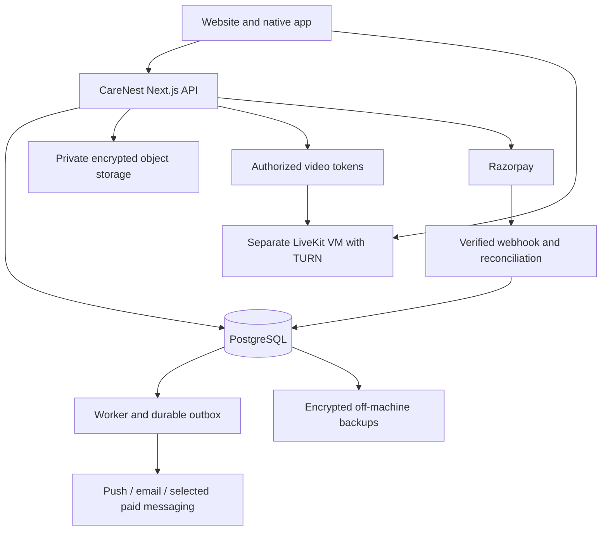

# CareNest: actual infrastructure and cost reduction review

Date: 9 October 2026. Scope: repository, local runtime, configuration readiness and published provider prices. This is an inspection and proposed plan; it does not deploy infrastructure or change application behavior.

## What the inspection establishes

CareNest is currently a local Next.js application with its own authentication, an embedded PGlite database, a separate local worker, local encrypted file objects and a self-hosted LiveKit container. The local homepage responded successfully. Google OAuth and Razorpay test credentials are configured. Actual mobile SMS, WhatsApp and external email delivery credentials were not configured in the inspected environment.

Earlier AWS estimates described a hypothetical architecture. They are not your current bill. In particular, CareNest does not currently use Cognito or Chime. Removing those hypothetical charges cannot be described as savings on an existing CareNest invoice.

No AWS/GCP billing export, production traffic history or externally deployed resource inventory was available. A Google project used for OAuth does not establish that Google hosts the website. This inspection cannot prove there are no independently provisioned resources in your accounts. Local computing also consumes electricity, internet access and disk space.

| Area | Actual implementation | Cost implication / remaining work |
|---|---|---|
| Website and backend | Next.js 16.3.8, React 19, TypeScript; domain modules inside one application | Keep this structure. A rewrite into microservices or Go is not justified by measured load. |
| Database | Local startup forces PGlite in `.data/pg`; PostgreSQL adapter already exists | Use real PostgreSQL for hosted, concurrent operation. No database hosting cost is verified today. |
| Authentication | Application-owned revocable sessions, OTP challenges, Google OAuth | No managed authentication fee per monthly active user in the current design. Security maintenance remains your responsibility. |
| Worker | Signed local HTTP request every five seconds | Substantial recurring work even with no customers. Production entry point needs separate configuration. |
| Video | Local LiveKit container on loopback; two participants per room | No managed video-minute charge is configured. Hosted server, bandwidth, TURN and operations will cost money. |
| Files | Private local filesystem, application encryption, quotas, PDF quarantine | No S3/GCS object adapter yet. Local filesystem is unsuitable for independently scaled application replicas without a shared storage design. |
| SMS | MSG91 and Twilio adapters; local launcher selects console OTP | Real phone OTP is not configured. AWS SMS and 2Factor are not existing adapters. |
| WhatsApp | Twilio sandbox adapter, joined-number restrictions, receipts and deduplication | Sandbox is not configured; the adapter is intentionally restricted to local mode. Production WhatsApp is unfinished. |
| Email | Resend adapter, opt-in, verified email requirement | Not configured; Gmail is not the implemented delivery service. |
| Push | In-app notification records; no FCM/web-push integration found | A notification inbox is not phone push. Device registration, delivery and preferences still need implementation. |
| Payments | Razorpay test orders, signature checks, captured-payment verification and ledger | Live processing fees are not established by test-mode operation. Webhook secret was not configured. |
| Pricing | Confirmed appointment invoice uses the stored consultation fee | The proposed ₹50 CareNest fee, tax breakdown, duration price catalogue and doctor settlement allocation are not implemented by this invoice path. |

The optional PostgreSQL Compose file exists, but the inspected running CareNest service was LiveKit, not that PostgreSQL container. Other projects' PostgreSQL containers were excluded from the review.

## Highest-value changes, based on your code

### 1. Separate video access checks from room provisioning

Evidence: `components/livekit-consultation.tsx:10`, `app/api/video/[bookingId]/livekit/route.ts:9`, `lib/domain/livekit.ts:52`.

Each connected participant calls the join endpoint every 20 seconds. That endpoint calls `livekitJoin`, which calls `provisionLivekit`, contacts LiveKit to create the room, performs database checks and updates, issues another token and records another join audit entry. The browser discards the successful response during these checks.

For two participants connected for an hour, this is roughly 360 additional join/provision operations, beyond the initial joins. Repeating creation is idempotent, but it still consumes network, database and worker capacity. These are not 360 separate billable video consultations.

Proposed fix: provide a lightweight access-status endpoint. Validate current account status, appointment revision, consent and time window without room creation or token issuance. Provision only on actual join/recovery. Retain server-side removal of revoked or expired participants. A 30-second join-token expiry does not disconnect someone already in the call.

Acceptance: a successful hour-long call provisions only as needed; cancellation, consent revocation and account restriction still terminate access within the explicitly chosen enforcement window; a brief network interruption has a tested reconnection policy.

### 2. Stop treating every maintenance task as a five-second task

Evidence: `scripts/worker.ts:9`, `lib/domain/maintenance.ts:7`.

The timer has up to 17,280 opportunities per day, or 518,400 per 30 days. Overlap is prevented, so slow ticks reduce the actual count. Every successful tick enters maintenance: expired holds, pet reminder queries, cleanup, outbox draining and LiveKit reconciliation. Calendar expansion is already limited to hourly execution, but its scheduling check still runs each tick.

Proposed schedules, subject to measured latency requirements:

| Work | Proposed trigger | Why |
|---|---|---|
| Outbox messages | Wake after committed events; recover with bounded polling/backoff | Responsive notifications without continuous empty work. PostgreSQL notification can wake a worker, but durable outbox rows remain the source of truth. |
| Active video enforcement | Prompt change events plus a short reconciliation interval while rooms exist | Preserve clinical access controls. Do not replace this with a daily sweep. |
| Expired appointment holds | Around 30–60 seconds, with expiry checked during booking transactions | Prompt release without making availability depend solely on the scheduler. |
| Calendar generation | Hourly, paginated over every eligible provider | Current query processes only the first 1,000 active doctors. Providers beyond that limit can be missed. |
| Pet vaccination reminders | Daily or a batched periodic task | Date-based reminders do not need checks every five seconds. |
| Old pairing/sync/worker records | Hourly or daily batches | Avoid recurring scans and delete overhead. |

The outbox currently handles events serially under a 30-second deadline. Introduce small, bounded parallelism only after verifying leases, idempotency and database connection capacity. Keep retries capped; uncertain provider outcomes need receipt reconciliation, not repeated sends.

### 3. Use the second-device pairing you already have

Evidence: `app/account/mobile/page.tsx`, `components/mobile-device-forms.tsx`, `lib/domain/mobile.ts:10`, `apps/mobile/src/api.ts`.

A signed-in patient can generate a single-use pairing code, then enter it in the native application. It expires after five minutes; device access currently expires after seven days, and up to five active devices are allowed. This is a code-entry flow, not an implemented QR scanner.

Promote this flow for people moving from PC to phone. It can avoid another SMS without weakening first-login identity verification. Do not assume every second-device login will use it, or that all 50,000 monthly active users need a fresh SMS every month. Measure adoption, renewals, recovery and abandonment.

Keep shorter staff/clinical session limits. Add passkeys or secure rotating device refresh only as a deliberate design with revocation and recovery, rather than making every token valid indefinitely.

### 4. Finish the notification router before buying more messaging services

Evidence: `lib/notifications.ts:9`, `lib/whatsapp.ts:12`, `lib/whatsapp.ts:63`, `lib/domain/notification-preferences.ts`.

Current external processing attempts WhatsApp before email/SMS. For an opted-in recipient, the WhatsApp adapter rejects outside local mode. Consequently, production WhatsApp opt-in can prevent later email/SMS routing in that event attempt. Fix channel isolation and distinguish configuration failures from transient delivery failures before enabling it in production.

Recommended policy:

1. Always persist the in-app event idempotently.
2. Attempt opted-in push where a usable registered device exists.
3. For routine updates, use verified email or the user's selected channel; do not send every event through every channel.
4. Use official WhatsApp for opted-in, valuable reminders when its economics are justified.
5. Reserve paid SMS for phone verification and explicitly chosen urgent fallbacks.

A push token is not evidence the user has read a message. Use application acknowledgement where necessary, distinguish provider acceptance from delivery, and define which appointment events warrant paid fallback. Notification SMS and OTP have different purposes; do not send an OTP to communicate a booking reminder.

FCM has no messaging charge, but the backend, device maintenance and fallback channels still cost money. [Firebase pricing](https://firebase.google.com/pricing).

### 5. Finish real SMS safely and price it using your existing adapter

Evidence: `lib/sms.ts`, `app/actions/auth.ts:32`, `lib/domain/otp.ts:15`.

Use the existing MSG91 integration first if its approved India route and commercial quote work for your business. Obtain the required sender/template approval and verify the configured API product before buying credits. Do not assume all providers' bulk transactional SMS rates apply to authentication OTP.

The existing controls are useful: 60-second resend cooldown; three requests per 15 minutes, five per hour and ten per day per phone; network limit 20/hour; OTP expiry five minutes. Keep controls against SMS pumping. Review the network limit for shared clinic/campus/carrier addresses so legitimate customers are not unnecessarily blocked.

The four MSG91/Twilio requests in `lib/sms.ts` have no explicit timeout. Bound them and distinguish timeout/unknown delivery from confirmed rejection. Blindly switching providers after a timeout can double-charge and deliver conflicting codes. Add provider receipt reconciliation and an aggregate spend cap.

MSG91's published India OTP table lists ₹0.19 at relevant bulk tiers, plus 18% GST. Actual billing depends on the purchased plan, route, message segments and agreement. [MSG91 OTP pricing](https://msg91.com/in/pricing/otp).

| Illustrative monthly OTP count | At ₹0.19 before tax | Cash cost with 18% tax |
|---|---:|---:|
| 110,000 | ₹20,900 | ₹24,662 |
| 55,000 | ₹10,450 | ₹12,331 |

The difference is ₹12,331/month if delivered/charged attempts really halve. This is a scenario, not a measured saving from your current console OTP. At 5,000 paid appointments, those SMS totals allocate ₹4.93 or ₹2.47 per paid appointment. Non-paying users' authentication still has to be funded.

### 6. Reduce database chatter before adding Redis

Evidence: `lib/auth.ts:127`, `lib/domain/mobile.ts:17`, `lib/domain/rate-limit.ts`, `lib/db/adapters.ts`.

Web authentication performs session/user checks and a conditional last-seen update. Mobile authentication updates last-seen on each request and writes rate-limit state. Repeated checks within the same render can multiply queries.

Use request-scoped deduplication, debounce device last-seen writes, inspect query plans and index the real hot paths. Keep authorization and revocation checks current. Public doctor/specialty pages may be cacheable; patient records, consent decisions and payment status must not be put in a shared public cache.

The PostgreSQL pool defaults to four connections per application process. Multiple replicas multiply that total. Set replica/concurrency limits against the database connection budget. A paid Redis instance is a future response to measured contention, not a prerequisite for 50,000 monthly users.

### 7. Remove unnecessary browser refreshes

Evidence: `components/whatsapp-controls.tsx:7`.

The updates view refreshes the server-rendered page every ten seconds without a visibility guard: six refreshes per minute per open view. Pause hidden tabs and use bounded status polling or an event feed instead of repeated full-page refreshes. The queue component already has a visibility check; do not rewrite it as if it lacks one.

### 8. Improve file representation and backup durability

Evidence: `lib/domain/files.ts:48`, `lib/domain/files.ts:61`, `lib/secrets.ts`, `scripts/backup-local.mjs`.

JPEG/PNG uploads are decoded and re-encoded as PNG. This sanitizes images but can make a photographic JPEG substantially larger. Choose a sanitizing format/quality appropriate to the document; preserve diagnostic fidelity and retain PDF quarantine/scanning.

File content is base64-encoded before encryption, then ciphertext is base64url-encoded in the envelope. Large payloads therefore occupy approximately 16/9 of sanitized binary size, plus envelope overhead. A versioned binary encrypted-object format could remove roughly 44% of this representation's payload bytes. That is not a 44% reduction in the whole storage bill. Keep old envelopes readable during migration; never discard keys.

The backup script correctly requires the local app to stop and copies database, files and keys. However, copies remain under `.data/backups` on the same machine. Its `encrypted:true` manifest is not proof the full archive/database/key material is encrypted: the script performs filesystem copies. Protect backup archives separately, keep controlled key recovery and create an off-machine copy. Verify restoration to a clean environment. Removing backups or access checks is not an acceptable cost saving.

## A suitable hosting design

Keep the modular application, own authentication, PostgreSQL outbox and LiveKit. Use one cloud and a small service set, rather than buying every AWS/GCP product.

### Before any hosting move

`npm start` currently runs the local launcher, which forces local mode, console OTP and loopback binding. `scripts/worker.ts` also forces local mode. Add distinct hosted application/worker entry points; preserve local safeguards. Configure hosted secrets, real PostgreSQL, private storage and HTTPS/WSS explicitly.

The daily Vercel cron route exists and calls maintenance, but a daily schedule cannot replace fast notification handling, slot expiry or active video enforcement. Define one ownership/lease model so multiple schedulers do not duplicate work.

### If you choose AWS

Evaluate a small app/worker VM, PostgreSQL with encrypted backups, private object storage and a separate LiveKit VM. A self-managed database reduces the service invoice but adds patching, restore and availability responsibilities; managed PostgreSQL is sensible if that operational burden cannot be covered. Do not choose an unencrypted database plan to hit a headline budget.

Current Lightsail Linux public-IPv4 examples are $24/month for 4 GB and $44/month for 8 GB. These are individual VM prices, not a complete CareNest bill or validated capacity. Mumbai includes half the displayed transfer allowance; both inbound and outbound count toward that allowance. [AWS Lightsail pricing](https://aws.amazon.com/lightsail/pricing/).

Defer EKS, microservices, an always-on Redis service, managed search and a separate managed authentication platform until an observed requirement justifies them. Buy redundancy when uptime commitments require it; a single low-cost VM is a single failure domain.

### If you retain your earlier Google Cloud preference

Evaluate Compute Engine for an app/worker pilot, PostgreSQL or Cloud SQL, Cloud Storage, and a separate LiveKit VM. Cloud Run can be an alternative for the HTTP application after its startup/storage/worker assumptions are changed. Its ingress must bind to `0.0.0.0`, not the current local launcher's `127.0.0.1`. [Cloud Run container contract](https://docs.cloud.google.com/run/docs/container-contract).

Keep the LiveKit media server on infrastructure suitable for its media ports and TURN configuration; do not assume moving the HTTP application to Cloud Run also hosts the entire video stack. [LiveKit deployment guidance](https://docs.livekit.io/transport/self-hosting/deployment/).

There is no verified AWS-versus-GCP total-price winner for your actual traffic. Compare equivalent region, availability, backup and measured video transfer requirements. Choosing a different cloud before fixing repeated application work does not remove that work.

## Video bandwidth: the expense that can defeat a ₹50 fee

Self-hosted LiveKit removes a managed per-minute tariff, not bandwidth or server expense. Its operations belong to your team. [LiveKit self-hosting overview](https://docs.livekit.io/transport/self-hosting/).

Illustration: if each of two participants receives an average 1.5 Mbps video/audio stream, aggregate server outbound is about 3 Mbps. An hour is approximately 1.35 GB outbound, excluding overhead. Five thousand such one-hour calls produce about 6,750 GB outbound per month. Comparable inbound transfer can consume a bundled allowance as well; do not double-count it as paid outbound when the provider only charges outbound overage.

This is a bandwidth scenario, not a measurement of your calls. Fifteen-minute calls at the same bitrate use one quarter of those bytes. MAU alone says nothing about peak concurrent calls, bitrate or TURN usage.

Configure and measure suitable video quality, adaptive subscription, encoding and audio-only fallback. Review installed SDK defaults before claiming these features are disabled. Owner decision after this review: do not record consultation audio/video; retain completed-visit history instead. Recording is already disabled in the CareNest LiveKit flow and no egress recording service is configured by its local setup. Call access currently permits ten minutes before the appointment and thirty minutes after it, so actual connected duration can exceed the sold duration. Define a clear grace/extension policy and warn users before expiry rather than surprising them with an abrupt disconnect.

## Can ₹50 before tax work?

It can be a target, but your current implementation and invoices do not prove it is profitable.

For the requested ₹800 total, the illustrative allocation is ₹741 doctor fee + ₹50 platform fee + ₹9 platform tax. The tax treatment and supplier/settlement arrangement need confirmation before production; this arithmetic does not establish a lawful medical fee split or that every healthcare service is exempt.

Use the following conservative cash model with no input-tax-credit assumption:

`contribution per paid booking = 50 - gateway cash cost - allocated hosting/video/messaging cash cost`

Razorpay's advertised standard rate is 2% plus GST for applicable methods. At 18% tax on the processing fee, ₹800 costs ₹18.88 to process. It is charged on the processed payment, not automatically only on CareNest's ₹50 portion. Method-specific and negotiated rates may differ. Razorpay states custom proposals are available for higher volumes, typically above ₹5 lakh/month. Request a written quote; 1.5% is not an existing offer. Standard bank UPI's zero MDR does not remove the gateway's platform fee. [Razorpay pricing](https://razorpay.com/pricing/).

| Goal per paid booking | Maximum hosting + video + messaging allocation, after ₹18.88 processing |
|---|---:|
| Break even before staff, support, marketing and refunds | ₹31.12 |
| Leave ₹10 contribution | ₹21.12 |
| Leave ₹15 contribution | ₹16.12 |
| Leave ₹20 contribution | ₹11.12 |

At 5,000 paid bookings/month, the ₹15 contribution target permits ₹80,600/month for hosting, video and all messaging combined. If OTP costs ₹24,662, the remaining allowance is ₹55,938. If OTP costs ₹12,331, it becomes ₹68,269. Those are spending ceilings, not vendor quotations. At only 1,000 paid bookings, the same target allows just ₹16,120 total infrastructure/messaging, so 110,000 OTPs alone would exceed it.

At 5,000 payments of ₹800, monthly processed volume is ₹40 lakh; standard processing is ₹94,400 including assumed GST. A hypothetical negotiated 1.5% plus GST would be ₹70,800, a ₹23,600 difference. Minimum fees, payment mix, settlements, refunds and eligibility must be part of the quote. Do not build profitability around a short-lived promotion.

Your service revenue at 5,000 paid bookings is ₹2.5 lakh before output tax. At ₹15 contribution, only ₹75,000 remains for staff, support, acquisition, losses and company profit. This is contribution, not net profit. The 50,000 MAU figure is not the paid-booking denominator.

## Ordered implementation and measurement plan

1. Separate video health checks from provisioning; test revocation and reconnect behavior.
2. Split worker schedules and page calendar expansion; preserve fast enforcement for active calls.
3. Isolate notification channel failures, add push registration/delivery, and add SMS timeouts/reconciliation/spend limits.
4. Promote existing mobile pairing; measure actual SMS attempts per active and paying user.
5. Finish hosted startup, PostgreSQL and private object storage; rehearse encrypted off-machine recovery.
6. Add an explicit service-fee/tax/duration price model and verified production payment callbacks/reconciliation before collecting real money.
7. Load-test PostgreSQL-backed booking races, webhook retries, notification backlog and representative simultaneous video calls. Do not infer 50,000-user capacity from a homepage check.
8. Record a seven-day traffic sample: peak concurrent calls, connected minutes, aggregate bitrate, outbound GB, TURN share, database query latency/connection usage, worker empty ticks/backlog, provider delivery outcomes and paid bookings.
9. Extrapolate usage cautiously, obtain matching AWS/GCP estimates and messaging/payment quotes, then choose hosting. Maintain daily/monthly spend alerts and a budget per paid booking.

Minimum metrics should use identifiers and aggregate counters, not OTP values, tokens, phone numbers or clinical content. Cost formulas should count chargeable attempts/segments and real bandwidth, not just successful user actions.

## ADR-COST-01: optimize the existing modular application before migration

Status: Proposed. Date: 2026-10-09. Decider: CareNest owner.

### Context and decision

The target is 50,000 monthly active users with affordable consultations and a ₹50 pre-tax platform fee. Current load, conversion, video usage and production invoices are unknown. Preserve the existing stack, remove avoidable repeated work and measure costs before committing to a cloud architecture.

### Options considered

| Option | Complexity | Cost | Scalability | Team familiarity |
|---|---|---|---|---|
| Optimize existing application; small VM/services pilot | Moderate operational responsibility | Modest service count; video transfer still variable | Increase application replicas and video capacity from measurements | Highest reuse of current code |
| Adapt HTTP application to Cloud Run plus managed PostgreSQL/storage and separate video | Moderate integration change | Usage-sensitive HTTP compute; database/video remain costs | Good HTTP elasticity with connection limits | Google CLI/OAuth setup exists, but no verified hosting experience |
| Full AWS suite, managed auth/video, Kubernetes and microservices | High | More independent fees and operating complexity | Broad capability, not a demonstrated requirement | Significant new systems |

The first option is the recommended pilot shape, with cloud selection left open. It trades lower recurring service complexity for explicit operations and failure-domain ownership. The second is viable after separating worker/storage concerns. The third does not have enough evidence to justify its cost today.

### Consequences and action items

- Existing domain, authentication and payment protections can be retained while cost-heavy paths are improved.
- A cheaper infrastructure invoice does not remove engineering, security, support or outage costs.
- Availability and video capacity must be revisited as real usage and service commitments become known.
- [ ] Complete the ordered implementation plan and validate it against representative load.
- [ ] Obtain quotes using measured volumes and document the selected availability/backup targets.
- [ ] Recalculate contribution from real paid bookings and settle the commercial/tax model before launch.

Validation of this review: repository evidence and local runtime/configuration metadata inspected; provider references checked; arithmetic recalculated. No production load test, cloud billing audit, real-money payment or phone delivery test was performed for this review. No runtime code or deployment configuration was changed.
