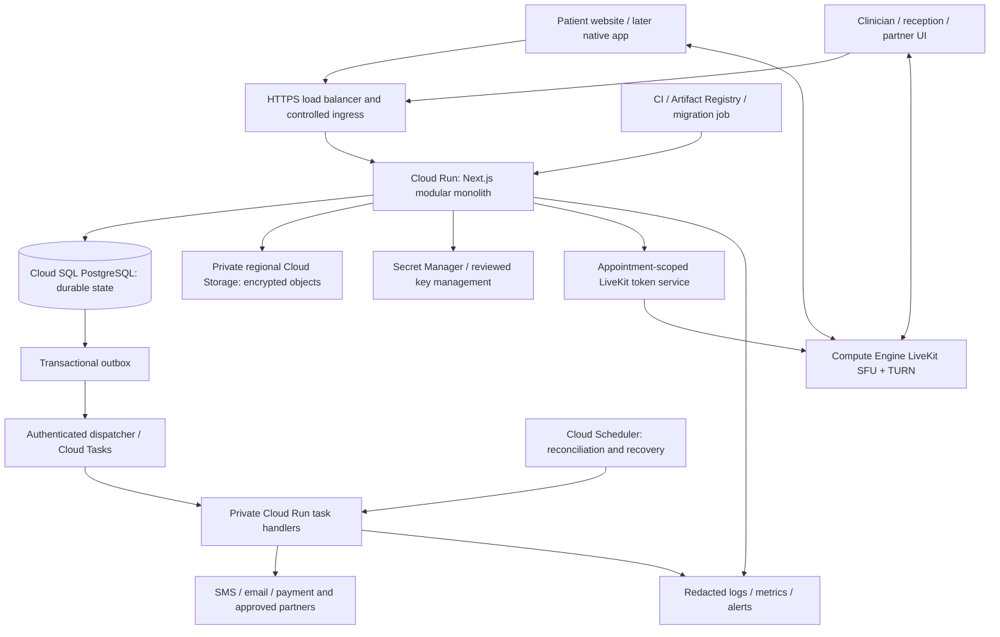

# CareNest website audit, Practo comparison and profitable Google Cloud strategy

**Audit date:** 9 October 2026, India time. **Reviewed source:** `3b26c49`, branch `codex/local-care-platform`. **Scope:** audit and recommendations only. No application fixes, cloud provisioning, provider-account changes, payments or deployments were performed for this audit.

## 1. The candid verdict

CareNest has become a substantial local software implementation. It has a coherent visual style, real booking transactions, household and pet records, clinic workflows and a video implementation. Calling it a simple landing-page prototype would now be inaccurate.

Calling it a Practo competitor ready for public clinical use would also be inaccurate. The website still runs on a local demonstration environment, advertises capabilities that depend on unvalidated external services, and has no demonstrated acquisition, retention or paying-clinic economics. Good code and 201 passing tests do not establish dependable care delivery.

The main commercial danger is **trying to launch ten businesses before proving one**: a human-health marketplace, veterinary marketplace, clinic software business, telehealth service, lab network, pharmacy operation, surgery brokerage, insurance intake and native app. Each adds support, professional review, partners and exception handling. More screens can reduce profit if they increase costs faster than repeat usage.

The recommended business is a **paid clinic operating system with dependable local discovery and repeat care**, initially in one existing supply area such as Navi Mumbai. Build separate human and veterinary clinical paths under the same household account. Prove appointment fulfilment, clinic time saved and recurring clinic revenue before expanding geography or services.

“Better than Practo in all ways” is an ambition, not a useful first release specification. Define better with measured outcomes: fewer failed appointments, clearer total prices, easier follow-up, better pet continuity, lower clinic administration effort and faster support. Earn broader competition through those results.

| Dimension | Current assessment |
| --- | --- |
| Visual presentation | Credible and substantially improved; the desktop blue/white layout is cohesive |
| Local functionality | Broad and transactionally stronger than the original prototype |
| Real service supply | Demo profiles are labelled; real operating supply was not established by this audit |
| Public-launch readiness | Blocked by operational, integration and infrastructure prerequisites |
| Proven profitability | Unknown: no real revenue, CAC, retention or cohort data supplied |
| Competitive advantage | Potential in local clinic operations and household/pet continuity; not yet demonstrated |

## 2. Evidence, methods and limits

### Fresh checks

- Inspected the running local production-mode website: homepage, search, veterinary listing/profile, filter reset and contact flow.
- Reproduced `/search?page=1.01`: a visible server-error screen and **HTTP 500**.
- Reproduced filter reset from `/search?q=fever&area=410210&video=1`: “Clear all” navigates to `/search`, removing the complaint and location as well as the video filter.
- Inspected the veterinary profile's DOM structured data: Dr. Neha Kulkarni is emitted as `Physician`.
- Checked eight anonymous HTTP responses and security/cache headers. See [HTTP evidence](http-checks.json).
- Refreshed both npm dependency audits: website **0 reported vulnerabilities**; separate mobile dependency tree **15 high-severity package findings**, 0 critical. These are package findings, not necessarily 15 independent vulnerabilities or confirmed production exploits. See [website audit](website-dependencies.json) and [mobile audit](mobile-dependencies.json).
- Reviewed discovery, profile/review presentation, booking, authorization/rate limits, files/secrets, worker/calendar, database adapters, policies, sitemap and local launch paths.
- Checked current public Practo product/help pages and Google Cloud/vendor documentation. Specific claims are linked below.

### Existing evidence reused

The source had not changed since the recorded **201-test full regression pass**, final **10-test targeted pass**, production build, synthetic PostgreSQL contention/restore test and synthetic LiveKit connection/disconnection test. These runs were reviewed, not rerun during this audit. The PostgreSQL result used 20 reservation contenders and observed one successful reservation; that is useful correctness evidence, not a production throughput benchmark. Evidence lives in `docs/implementation/livekit-full-tests.txt`, `livekit-final-targeted-tests.txt`, `livekit-build.txt`, `postgres-verification.txt` and `livekit-local-verification.json`.

### What this audit does not establish

There was no destructive testing, live consultation, payment, account registration, production penetration test or review of Practo's authenticated provider product. Practo's main homepage and security page returned 403 to direct web fetching; accessible official help/product pages and the indexed veterinarian listing supplied the comparison. Practo marketing claims are attributed as such, not independently certified.

The browser's requested 390px viewport override did not take effect: DOM width remained 1280px. A fresh phone breakpoint pass therefore cannot be claimed. Earlier saved responsive evidence and mobile screenshots remain historical, and current mobile code was reviewed. Real iOS/Android, slow-network, screen-reader and camera/microphone testing remain required.

The local response observations were homepage 724ms, search 89ms and pets 174ms in one sequential pass. They include local server response time only. They are **not** LCP, INP, CLS, internet latency, a p95 or a comparison against Practo. No invented Lighthouse score is provided.

## 3. What is already good and should be preserved

1. **The booking core has real invariants.** Reservation ownership, revisions, idempotency, provider eligibility, current consent and transaction boundaries are stronger than UI-only validation.
2. **Money uses integer paise in the financial workflows.** Keep gateway collection, provider liability, invoice state and refund outcome separate.
3. **Patients can manage family and pet subjects.** Human and veterinary subject checks are explicit; one account does not imply interchangeable clinical authority.
4. **Sample identities are disclosed.** Do not replace generated avatars with unrelated real doctors' photos or manufacture reviews to make the marketplace look busy.
5. **Clinical records and private files have contextual encryption and access checks.** Keep that boundary when replacing local storage.
6. **Reviews are attendance-gated on the server.** The presentation needs correction, but the service requires an attended appointment.
7. **The LiveKit implementation limits participant and room scope.** Short tokens, current eligibility, camera/microphone-only publishing, cleanup and reconciliation are good foundations. Token expiry alone does not disconnect an existing participant.
8. **A modular monolith is appropriate.** Retain shared transactions and extract services only when measured workload, isolation or team ownership justifies it.

These observations do not certify that every code path is secure. Preserve the useful controls and test them after every deployment change.

## 4. Findings register: defects, risks and release gaps

**P1:** fix or resolve before the affected public service launches, or before the stated growth threshold. **P2:** important correctness, usability or maintainability work. **Observed:** reproduced directly. **Source:** clear from implementation, without reproducing every variant. **Gap:** missing operating evidence/capability. **Risk:** plausible exposure requiring validation, not a proven incident.

There is no confirmed P0 exploit in this review. That is a scope statement, not a declaration that no critical vulnerability exists. The table contains **24 findings: 12 P1 and 12 P2**, including release gaps rather than disguising every item as a software bug.

| ID / priority | Evidence and concrete problem | What to change / acceptance condition |
| --- | --- | --- |
| F01 / P2 | **Observed:** fractional `page=1.01` causes HTTP 500. `app/search/page.tsx` derives an offset from a non-integer page; `lib/db/sql.ts:430` only bounds it. | Parse an integer once, validate finite/range values, and use it consistently for SQL and links. Decimal, negative, array, malformed and excessive inputs must produce a valid safe page or deliberate 400, never 500. |
| F02 / P2 | **Observed:** “Clear all” also erases `q` and `area`. `components/doctor-results.tsx` resets to `/search`. | Separate “Clear filters” from “Start a new search”; preserve location and discovery query. Changing a specialty chip or resubmitting search should preserve intentionally compatible criteria. |
| F03 / P1 | **Source/claim gap:** “Cashless insurance accepted” uses only `doctor.cashless`; no insurer, policy/network, service coverage or authorization is established. `components/doctor-results.tsx`; `lib/db/sql.ts:402`. | Remove insurance acceptance claims until actual partners and coverage evidence exist. Model insurer/network/service/date separately; display “subject to insurer authorization” where applicable. Online payment is not insurance coverage. |
| F04 / P1 | **Observed/source:** profile says sign in to “confirm the slot”, while booking creates `requested`, with a clinic-response hold of up to 30 minutes. `app/doctor/[slug]/page.tsx:260`; `lib/domain/bookings.ts`. | Use “Request appointment” consistently. Show awaiting-confirmation state, expiry, cancellation/payment terms and clinic response expectation before submission. Only show instant confirmation for an implemented clinic-authorized policy. |
| F05 / P1 | **Source:** discovery's video flag does not check usable provider integration or operational readiness. Booking subsequently rejects an unconfigured LiveKit/Google service. `lib/db/sql.ts:401`; `lib/domain/bookings.ts`. | Compute public bookability from provider eligibility, mode, published slots and integration state. Fail closed or clearly explain temporary unavailability. Test disconnected Google accounts and a down LiveKit service. |
| F06 / P2 | **Observed:** veterinary profile emits `Physician` JSON-LD. `app/doctor/[slug]/page.tsx:68`. | Represent the veterinarian as a person with accurate qualifications and link to the veterinary organization. Use [VeterinaryCare](https://schema.org/VeterinaryCare) for the vet's office, not as a person type. Validate structured data and never imply human medical qualification. |
| F07 / P2 | **Observed/source:** `/pets` has species/video/home filters but no area search or pagination, and silently caps results at 30. `app/pets/page.tsx:7`. | Add area/PIN, language, fee and actual service-area filters plus pagination or cursors. Show supported species on cards. Test more than 30 vets and unsupported species. |
| F08 / P2 | **Source:** “Other ... nearby” filters specialty/kind but not locality or city. `app/doctor/[slug]/page.tsx:59–64,211`. | Apply locality adjacency/city scope, or label “Other providers” without proximity claims. Do not show invented kilometre distances. |
| F09 / P2 | **Source/visible copy:** `canReview` is any signed-in user; copy invites everyone to leave a review, although `lib/domain/reviews.ts` requires attendance and rejects duplicates. `components/review-list.tsx`; profile page. | Query eligibility for the actual user/provider. Show “Review after your attended visit”, existing review state and fair moderation/dispute rules before the user writes a long response. |
| F10 / P2 | **Source:** an area with zero filtered matches replaces the entire results/filter panel. Empty-state copy says no verified doctor has listed there, even when filters excluded available providers. `app/search/page.tsx`; `components/nearby-suggestions.tsx`. | Keep active filter controls visible. Distinguish uncovered area, zero providers, zero matches and exhausted page. Let users remove one constraint and preserve the others. |
| F11 / P2 | **Source:** sitemap eligibility lacks the inactive-clinic check used by public profile/search reads. Suspended clinic providers can remain in sitemap candidates. `app/sitemap.ts` versus `lib/db/sql.ts`. | Share one publication eligibility policy for sitemap, search and profile. A clinic suspension must remove public URLs from the next generated sitemap without indexing private pages. |
| F12 / P2 | **Source:** “Relevance” uses rating/experience order, not text rank or appointment availability. `lib/db/sql.ts:425–427`. | Rank exact names/specialties and text match, eligible availability and location explicitly. Use Bayesian/review-count-aware treatment; never sell undisclosed organic rank. Add typo/local-language discovery tests. |
| F13 / P1 | **Risk:** complaints are placed in `q` URLs. Private/no-store and same-origin referrer controls help, but browser history, same-origin links and future proxy/cloud request logs can still carry health-related text. | Minimize free-form clinical search data, strip query strings from analytics/error events and sensitive access logs, and review cloud logging/redaction before launch. Demonstrate that diagnostic text cannot appear in analytics exports. No leakage incident is claimed here. |
| F14 / P2 | **Observed:** no CSP or Permissions-Policy in checked responses; `proxy.ts` supplies nosniff, frame denial and same-origin referrer policy. | Add a tested nonce/hash-aware CSP and restrictive feature permissions compatible with video, uploads and payment UI. Use report-only rollout first. HTTPS/HSTS is a future edge requirement; absent HSTS on local HTTP is not a local defect. |
| F15 / P2 | **Source:** phone filter drawer has no dialog semantics, focus trap, focus restoration or Escape handling. `components/doctor-results.tsx`. | Use an accessible modal/dialog primitive. Keyboard and screen-reader tests must show focus enters, stays inside, closes and returns correctly; background navigation must not remain interactive. |
| F16 / P2 | **Source:** patient bottom navigation excludes `/practice` and `/admin`, but not `/staff` or `/consult`. `components/mobile-navigation.tsx`. | Use role/surface-aware navigation. A staff workflow or video call must not be obstructed by unrelated patient navigation or fixed overlays; test keyboard and safe-area overlap on devices. |
| F17 / P1 at growth | **Source:** hourly calendar maintenance selects the same first 1,000 active doctors, with no cursor. `lib/domain/maintenance.ts:9`; `openSlots` only reads. | Use durable keyset batches or per-provider schedule jobs, with checkpoints and last-materialized horizon. Test provider 1,001 receives future slots and interrupted work resumes. This is a growth defect, not evidence that today's demo calendar failed. |
| F18 / P1 for mobile release | **Fresh audit:** mobile has 15 high-severity package findings, including Expo/React Native toolchain dependencies. Website audit is separate and clean at this check. | Trace advisory roots and affected runtime/build paths; move to a compatible patched supported matrix, then build and device-test. Do not blindly force npm's suggested major downgrades to Expo 44 / React Native 0.72. |
| F19 / P1 for release | **Gap:** no `.github/workflows` exists in the checkout. Good recorded local tests are not an automated gate for future merges. | Add dependency install, typecheck, meaningful regression tests, migration checks, secret/dependency scans and production build in CI. Run cloud integration/load/restore checks separately on synthetic isolated data. |
| F20 / P1 for cloud launch | **Source:** package start runs the local launcher, forces demo/PGlite, binds `127.0.0.1`, spawns a local worker; files use a filesystem root. | Create an explicit non-local deployment entrypoint, durable PostgreSQL/object storage, stable managed secrets and separately scheduled work. Two app instances must see identical authorized data/files, without demo OTP. See section 9. |
| F21 / P1 for public launch | **Gap/visible:** real legal operator identity, staffed grievance contact and reviewed policies are missing; policies describe implementation and retain obsolete Zoom wording. Contact shows an anonymous form, but submit requires sign-in. | Publish actual reviewed operator/policy details and an accessible monitored recovery/grievance route. Warn before collecting text if login is required, preserve safe drafts, and provide a route for locked-out users. |
| F22 / P1 for affected services | **Gap:** real video-device testing, completed Google callback/Meet test, SMS/email receipts and live payment/refund validation remain unproven. | Keep each affected service hidden or explicitly unavailable until its activation checklist passes. Verify failure, duplicate, timeout, reconciliation, opt-out and support paths as well as the successful path. |
| F23 / P1 for profitable launch | **Gap:** inspected source/package has no product funnel or real-user performance instrumentation. Logs and audit trails do not answer CAC, conversion or retention questions. | Implement purpose-limited analytics and revenue/cohort dashboards with no clinical content. Tie recognition to completed services or subscribed clinics; attribute acquisition and variable cost. See sections 7–8. |
| F24 / P1 for monetization | **Commercial/legal gap:** provider percentages, surgery/lab referral incentives and “unlimited” care have not been priced, clinically governed or legally approved. | Start with real software value and reviewed clinic contracts. Require professional/legal/accounting review of the actual fee/settlement structure before charging; do not create incentives for unnecessary treatment. |

Detailed reproduction evidence is in [browser observations](browser-observations.md) and [HTTP checks](http-checks.json). Source findings include locations so a future implementation can create focused tests. This is not an exhaustive inventory of every bug.

## 5. How CareNest differs from Practo today

The comparison distinguishes **implemented locally**, **operationally validated**, and **proposed**. A local feature is not automatically competitive parity with a service customers use successfully.

| Capability | Practo public evidence | CareNest now | Competitive implication |
| --- | --- | --- | --- |
| Doctor discovery | Public city/specialty listings, fees, stories and availability filters | Filtered local database; labelled sample providers | Supply quality and search intent handling matter more than card count |
| Booking fulfilment | Prime advertises instant booking and waiting-time/service assurances at participating clinics | Atomic request/hold/acceptance, not universal instant confirmation | Match promises to the clinic's operating policy; prove fulfilment before guarantees |
| Online consultation | Consult advertises specialist access, prescriptions and a free follow-up period | Scheduled local LiveKit, optional Meet; real device validation pending | Win on reliable connection and continuity, not a video button |
| Clinic administration | Ray publicly describes scheduling, reminders, EMR, queue, billing and refunds | Many analogous persisted local workflows | Clinic software is a direct competitive category, not a unique new idea |
| Pet discovery | Practo already has veterinarian listings in Mumbai | Species-aware subjects, pet records/reminders and vet search | Differentiate pet lifecycle and clinic operations, not “we list vets” |
| Human household + pets | Public pages reviewed do not establish an equivalent unified pet-lifecycle workflow | One account with separated human/vet data paths | An opportunity hypothesis; validate Practo's current app and user needs before claiming exclusivity |
| Reviews and trust | Public patient stories and professional verification claims | Attendance checks implemented; no fabricated reviews | Show genuine evidence, verification date and limitations; never conflate stars with outcomes |
| Labs/pharmacy | Official FAQ describes authorized partner delivery/testing models | Local workflows; actual partner authority not established | Software integration cannot manufacture a supply network |
| Monetization | Official FAQ describes software/visibility subscriptions and service/platform models | No proven paying-clinic cohorts | Compete with clear software ROI and fair terms rather than unsustainable discounts |
| Privacy/security | Practo describes security controls/certification in official help | Access checks and contextual encryption; operational assurance still needed | No basis to claim CareNest is more secure without independent evidence |
| Google Cloud | Current private Practo topology is not established by these sources | Future target only | Hosting vendor is infrastructure, not a consumer differentiator |

Practo's [Prime patient FAQ](https://help.practo.com/practo-prime/faqs-for-practo-prime-patients/) describes assurances at participating clinics; these should not be generalized to every doctor listing. The reviewed [Mumbai veterinarian listing](https://www.practo.com/mumbai/veterinarian) itself cautions about confirmation/wait-time guarantees for listed providers.

The [Consult page](https://www.practo.com/consult?source=homepage) describes consultation and follow-up, while [Ray's public product page](https://raysem.practo.com/practo-ray-software/) describes practice workflows. Those are published offerings, not independently measured success rates. Current prices and availability vary by offering; no live checkout or negotiated Ray quote was inspected.

Practo's [official FAQ](https://help.practo.com/practo/practo-faq/) is the source for its published business categories and security claims. It does not disclose a complete current system architecture, unit margin, ad allocation logic or doctor settlement percentage. Do not copy an invented “Practo architecture” from a generic blog and treat it as fact.

## 6. A defensible way to become better

### The first customer and the first market

Start with a manageable cluster of independent clinics and vet practices where you can personally verify supply and troubleshoot failures. Navi Mumbai is a reasonable initial hypothesis because the current locality data already covers it; demand and willingness to pay still require interviews.

Interview at least 10 human clinics, 10 vet practices and 20 patients/pet owners before selecting the first paid segment. Ask about missed calls, appointment failures, billing reconciliation, repeat reminders, staff time and switching costs. Watch real reception work. Request a paid pilot or dated purchase commitment; enthusiastic comments alone are weak validation.

Run human and vet pilots as separate cohorts. If one segment pays and retains better, concentrate the commercial rollout there. The website can share branding and household identity without sharing prescriptions, practitioner scope or emergency claims.

### The care experience to build

| Journey | Better experience | Proof before claiming it |
| --- | --- | --- |
| Discovery | Show eligible next slot, actual location/languages, complete price, registration status and mode availability | Search-to-book conversion and independently checked provider details |
| Appointment request | Distinguish request, hold and confirmation; give a clear response deadline and next action | Acceptance/expiry/cancellation rates by clinic |
| Arrival and delay | Clinic attendance/queue updates with last-refresh time, realistic estimates and a way to report failure | Actual wait-time distribution and clinic compliance |
| Video | Browser pre-call device test, reconnect, network warning and human support | Android/iOS/laptop call matrix, weak networks and permission denial |
| Follow-up | Same clinician where possible, stated scope/time window and auditable response queue | Follow-up workload, response time and clinician compensation |
| Records | Clean timeline, export, consent controls and reliable signed-record amendments | Access tests, export completeness and restore rehearsal |
| Pet continuity | Species/weight-aware records, vaccination history, clinician-approved due dates, owner reminders and continuity across visits | Vet review, owner comprehension and reminder-to-completed-visit cohorts |
| Support | Public operator contact, account recovery, visible case progress and reconciliation evidence | Staffed coverage and measured response/resolution times |

A shared family account must still support adult privacy, guardian authority and revocation. Do not give one household member automatic access to another adult's sensitive chart merely because they booked the appointment. Keep pet prescribing and human prescribing governed separately.

### Website design priorities

Keep the existing palette, rounded cards and mobile navigation. The bigger improvements are decision clarity: actual available time, verified evidence, total cost, request status and recovery. Move secondary services out of the first booking path; create distinct Human care/Pet care entry points. Keep calls to action descriptive rather than promising clinical outcomes.

Replace vague “top rated” claims with transparent ranking explanations. Display review sample size, recency and attended-visit eligibility. Include fair provider replies and an audited moderation process that protects privacy without deleting criticism simply because a clinic pays.

Improve large-text and screen-reader usability, keyboard focus, input errors, touch targets, bottom safe areas and call-screen overlays. Translate the actual local-market journeys into Hindi/Marathi with professional review of clinical text. Never equate translation with clinically reviewed symptom routing.

For growth, publish useful locality/service pages only where real supply exists. Add legitimate provider/clinic descriptions, accurate schema, canonical URLs and dated reviewed educational content. Do not mass-generate hundreds of empty city pages or fabricate medical advice to obtain SEO traffic.

## 7. A profit model that can survive real costs

### Revenue priorities

1. **Recurring clinic/vet software subscription:** scheduling, reception, billing, reminders, records, reconciliation and permissions. Charge for saved work and dependable workflow, not a promise to deliver patients you cannot fulfil.
2. **Paid onboarding/import/training:** quote the real scope separately, with a recoverable export and migration plan. A reasonable starting experiment is INR3,000–10,000 per practice, depending on work; this is a hypothesis, not market pricing.
3. **Metered communications/video:** show included usage and transparent overages. Pass through expensive third-party usage with clear limits instead of unlimited bundles.
4. **Multi-clinic operations/reporting:** charge more when organizations need more locations, roles and operational support.
5. **Transaction technology fee:** optional only after actual contracts, settlement, taxes and professional ethics review. Model contribution before introducing it.

Avoid treating referral payments for surgery, prescribing or diagnostics as easy margin. [NMC's published ethics code](https://nmc.org.in/page/rules-regulations-rules-regulations-of-erstwhile-mci-code-of-medical-ethics-regulations-2002) contains restrictions on commissions for procuring/referring patients. The actual contract and practitioner/establishment context need qualified review. Describing a fee as “technology” does not by itself settle legality.

Patient memberships can be explored later for defined coordination/reminder benefits. Do not sell unlimited professional consultations, emergency coverage or insurance under an inexpensive generic membership without priced capacity and the necessary authority. No revenue should rely on selling health data or nudging patients toward unnecessary treatment.

### Pricing experiments

| Plan hypothesis | Net monthly price before applicable tax | Proposed scope |
| --- | ---: | --- |
| Starter | INR1,499 | One small practice; core calendar/reception/billing; limited usage |
| Practice | INR2,999 | Team access, records, reminders, reconciliation and bounded video usage |
| Multi-location | INR5,999+ | Location/role controls, reporting, migration and higher support requirements |

These are **prices to test with paying clinics**, not a claim about Practo pricing or guaranteed demand. Price human and vet packages independently where costs differ. Avoid a large perpetual free tier that leaves you paying support costs for non-buyers. Use a short trial with clear activation criteria and no inaccessible data lock-in.

### Unit economics: why cheap booking fees are fragile

The accompanying [model source](unit-economics.mjs), [assumptions/results](unit-economics.json) and [scenario CSV](unit-economics.csv) are reproducible. No user revenue or business forecast is represented.

**Subscription example:** INR2,999 recognized monthly revenue, INR600 variable clinic support/onboarding/communications allocation. Assuming 18% invoice tax, the charged amount is INR3,538.82. Assuming gateway cash cost of 2.36% on that amount, processing costs INR83.52. Contribution is approximately **INR2,315.48 per clinic per month** before central fixed costs. Tax classification and input credits require an accountant; the example assumes no recovery of gateway GST.

**Transaction example:** INR700 collected, with INR49 assumed net technology revenue within the collection. The remaining provider funds are pass-through, not CareNest revenue. Gateway INR16.52, communication INR4, allocated video INR8, support INR12 and recovery reserve INR5 leave only **INR3.48 contribution per completed transaction**. Actual settlement/tax structure can make it worse. [Razorpay's public pricing](https://razorpay.com/pricing/) describes 2% plus GST; negotiated rates/payment methods can differ. The other allocations are modelling hypotheses.

At an illustrative INR8,000 clinic CAC, subscription contribution gives about **3.46 months payback**. A simplified contribution/churn estimate at 3% monthly churn is about INR77,183 lifetime contribution before fixed costs, discounting and uncertainty. This becomes misleading if churn is unmeasured, onboarding costs are omitted or customers do not pay: use observed cohorts, not a spreadsheet multiplier, for decisions.

| Hypothetical monthly scenario | Paying clinics | Completed transactions | Recognized SaaS + transaction revenue | Fixed operating cost | Operating result after modelled variable costs |
| --- | ---: | ---: | ---: | ---: | ---: |
| Pilot | 20 | 300 | INR74,680 | INR100,000 | **-INR52,646** |
| Base | 80 | 1,500 | INR313,420 | INR210,000 | **-INR19,541** |
| Growth | 120 | 3,000 | INR506,880 | INR210,000 | **INR78,298** |
| Expanded | 200 | 7,000 | INR942,800 | INR300,000 | **INR187,457** |

The base/growth fixed-cost hypothesis is INR120,000 engineering/founder compensation, INR40,000 operations, INR30,000 sales/marketing and INR20,000 cloud, totalling INR210,000. These are planning allocations, not actual salary quotes or measured spend. The model excludes one-time setup and corporate income tax. It does not imply the lean cloud allowance is adequate for managed HA production. Recalculate after getting a region-specific quote and real support costs; budget qualified professional review and insurance where required separately.

At INR210,000 fixed cost, SaaS alone needs approximately **91 paying clinics** at these assumptions. Adding 1,500 completed transactions at INR3.48 contribution only reduces that to **89**. If monthly cloud/security/operations costs increase by INR40,000, about 18 additional clinics are required. This is why “many bookings” and “large GMV” are not profitability metrics.

Paid consumer acquisition is especially dangerous in the transaction example. INR300 acquisition cost needs about **87 completed transactions** at INR3.48 contribution just to recover acquisition spend. The claim is arithmetic under this model, not an observed customer lifetime. Concentrate first on clinic-generated repeat usage and referrals without prohibited incentives.

### Cost discipline

Track subscription discounts, uncollected bills, onboarding hours, message segments, video participant-minutes/egress, support minutes, payment/refund costs and fraud losses. Calculate refund reserves from outcomes. Do not claim doctor payouts as revenue or refunds as merely an appointment status.

Sell and support a narrow region before national paid ads. Avoid maintaining separate human/vet codebases, buying enterprise infrastructure early, or building a full hospital system before someone pays. Preserve clean data portability so clinics can trust adoption and renewal.

## 8. Measurement and go/no-go targets

The following are **proposed targets**, not current CareNest or Practo results. Define numerator, denominator and cohort before reading the dashboard.

| Measure | Definition / proposed pilot gate |
| --- | --- |
| North star | Completed eligible care episodes with a receipt and clinically appropriate documented next step; reported separately for human and vet care |
| Supply activation | Practice verifies evidence, publishes usable slots, trains reception and handles a synthetic booking before publication |
| Request fulfilment | Target at least 90% of valid requests accepted inside the clinic's advertised response window; report coverage and failure reasons |
| Care attendance | Measure completed/confirmed appointments separately from patient cancellation and provider failure; no hiding failed bookings |
| Video reliability | Target at least 98% successful connection among eligible joining pairs, with explicit network/device exclusions and failed-attempt counts |
| Payment operations | No unreconciled paid-but-unfulfilled case beyond the promised handling window; test real-time/next-day exception reports |
| Support | At least 90% of non-urgent pilot requests acknowledged within the staffed service window; publish hours and realistic resolution policy |
| Clinic activation | At least 70% of paid pilots use core reception/calendar workflows weekly after onboarding |
| Clinic retention | Target at least 90% of a paid cohort still paying/using after 90 days; do not infer steady-state churn from a tiny cohort |
| CAC payback | Target under 6 months on collected recurring revenue and actual variable cost |
| Contribution | Positive by clinic and service cohort before expanding marketing spend |
| Performance | Proposed field p75 LCP <=2.5s, INP <=200ms, CLS <=0.1, segmented by device/network; first collect real evidence |

Instrument `search_started`, `search_results`, `profile_viewed`, `booking_started`, `request_submitted`, `request_answered`, `visit_attended`, `video_join_failed`, `invoice_paid`, `refund_completed`, `clinic_activated` and `subscription_renewed`. Use random event IDs, schema versions, purpose-limited timestamps and coarse allowed attributes. Keep raw complaints, diagnoses, prescriptions, patient names, phone numbers, OAuth tokens and addresses out of product analytics.

Use transactional events for financial/service facts; browser click events cannot establish money collected or care delivered. Deduplicate by event ID, validate versions and separate test/demo data. Start with privacy-safe server metrics and a small dashboard; add BigQuery exports when analysis volume justifies the extra operational surface.

## 9. Google Cloud target architecture: future implementation, not deployment

The target is a managed **Google Cloud application tier and PostgreSQL system of record**, retaining the modular monolith. Choose Mumbai `asia-south1` as the initial candidate for latency and intended operating region. Confirm service availability, contracts, backup locations and vendor data paths. An India region does not automatically make every connected vendor or log destination India-resident, or establish legal compliance.

This is a recommendation derived from CareNest's requirements. It is not Practo's disclosed architecture, and none of these resources were created during this audit.

### Services and why

| Component | Initial Google Cloud choice | Critical rule |
| --- | --- | --- |
| Web/API | Cloud Run with a dedicated non-local entrypoint | Listen on `0.0.0.0:$PORT`; require managed database/secrets; disable local/demo authentication |
| Database | Cloud SQL PostgreSQL; dedicated production capacity and HA according to release SLO | Shared transactions remain; migrations run once as controlled release jobs; test PITR/restore |
| Private files | Regional private Cloud Storage | Application authorization before delivery; no public bucket/CDN caching of clinical objects; reconcile orphan objects |
| Secrets | Secret Manager, narrowly scoped service accounts; reviewed KMS/key versioning | Preserve envelope compatibility and old keys during rotation; test re-encryption and restore before retiring keys |
| Background jobs | Transactional outbox + authenticated Cloud Tasks handlers; Scheduler for reconciliation | Duplicate delivery is expected: business effect keys, durable retries/leases and reconciliation must remain |
| RTC | LiveKit on Compute Engine with reviewed firewall/TURN/TLS configuration | Application tokens remain appointment-scoped; production network/device and capacity tests required |
| Edge | HTTPS load balancer; Cloud Armor where justified; prevent origin bypass | Keep clinical/private responses uncached; rate-limit abuse at edge and application layers |
| Delivery | CI + Artifact Registry + separately authorized migration job | Do not let web instances run production DDL on startup or package the private local workspace |
| Operations | Cloud Monitoring/Logging, alerts, audit/export retention, billing controls | Redact sensitive URLs/payloads; alert on failed work and business reconciliation, not just CPU |

[Cloud Run's container contract](https://cloud.google.com/run/docs/container-contract) requires the correct listener and describes non-durable writable filesystem behavior. That conflicts with the current local launcher and local private-file storage. Setting `DATABASE_URL` alone does not migrate this application.

[LiveKit's deployment guidance](https://docs.livekit.io/transport/self-hosting/deployment/) covers media networking and TURN. Keep the SFU/TURN outside the HTTP application container. Do not assume ordinary Cloud Run web ingress provides the required public UDP media transport. The self-hosted single-VM option has a failure domain and ongoing maintenance cost; replicate/test media capacity later, and measure call interruption during deploys.

### Migration work required before a GCP pilot

1. Build an explicit production image/entrypoint that uses `next start` or the tested standalone server, not `npm start`'s local launcher. Fail startup without mandatory database/secrets/integration configuration. Remove demo providers from public publication.
2. Move database state to Cloud SQL using a reviewed export/import mapping. Dry-run synthetic migrations, then validate row counts, foreign keys, financial totals, encrypted reads, booking revisions and identifiers. Establish a maintenance/cutover/rollback plan; do not run two independent writable systems.
3. Replace filesystem upload/download/purge with a durable object adapter. Preserve context-bound encryption, checksums, quarantine, ownership and retention holds. Upload to random temporary objects, commit metadata and clean orphans; object writes do not participate in a PostgreSQL transaction.
4. Transfer private keys through managed secret storage with least privilege and versioned rollout. Rotate previously shared test credentials before production. Never place service secrets in browser variables, container layers or Git.
5. Replace the local five-second worker process with durable scheduling. Cloud Scheduler is suitable for coarse periodic sweeps, not a claim of five-second fencing. Use a separate continuously allocated worker where that cadence is truly required, or redesign event-driven revocation and measure its latency.
6. Configure production TLS, real domain, secure cookies, approved OAuth redirects/consent, trusted ingress headers and bounded body sizes. Validate `sameOrigin` against the URL Cloud Run/your load balancer actually supplies; do not trust arbitrary forwarded headers to make it pass.
7. Start with bounded Cloud Run instance count and DB pools. Example planning limit: 10 web instances x 4 connections plus 10 worker instances x 2 connections = 60, before migration/admin/surge headroom. Choose actual limits against Cloud SQL capacity and staging contention results. Autoscaling is not unlimited database capacity.
8. Deploy LiveKit with TLS and restricted media ports, TURN fallback, dedicated identities/secrets and capacity monitoring. Test real Android/iOS browsers, corporate Wi-Fi, mobile data, reconnect and host departure. Existing local two-client tests are insufficient.
9. Add authenticated jobs, provider-specific sender setup/webhooks, dead-letter alerts and operator runbooks. Verify uncertain gateway outcomes by reconciliation rather than blind retries.
10. Rehearse backup restore with keys and files, revocation, clinic suspension, data-request handling and a rollback. Demonstrate the actual recovery objective using synthetic records.

### Availability and data controls

For a small private synthetic pilot, choose deliberately limited availability and avoid overpaying for idle infrastructure. Before real clinical operation, set a reviewed SLO, deploy durable/appropriately redundant storage, provide operator coverage and rehearse failure handling. Suggested planning objectives are app availability 99.9%, database RPO <=5 minutes and recovery <=60 minutes; they are design targets, not guarantees or current achieved results. HA database configuration alone does not meet recovery objectives for keys, files, queues, clinical support or video.

Use separate development/staging/production projects, minimal per-service IAM, no long-lived downloadable service-account keys in the application, and an audited emergency-access process. Keep financial audit records and privacy retention policies distinct from product analytics. Review deletion/holds/backups and third-party subprocessors against the actual legal obligations.

[MeitY's DPDP Rules material](https://www.meity.gov.in/documents/act-and-policies/digital-personal-data-protection-rules-2025-gDOxUjMtQWa?pageTitle=Digit) and the [published 2025 Gazette](https://www.meity.gov.in/static/uploads/2025/11/53450e6e5dc0bfa85ebd78686cadad39.pdf) include staged commencement. Obtain a current applicability/timeline review for the operator, including children/guardians and human/vet data. Neither an India region nor encryption certifies compliance.

### Rate limits and timing on the cloud

Retain database-backed atomic limits initially; introduce Redis only when measured contention justifies the new dependency. Keep money/booking correctness in PostgreSQL, not a cache lock alone.

| Existing policy | Why it exists | Audit recommendation |
| --- | --- | --- |
| OTP resend 1/60s; 3/15min, 5/hour, 10/day per phone; 20/hour per network | Delivery cost/abuse, usability and brute-force exposure | Review trusted client-IP extraction at the edge; shared mobile networks must not lock out a clinic. Measure denial rates and add safe recovery. |
| OTP lifetime 5min; maximum 5 incorrect guesses | Short challenge validity and bounded guessing | Keep single-use challenge semantics; resend must supersede old challenge; never display OTP in public production. |
| OTP verification network 30/15min | Limits mass guessing across phone numbers | Combine with per-challenge attempts and edge abuse controls; don't accept spoofed header identities. |
| Booking intent 5/min, 20/hour; at most 3 live requests | Limits slot hoarding while allowing legitimate booking | Keep idempotent retries separate from new requests; monitor busy households and clinic-assisted flows. |
| Request hold up to 30min or slot start | Gives clinics time to answer a request | Measure response distribution. Near-term appointments may need shorter clinician-authorized policy; never call this instant confirmation. |
| LiveKit join 5/min; token 30s; join window -10min to +30min | Limits room-provision abuse and stale join grants | Test legitimate reconnects; return Retry-After. Token expiry is admission control, not active-call termination. |
| Admin 5/15min per account; 30/15min network | Slows password guessing, combined with MFA | Add alerting/recovery; require current session/authorization and audit emergency access. |

Do not increase every limit to improve conversion. Tune denial, abuse, gateway cost and user recovery together. Public search also needs bounded input lengths, integer pagination and edge/resource budgets without logging sensitive search text.

## 10. Google Cloud cost planning

The existing [cloud cost model](../../architecture/CLOUD_COST_ESTIMATES.md) has reproducible historical Mumbai captures. Its approximate USD66.97 managed pilot and USD368.78 managed production baseline are **scenario calculations with specific exclusions**, not an updated quote for the expanded LiveKit application. Do not advertise them as the total cost of this release.

Current [Cloud Run pricing](https://cloud.google.com/run/pricing) depends on region, billed resources and configuration; the free tier is aggregated at billing-account level. [Cloud SQL pricing](https://cloud.google.com/sql/pricing) includes continuing database capacity/storage/backup costs. Low website traffic does not automatically make the full stack free.

For decision-making, use a provisional **spending envelope**, then obtain an actual calculator/export-based estimate:

| Environment | Provisional monthly planning allowance | What must be checked |
| --- | ---: | --- |
| Private synthetic pilot | INR15,000–35,000 | Small SQL, bounded application instances, one media VM, storage, monitoring; deliberately no claim of HA |
| Managed production baseline | INR45,000–90,000 | HA database, adequate web/media capacity, edge/TURN/egress, backups, logs/security and restore operations |
| Growth | Recalculate from measured usage | Concurrent calls, outbound GiB, SQL capacity, support load, message segments and peak traffic |

These envelopes are judgement-based budget hypotheses, **not vendor prices or capacity guarantees**. They exclude staff, taxes, payment fees, sender costs and partner payouts. Current INR currency SKUs should be used where available; no fixed exchange-rate claim is made. High video use, replication, logging or support can exceed the range.

Maintain a monthly cost worksheet with app vCPU/GiB seconds, min-instance idle time, SQL hours/storage/backups, media VM hours, bitrate x participant-minutes, TURN fraction, outbound bytes, task attempts, log retention and build/artifact costs. Measure actual bitrate/egress rather than assuming video bandwidth is free. Attach a 25–40% uncertainty allowance until a pilot establishes usage.

Use instance caps, SQL connection limits, upload quotas, retention, message/video usage allowances and alert thresholds. Google's [current spend-cap documentation](https://docs.cloud.google.com/billing/docs/how-to/budgets-spend-caps) now covers limited eligible services; verify actual account/service eligibility. Ordinary alerts-only budgets do not stop spending. A hard cap that stops new clinical requests can also interrupt service: define a deliberate safe-degradation plan rather than disabling the entire business at an arbitrary spend threshold.

Choose GCP because it meets your operational needs and team skills, not because a generic claim says it is always cheaper. Within GCP, the largest early savings are narrow scope, controlled media usage, efficient clinic support and avoiding premature Kubernetes/search/Redis/multi-region services.

## 11. Prioritized execution plan after this audit

| Phase | Product/engineering | Commercial/operations | Exit gate |
| --- | --- | --- | --- |
| Days 1–14 | Resolve F01–F10; truthfully gate unavailable services; accessibility basics; CI and measurement specifications | Clinic/vet/patient interviews; select one paid segment; actual operator/policy review | Clear booking promise, observed defect fixes and documented pilot buyers |
| Days 15–30 | GCP staging entrypoint, SQL/object storage/secrets, isolated migration/restore rehearsal; device calls; payment/SMS/email test contracts | Train reception, verify professional evidence, price a small paid pilot, staff support hours | Staging readiness evidence, signed reviewed arrangements and tested exception handling |
| Days 31–60 | Small controlled release; dashboards; attendance/follow-up and reconciliation; fix discovery/pet scope | 10–20 paying practices across separately measured human/vet cohorts; in-person support | Positive clinic contribution, actual activation/fulfilment data and no unresolved payment/care failures |
| Days 61–90 | Improve retention, exports and clinic onboarding; calendar batches/capacity where needed | Expand only the segment with repeat use and CAC payback; reconsider plan prices | Paid cohort renewals and a credible path toward SaaS break-even |
| After evidence | Broader geography, approved partners and native-app release after dependency/device gates | Partnership economics and staffed operational capacity | Expansion profitable by cohort, not just more registrations |

Timelines are planning windows, not promises. Dependencies on actual professional reviews, accounts and clinics may take longer. Do not turn the plan into a cloud deployment merely because the user selected GCP; this request authorized audit only.

### What to defer

Defer nationwide ads, blanket instant/emergency guarantees, AI diagnosis, full hospital administration, mass SEO pages, an owned pharmacy/lab fleet, insurance underwriting/loans and an unlimited consultation subscription. Defer a native release until dependency and device checks pass. Existing intake/workflow code can remain as internal groundwork while the public experience focuses on validated care.

### The next concrete implementation batch

Start with the reproducible search crash and discovery/booking truthfulness: integer page parsing, context-preserving filter resets, actual review eligibility, vet schema/location/pagination, accurate proximity and video/insurance claims. Add regression tests around these user-visible failures. In parallel with commercial interviews, prepare the explicit GCP staging adapter work; deployment needs its own authorized task and reviewed release result.

## 12. Decision

CareNest can become a valuable business if it sells reliable workflows and builds repeat care around real supply. It cannot establish superiority or profit through a feature checklist. The strongest near-term proposition is: **a practice can handle its existing patients and pets more reliably, with transparent billing and less receptionist work, while patients get clear appointments and continuity**.

Measure that proposition, charge for the value, keep service promises honest, and grow from a narrow profitable cohort. The software work is substantial; the next decisive work is proving real service quality and paid retention.
