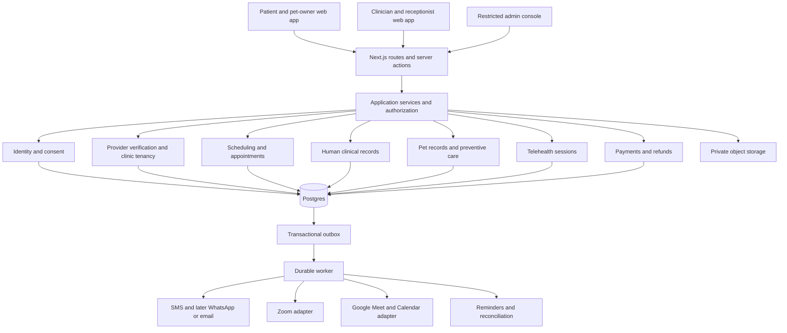

# CareNest: code audit, product assessment and architecture proposal

Reviewed on 6 October 2026. Scope: the local project at `C:\Users\champ\Desktop\carenest`, its database schema, server actions, API routes, public browser flows, test suite and build. Competitor and integration references were checked against primary sources.

## Verdict

**CareNest is a promising prototype, but it is not ready to handle real patient records or compete with Practo.** The obstacle is not the visual design or choice of Next.js. It is that the app promises a complete healthcare service while several important flows are demonstrations and the working flows have failures in authorization and booking consistency.

The harsh assessment: another page, AI feature, species filter or video-call logo will not solve the current weaknesses. A healthcare platform earns trust when the right patient sees the right clinician, the appointment actually exists, the records stay private, and someone resolves failures. CareNest does not yet guarantee those outcomes.

**Recommended direction:** keep Next.js, TypeScript and Postgres; organize the application as a modular monolith; add one durable worker; finish one local booking and follow-up experience for humans and pets. Expand after clinics are using it regularly.

These are findings from this audit, not a claim that every possible defect has been discovered. Live SMS delivery, Google/Zoom authorization, production Neon behavior, payment gateways and authenticated browser flows were not exercised with external credentials.

## What is real today

| Capability | Current implementation | Assessment |
| --- | --- | --- |
| Public doctor search and profiles | Database-backed search, filters, area graph, profiles | Useful foundation; search parameter mismatches and stale availability need repair |
| Patient accounts | OTP, database sessions, signed middleware claims, optional Google login | Working design with dangerous defaults and account-linking weakness |
| Household members | Relational family members and booking references | Useful Indian-market feature; booking ownership validation is missing |
| Appointment requests | Conditional SQL slot holds, clinician accept/decline, attendance | Works on basic paths; expired requests break consistency |
| Surgery enquiries | Database-backed leads, admin approval, referrals, estimates, disputes | Substantial prototype; operational promises and multi-write consistency need attention |
| Prescriptions and notes | JSONB persistence plus doctor actions | Unsafe authorization; demo patient screen is disconnected from actual records |
| Clinic requests | Real clinician-scoped requests | Keep and improve |
| Clinic calendar, patient chart, reports, billing | Mostly hardcoded data or local React state | Demonstrations, not operational clinic software |
| Veterinary section | Five static vet cards; three vet seed records | Display only; main booking buttons have no action |
| Lab orders | Static packages and buttons | No working order flow |
| Video consultation | Booking mode flag | No meeting creation, join flow or session lifecycle |
| Provider onboarding | Multi-step form with local completion state | Shows success without creating a provider |
| ABDM, sharing settings, online follow-up | UI state | Integration settings are not integrations |

Keep the parameterized SQL, revocable sessions, secure cookie options, database-scoped clinician requests, conditional slot hold, household model, human approval of surgical enquiries and estimate history. These are sensible building blocks. Their existence does not prove that the whole application consistently uses them.

## Evidence and validation

- `npx --no-install tsc --noEmit`: passed.
- `npm run build`: passed. Next reports that build-time type validation is skipped by configuration; the separate TypeScript check above passed.
- `npm test`: final result is recorded in `validation-results.md` alongside this report.
- `node docs/audit/reproduce.mjs`: 13 checks passed by reproducing problematic behavior or verifying its direct cause. Output is saved in `reproduction-results.txt`.
- `npm audit --omit=dev`: 12 affected packages: 2 critical, 8 high, 2 moderate. These are package audit results, not 12 demonstrated remotely exploitable application vulnerabilities.
- Browser: homepage, lab page, pet page and video-search link inspected. Clicking lab **Book now** and pet **Book appointment** produced no booking action. `/search?mode=video` left the video filter unchecked.

The reproduction harness transpiles the actual application modules and runs their database queries against a fresh in-memory PGlite database. It stubs framework effects and the authenticated actor; it does not forge a session, send messages, use real records or prove a full HTTP exploit. B01/B02 use the actual transitions in the same order as the clinician action. PGlite serializes work; it is not a substitute for independent connections on production Postgres when testing contention.

## Launch blockers and serious bugs

Severity here is application impact and priority: P0 blocks handling real users; P1 should be repaired before a pilot; P2 is important correctness or usability work. `Bxx` identifies a check in the reproduction script. Other evidence is explicitly source inspection or browser behavior.

| ID | Priority | Finding and trigger | Evidence | Required fix |
| --- | --- | --- | --- | --- |
| F01 | P0 | Missing or invalid SMS configuration falls back to the console adapter and returns the OTP to the browser, including in production. A visitor can sign in as another phone number. | `lib/sms.ts:34`, `app/actions/auth.ts:108`; source | Make production fail closed when SMS settings are absent or inconsistent. Permit visible OTPs only in explicit local/test mode. Verify the real gateway before launch. |
| F02 | P0 | On an empty admin table, the first public login creates the admin. An attacker can claim a fresh deployment; parallel bootstrap requests can also create multiple admins. | `app/actions/auth.ts:235`; source | Provision the first admin through a restricted deployment command. Disable public bootstrap. Add individual accounts, MFA and audited access. |
| F03 | P0 | A doctor-role account can save a note or prescription for an unrelated patient, even without verified KYC or a linked provider. Patient ID and displayed patient name are supplied by the browser. | `app/actions/care.ts:184`, `:205`; B06 | Authorize a verified, active practitioner against the specific encounter, clinic membership and patient consent. Resolve the patient and practitioner names server-side. |
| F04 | P1 | An old request whose hold expired can confirm a new patient's hold. Answering both requests produces two confirmed bookings for one slot because the second slot failure is ignored. | `app/actions/practice.ts:52`, `:64`; `lib/db/slots.ts:178`; B01 | Tie the hold to the booking, not only the account. Require matching booking ID, live expiry and expected state/version in one transaction. Expire the old booking before reuse. |
| F05 | P1 | Declining an old expired request releases another patient's held or already booked slot. That time can then be sold again while the second booking remains confirmed. | `app/actions/practice.ts:65`; `lib/db/slots.ts:191`; B02 | Release only the reservation owned by that booking. Update booking and slot together and treat a failed transition as a failure. |
| F06 | P1 | Booking accepts a family-member ID owned by a different account. Joins then expose that member's name to the attacker and demographics to the clinician. | `app/actions/care.ts:75`; `lib/db/sql.ts:666`, `:701`; B03 | Look up the selected member using both member ID and authenticated account ID before holding anything. Back the relationship with database constraints or an authorization relationship. |
| F07 | P1 | Slot hold, booking insert, event insert and related writes commit separately. A rejected booking insert leaves a hold with no booking; a later event failure leaves a booking without its notification. | `app/actions/care.ts:64`, `:78`, `:95`; B05 | Add transaction support to `Db`; commit the booking, reservation, required audit record and outbox event atomically. Use an idempotency key for retries. |
| F08 | P1 | A suspended doctor remains readable by slug and bookable directly. Search filters ACTIVE providers, but profile/booking lookup does not enforce status. | `lib/db/sql.ts:417`; booking action; B12 | Gate public bookability on active, currently verified provider status, again inside the booking transaction. Support an explicit policy for historical profiles. |
| F09 | P1 | A phone account can enter someone else's email in its profile. The Google callback automatically joins accounts using that unverified local email. A victim later signing in with Google can enter an account the attacker still controls by phone. | `app/actions/profile.ts:48`, `:53`; `app/api/auth/google/callback/route.ts:60`; source | Distinguish contact emails from verified authentication identifiers. Require proof of both accounts before linking. Do not silently link by a mutable, unverified profile field. |
| F10 | P1 | Notes and prescriptions live in shared component state, independent of selected patient. Switching patients leaves the previous patient's chart visible and can submit the previous prescription under the next patient's ID. Reloading does not load saved records. | `app/practice/patients/page.tsx:43`, `:47`, `:54`, `:116`, `:427`; source | Load the real encounter and its records. Key the editor by encounter ID; maintain isolated drafts, unsaved-change prompts and version checks. This deserves a browser regression test. |
| F11 | P1 | The central PHI helper has no application callers. Real pages read records directly, so the advertised policy/audit boundary is not enforced. The helper also catches and ignores audit-write failure. | `lib/phi.ts:29`, `:65`; `app/account/page.tsx`, `app/dashboard/patient/page.tsx`; source | Put authorization and durable audit intent in the actual read/write services. Decide and test failure behavior; do not rely on an unused helper or activity feed as an access audit. |
| F12 | P1 | The clinic layout checks doctor role, but not current verification. Some actions consult a 30-day claims cookie while current KYC may have changed. Provider suspension is also absent from these authorization checks. | `app/practice/layout.tsx`, `lib/auth.ts`, `app/actions/practice.ts:36`; source | Derive sensitive authorization from the current session principal and current provider/clinic membership, including suspension and verification. Short-lived claims can assist routing. |
| F13 | P1 | Past slots and video mode for a clinician without video are accepted by the actual booking action. Arbitrary mode strings are also not allowlisted. | `app/actions/care.ts:36`, `:55`; `lib/db/slots.ts:169`; B04 | Validate time, allowed mode, provider capability and service/subject compatibility server-side, including within the conditional reservation write. |
| F14 | P1 | `/{backslash}audit.example` passes the redirect guard and URL parsing turns it into an external destination. | `lib/routes.ts`; B08 | Parse against the application origin and require the result to keep that origin. Reject backslashes/control characters and prefer an internal destination allowlist. |
| F15 | P1 | Prescription JSON is cast rather than validated. Invalid dose/duration fields and a forged name are persisted; malformed non-array objects can reach persistence. | `app/actions/care.ts:212`; B06; source | Validate bounded arrays and field shapes, clinician identity, encounter, subject type and record lifecycle. Drug safety decisions require clinical review, not a TypeScript cast. |
| F16 | P1 | Homepage and service copy present unsupported scale, verification, response-time, insurance, lab and emergency-service claims. Placeholder phone numbers are shown as emergency contact routes. | `app/page.tsx:107`, `:114`; `lib/content.ts`; `app/pets/page.tsx:114`; footer | Remove unmeasured claims and unverified emergency numbers. Show only contracted services and measured statistics. Label sample profiles/data clearly in a demo. |

Do not solve F04/F05 merely by adding `locked_by = userId`: one account can have multiple bookings, and stale operations can still act on a later reservation from that same account. The ownership token must identify the reservation or booking itself.

## Other discovered correctness and product failures

| ID | Priority | Finding | Evidence and consequence | Fix |
| --- | --- | --- | --- | --- |
| F17 | P1 | Pet booking and video buttons are inert. | `app/pets/page.tsx:269`; browser confirmed. The pet catalogue is separate from live provider search. | Use live vet records and connect buttons to a pet-aware booking flow. |
| F18 | P1 | Lab Book/Add buttons are inert. | `app/labs/page.tsx`; browser confirmed. No order, collection or result workflow. | Implement the full partner/order flow or withdraw the service offer. |
| F19 | P1 | Provider onboarding claims success without persistence. | `app/join/page.tsx:35`; `setDone(true)` is the completion action. | Save validated drafts, authenticate submission, upload documents privately and create a verification case. |
| F20 | P1 | Booking success says confirmed while the saved state is requested. | `app/account/page.tsx:85`; booking action saves requested. A query parameter alone triggers the success banner. | Show request sent and actual status retrieved from an owned booking. Confirm only after acceptance. |
| F21 | P1 | No working patient cancellation/rescheduling or clinician no-show action. | Source search of actions; account copy asks users to cancel but provides no implementation. | Add guarded, idempotent transitions, release rules, provider updates and later refund handling. |
| F22 | P2 | Search inputs disagree with the search page contract. | `components/care-search.tsx` sends `near` and `mode`; page expects `area` and `video=1`. It reads `q` for symptom routing but never passes ordinary text into `query.text`. Browser confirms ignored video mode. | One typed search contract; test locality, practitioner name, speciality, human/vet mode and video links through real pages. |
| F23 | P2 | Duplicate reviews are possible. | `hasReviewed` then `addReview` is a read/write race; no unique constraint. B13 reproduces two successful real action submissions. | Add a stable provider/user or encounter review key enforced by a unique constraint. Make rating updates consistent with insertion. |
| F24 | P2 | Account page treats provider ID as a slug. | `app/account/page.tsx:54`, `:147`; B09. Seeds set ID equal to slug, hiding the problem. | Join by stable provider ID and use slug only for URLs; use realistic fixtures with different values. |
| F25 | P2 | Upcoming visits are not filtered by appointment date or sorted by appointment time. | `app/dashboard/patient/page.tsx:33`; query sorts by creation date and omits actual slot timestamp. | Return timestamps; filter future eligible visits and sort earliest first. Handle pending visits explicitly. |
| F26 | P2 | Relative appointment labels become stale. | `slotLabel` returns Today/Tomorrow and the action stores that label permanently. B11 verifies the formatter's behavior. Cards also use seeded `next_slot` strings. | Store instants; format relative time when rendering. Compute real next availability. |
| F27 | P2 | Slot generation anchors to UTC date instead of the IST calendar date. | `lib/db/slots.ts:85`; B10. At 01:30 IST, `days=1` creates no slots for that day; the default horizon loses a day. | Derive today's date in clinic timezone before generating the rolling horizon. |
| F28 | P2 | Queue function returns a queue for tomorrow and requested bookings. | `lib/db/queue.ts:60`; B07. It checks whether a slot exists, not whether the booking is confirmed and today. | Validate booking state, owned live reservation and today's IST date. |
| F29 | P2 | Queue date comparisons depend on the database timezone; slot joins include stale bookings. | `lib/db/queue.ts:82`, `:143`, `:148`. Reused slots can join multiple historical bookings. | Use explicit clinic timezone and join only the slot's current active reservation. |
| F30 | P2 | Queue ETA assumes fixed durations and does not include real check-in, start/end, walk-ins or no-shows. | Derived solely from BOOKED/ATTENDED state. It is an estimate, not reliable clinic progress. | Capture actual encounter transitions; show freshness and uncertainty. Do not base arrival promises solely on this heuristic. |
| F31 | P2 | Failed notifications may wait until the daily cron. Unknown event kinds are marked SENT without delivery or a failure trace. | `vercel.json:5`; `lib/drain.ts`; comment promises a trace but no last_error is written in the unknown-handler branch. | Frequent durable worker, dead-letter monitoring, retries, handler versioning and idempotent consumers. |
| F32 | P2 | Google-only accounts can book with no phone, but the outbox only sends SMS. | Phone is nullable in schema and typed as non-null in `User`. Notifications fail with no phone; `submitReview` fallback can call `.slice` on null when name is empty. | Model nullability accurately; collect a verified contact before services that need it, or support email/app notifications. |
| F33 | P2 | OTP consumption and attempt enforcement are separate reads/writes. | `app/actions/auth.ts:123`, `:131`, `:141`; source. Concurrent verification can reuse a code or exceed the intended attempt budget. | Atomic challenge consume/attempt updates, hashed challenge material, endpoint throttling and concurrency tests. |
| F34 | P2 | Nearby suggestions count all doctors while preserving restrictive filters. | Search page plus `neighbouringAreas`. A chip can lead to another empty page for a chosen speciality or fee, contrary to the stated guarantee. | Count neighbours using the same filters, or explicitly offer relaxing filters. |
| F35 | P2 | Footer navigation and policy links all route to Help. | `components/site-footer.tsx:47`; browser confirmed. Placeholder company identity is shown. | Map links to real destinations; publish actual privacy, consent, grievance, cancellation and company details. |
| F36 | P2 | Practice shell is mounted in both layout and requests page. | `app/practice/layout.tsx`, `app/practice/requests/page.tsx`. Duplicate navigation and nested layout are inevitable on that route. | Mount the shell once in the layout. |
| F37 | P2 | Self-profile date of birth/gender do not synchronize to the household self row. | `app/actions/profile.ts:53`, `:64`; rename updates only name. | Update all shared person fields in one transaction; avoid duplicating authoritative demographic fields. |
| F38 | P2 | Surgery AI runs inline after persistence, not in a job. An unauthenticated caller can rotate phone numbers to trigger model work. | `app/actions/leads.ts:46`, `:66`; only a phone bucket exists. No per-network/global cost control. | Enqueue bounded triage after responding; add network/account/cost limits and explicit text-processing consent. |
| F39 | P2 | Referral routing and provider status history use separate writes. | `routeLead` inserts referrals before guarded transition; `transitionDoctorStatus` writes history then status. Failure or concurrent requests can duplicate/inconsistently record routing. | Transactional transitions with expected state and unique/idempotent referral intent. |
| F40 | P2 | Symptom matching uses substrings and English-only normalization. | `lib/taxonomy.ts`: `fit` can match `fitness`; Hindi script is removed; negation/history are not interpreted. Availability test checks a hardcoded speciality list rather than actual supply. | Treat this as a limited navigation aid. Have clinicians approve rules and adversarial examples; use boundaries and supported-language handling. |

## Engineering risks that need work, without claiming a proven exploit

1. **Database migrations run on application cold starts.** `ensureSchema` issues DDL that drops/recreates constraints and triggers. Concurrent cold starts can contend and application credentials need unnecessary DDL permissions. A failed ready promise remains cached for the process. Add ordered migration files, a real migration command and an isolated migration identity. `npm run migrate` is mentioned in a comment but is absent from `package.json`. Verify the Neon schema execution path: the app sends the entire script while tests and seed split statements.
2. **The test suite copies substantial query logic.** `tests/helpers.mjs`, slots and outbox tests can stay green while production actions drift. Use direct service tests, independent-connection Postgres contention tests and browser journeys. PGlite is useful for fast SQL checks; it does not establish production networking or locking behavior by itself.
3. **Type checks are disabled in builds.** Remove `ignoreBuildErrors`; keep an explicit CI type check. This audit's separate type check passed, but the release pipeline should enforce it.
4. **Dependency hygiene needs attention.** Next 16.3.3 falls within the affected range of the official next/og RCE advisory; the fix is 16.3.6 or later. No `next/og`/`ImageResponse` use was found, so this audit does not assert that this route is exploitable here. Upgrade to a reviewed patched version; evaluate transitive advisories by reachability. Keep `shadcn` CLI out of runtime dependencies and remove unused NeDB. Do not blindly force the audit's suggested shadcn downgrade. [Official Next.js advisory](https://github.com/vercel/next.js/security/advisories/GHSA-vcvr-r3jv-pc5j).
5. **Clinical documents need typed relational envelopes.** The shared documents table has no typed patient/practitioner/encounter foreign keys and review uniqueness. Keep JSONB for structured content, but add domain-specific ownership, lifecycle, version, author and encounter columns. An index is not an authorization boundary.
6. **No real clinic tenancy model.** One provider row carries clinic text and a user link. It cannot properly represent group practices, visiting doctors, multiple locations or receptionists. A region claim is neither clinic membership nor physical data residency.
7. **No visible release controls.** Add linting, pinned test tooling (`tsx` is currently fetched by npx), migrations, CI checks, integration smoke tests and reviewed environment validation. Next also warns that middleware should migrate to the proxy convention.
8. **Performance needs measurement.** `/account` does provider and estimate lookups per booking/lead. Search and sitemap silently cap each population at 100 without pagination. Images are unoptimized. Batch read models, paginate search and sitemap, optimize owned imagery, and measure mobile Core Web Vitals with real traffic.
9. **Privacy and operations are incomplete.** Add consent records, access audit, encryption/key management, private uploads, backup/restore drills, retention workflows, customer support and incident handling. Do not send diagnosis or prescriptions to product analytics. Never claim that a logical IN-MH field enforces data location.

## Competing with Practo

Practo's competition is a combined marketplace and clinic workflow. Its public consultation offer includes doctor consultation, prescriptions and follow-up; Ray lists scheduling, billing, charting, reminders and record sharing. Those are table stakes, not a unique selling point. [Practo Consult](https://www.practo.com/consult), [Ray plans and capabilities](https://www.practo.com/providers/clinics/ray/plans).

**Pets alone are not a moat.** Practo announced veterinary teleconsultations in March 2021. That historical launch does not prove current availability in every locality, but it does disprove the idea that adding pets creates a wholly new category. [Practo veterinary announcement](https://blog.practo.com/practo-launches-online-veterinary-consultations/).

The competitive proposal below is an inference and strategy recommendation, not a claim that Practo cannot offer these features.

**Start with Navi Mumbai**, because the code already contains local supply and locality data. Recruit a small set of real participating clinics and vets before buying traffic. Win on useful local outcomes:

- Confirmed availability that matches the clinic's actual schedule.
- A receptionist workflow that handles online bookings and walk-ins in one place.
- Household management for parents and children; a separate pet record with vaccination follow-up.
- Transparent service prices, home-visit boundaries and cancellation terms.
- A verified, maintained urgent-care directory with confirmed hours and a clear date last checked.
- Follow-up with the same practitioner and records that can be exported or deliberately shared.
- Hindi/Marathi/English navigation and notifications for the initial market.

Measure completed appointments, clinic response time, failed confirmations, cancellation/no-show rate, patient repeat use, clinic weekly activity and contribution margin. Do not use raw signups or invented doctor counts as evidence of traction.

Offer clinics a useful scheduling/communications subscription and validate willingness to pay. Model actual costs per completed visit: messaging, hosting, provider integration, support, refunds and acquisition. Do not promise a lifetime free service until the business model supports it. Avoid taking on surgery coordination, pharmacy, insurance, boarding, taxi and nationwide diagnostics at the same time; each brings a separate supply chain and support burden.

## Proposed architecture

**A modular monolith with Postgres and a durable background worker is the right next architecture.** You have consistency problems inside one application; adding network boundaries now would make them harder to repair. Extract services later only when independent scaling, ownership or failure isolation justifies it.



Use the existing Postgres deployment if its region, backup, access and reliability configuration meets the product's needs. PGlite remains a local/test tool. Add transaction methods or a compatible unit-of-work implementation that preserves the same connection/transaction for all operations. Do not implement `BEGIN` and `COMMIT` as unrelated HTTP requests. For fixed operations an atomic SQL statement or driver-supported batch transaction can work; interactive workflows need a transaction-capable connection.

Suggested code boundaries:

```text
app/                          pages, routes and actions; thin adapters
modules/
  identity/                   sessions, verified identifiers, account linking
  consent/                    consent receipts and caregiver permissions
  providers/                  practitioners, credential verification, suspension
  clinics/                    organizations, locations, staff and memberships
  scheduling/                 schedules, exceptions, reservations, availability
  appointments/               lifecycle, check-in, attendance, cancellations
  human-care/                 patients, encounters, prescriptions, documents
  pet-care/                   pets, guardians, vaccines, weight and encounters
  telehealth/                 provider adapters, OAuth connections, join access
  payments/                   orders, webhook events, refunds, reconciliation
  notifications/              templates, outbox, delivery and preferences
  reviews/                    attendance eligibility, uniqueness, moderation
  support/                    cases, operational overrides and audit
infra/
  db/                         migrations, database adapters and transactions
  storage/                    private blobs and signed access
  jobs/                       durable delivery, retries and scheduled work
```

Application services must accept a validated session principal and authorize the requested resource. Repositories perform scoped database queries. Do not pass an arbitrary browser patient ID directly to a generic document writer.

Critical database guarantees:

- Stable IDs distinct from public slugs.
- Clinic memberships and scoped staff permissions.
- A reservation linked to its exact booking, with expiry and expected version.
- A unique active appointment per single-capacity slot; an overlap constraint where variable durations require it.
- Foreign keys and explicit allowable lifecycle states.
- Exactly one valid care subject per appointment.
- Atomic booking/reservation/audit-intent/outbox writes.
- Unique payment/webhook/idempotency keys and reservation ownership on every transition.
- Unique review eligibility key.

Postgres supports uniqueness and exclusion constraints; choose them around the actual capacity model rather than assuming a slot row alone solves the full booking lifecycle. [PostgreSQL constraints](https://www.postgresql.org/docs/current/ddl-constraints.html).

A frequent worker should drain the outbox, retry integration jobs, expire reservations and reconcile provider events. Redis is optional for throttling/caching or a chosen queue implementation; it should not be the only protection against double booking. Keep clinical records out of public caches and service-worker offline caches. Start with responsive web/PWA navigation; build native apps after repeat use justifies the maintenance cost.

## Human and pet data model

An account is the person logging in. It is not necessarily the patient receiving treatment. Do not turn a pet into a family member with a species field and reuse human prescription rules.

| Entity | Purpose |
| --- | --- |
| users, verified_identities, sessions | Authentication and contact channels |
| clinics, clinic_locations, clinic_memberships | Organizations, physical sites and staff access |
| practitioners, credentials, service_offerings | Human/vet scope, verified registrations, fee and mode |
| human_patients, caregiver_grants | People receiving care and authorized household access |
| pets, pet_guardians | Animals receiving care and authorized owners |
| appointments, reservations | Shared scheduling for one human patient or one pet |
| human_encounters, veterinary_encounters | Separate clinical treatment contexts |
| prescriptions, document_versions | Authored, versioned treatment documents tied to an encounter |
| vaccinations, preventive_care_tasks, weight_events | Pet history and reminders |
| consent_receipts, record_access_events | Purpose, scope, recipient and audit |
| integration_connections, telehealth_sessions | Provider credentials and meeting lifecycle |
| payment_orders, refunds, webhook_events | Financial state and reconciliation |

For a straightforward relational design, appointments can carry nullable `human_patient_id` and `pet_id`, both with foreign keys, with a check that exactly one is populated. Enforce practitioner/subject/service compatibility inside the booking transaction. Alternatively use a properly constrained subject registry; avoid unconstrained polymorphic IDs.

Pet profiles should include species, breed, approximate or known birth date, sex, neuter status, microchip if present, allergies, owner contacts and dated weight entries. Keep human and veterinary drug catalogues, dosing validations, vaccine templates and consent workflows separate. Show pet records through pet guardianship, not generic access to every owner's human records.

**Pet MVP:** create/select pet, choose a verified vet who treats that species, choose supported clinic/home/video service, confirm the appointment, complete the encounter, receive records, and schedule a vet-reviewed preventive-care reminder. Later add visit travel zones, multiple guardians, vaccination-card export and vet-directed follow-up. Separate dog and cat vaccine templates; the current combined puppy/kitten schedule is not an adequate clinical model.

Verify veterinarians through the relevant veterinary registration process, distinct from human medical registration. The VCI publishes an Indian Veterinary Practitioners Register; confirm current registration with the appropriate authority rather than relying only on a static profile badge. [VCI register](https://vci.dahd.gov.in/ivpr).

## Zoom and Google Meet implementation plan

The existing Google login only requests `openid email profile`. It provides neither Calendar/Meet authorization nor stored refresh credentials. Treat clinician integration connections as a separate, explicit connect-account flow.

Start with **scheduled meetings opened through a protected Join consultation page**. Implement both provider adapters behind one interface, choose one to pilot first, and enable video booking only after its complete journey works. Embedding can follow when the provider's supported SDK, eligibility and product experience justify it.

| Choice | How to implement | Key constraint |
| --- | --- | --- |
| Google Meet with scheduling | Clinician Google OAuth; create a Calendar event with a new `conferenceData.createRequest`, `conferenceDataVersion=1`; wait for successful conference creation | Conference creation is asynchronous; check the organizer calendar's supported conference solution. Use a unique event/conference per encounter. |
| Google Meet without a calendar invite | Meet REST `spaces.create`; store the returned meeting URI and resource ID | Requires suitable user authorization and `meetings.space.created` scope. |
| Zoom using clinicians' accounts | User/account OAuth for the host; create/update/cancel meetings through the Meetings API | Manage connected-account permissions and required app review. |
| Zoom using CareNest-controlled hosts | Server-to-server OAuth within the platform's own Zoom account | Does not grant access to arbitrary independent doctors' accounts; provision sufficient host capacity. |
| Zoom inside the app later | Meeting SDK plus backend-generated authorization; host-specific authorization for starting meetings | Meeting creation and SDK authorization are separate steps. Keep host capabilities private. |

Sources: [Google Calendar conferencing](https://developers.google.com/workspace/calendar/api/guides/create-events), [Meet space creation](https://developers.google.com/workspace/meet/api/reference/rest/v2/spaces/create), [Zoom Meetings API](https://developers.zoom.us/docs/api/meetings/), [Zoom internal apps](https://developers.zoom.us/docs/internal-apps/), [Zoom Meeting SDK authorization](https://developers.zoom.us/docs/meeting-sdk/auth/).

Do not assume a Meet URL is an embeddable video SDK. The Meet add-ons SDK places your application inside Meet; that is a different product direction from placing a call inside CareNest. Verify any proposed embedded SDK's availability before promising it. [Google Meet developer products](https://developers.google.com/workspace/meet).

Proposed adapter boundary:

```ts
interface TelehealthProvider {
  createSession(input: SessionInput): Promise<ProviderSession>
  updateSession(session: ProviderSession, change: ScheduleChange): Promise<void>
  cancelSession(session: ProviderSession): Promise<void>
}
```

Use a provider-neutral `telehealth_sessions` row: appointment ID, provider, organizer connection ID, external resource ID, protected participant join information, scheduled start/end, provisioning state, attempt count and timestamps. Keep refresh tokens and host start capabilities encrypted server-side. Prefer deriving the host start capability on demand rather than treating a long-lived URL as harmless data.

The lifecycle should be:

1. Validate consent, contact, practitioner capability and the care subject.
2. Commit the confirmed appointment plus a unique meeting-provisioning event.
3. A worker provisions the provider session and stores the result. Use stable application idempotency keys and provider reconciliation where the API does not promise idempotency.
4. Notify participants that the consultation is ready. Make a failed provisioning job visible to staff; do not tell a patient the call is ready before it exists.
5. `/consultations/[appointmentId]/join` validates a current session, participant/guardian relationship, appointment state and time window. Issue the participant's own access only.
6. Verified provider events update session status. For Zoom validate webhook signatures and deduplicate event IDs. For Google validate the relevant push/subscription channel and permission model. Clicking Join alone is not proof of attendance.
7. Cancellation/rescheduling updates the appointment, integration job and notification consistently. Rotation/revocation or ending a room follows provider capabilities; hiding a previously issued URL does not invalidate it.
8. Practitioner completes the encounter and publishes the appropriate prescription/visit summary and follow-up window.

Use one room per encounter. Configure provider-supported waiting/admission controls. Keep diagnosis, symptoms and pet/human medical details out of meeting titles, invites and routine notifications. Disable recording/transcription by default. If offered later, implement separate consent, provider capabilities, storage, retention and deletion handling. Test revoked OAuth, expired tokens, late provider responses, unavailable host capacity, duplicate events, browser microphone failures, low bandwidth, no-show, reschedule and cancellation.

Avoid launching chat and both embedded calling SDKs simultaneously. First make one completed video encounter reliable, then expand provider choices.

## India-specific product requirements

For human teleconsultations, map the workflow to the applicable telemedicine requirements with a clinical and legal owner: practitioner identity/registration, patient identity and age, consent where applicable, modality suitability, permitted prescription behavior, encounter documentation and an in-person escalation path. The official NMC telemedicine material is an important baseline; veterinary care needs its own scope review. [NMC telemedicine guidance](https://www.nmc.org.in/wp-content/uploads/2019/10/Public_Notice_for_TMG_Website_Notice-merged.pdf).

The 2025 DPDP rules and commencement timeline have been published with phased enforcement. Do not assume every provision began on the same date or that a generic compliance checkbox solves the problem. Implement clear notices, purpose-limited consent, caregiver/child handling where relevant, processor contracts, secure access, retention, rights requests and a breach workflow, with the applicable dates checked for launch. [MeitY rules and timeline](https://www.meity.gov.in/documents/act-and-policies/digital-personal-data-protection-rules-2025-gDOxUjMtQWa).

Create real privacy, teleconsultation consent, cancellation/refund and grievance pages. Before sending clinical text to a hosted AI provider, establish the purpose, authorized sharing and contractual safeguards. AI triage and summaries should remain assistive and reviewed; model-generated urgency must not silently approve, reject or prescribe. ABDM should be a genuine later integration with sandbox and approval work, not a UI badge.

## Proposed delivery order and acceptance gates

This is a suggested sequence, not a guaranteed calendar estimate. Reassess scope after each gate; a solo developer should expect integration and clinical review to extend the schedule.

| Phase | Work | Evidence required before moving on |
| --- | --- | --- |
| 1: security and truthfulness | F01-F16; remove misleading/inert offers; verified admin provisioning; dependency patches; CI | Production rejects demo OTP; outsider cannot bootstrap admin; unauthorized chart/household access denied; old booking cannot modify a new reservation |
| 2: real appointment system | Transactions, booking ownership, schedule editing, staff roles, walk-ins, cancellation, rescheduling and attendance | Independent-connection contention test; failure injection rolls back cleanly; patient and receptionist see the same state |
| 3: usable human and pet records | Real patient charts, separate pet subjects, practitioner verification and consent | Correct records survive reload; switching subjects never crosses drafts; household and pet-guardian access is tested |
| 4: video and notifications | Durable worker; Meet and Zoom adapters; one pilot provider first; protected join flow and support recovery | Successful and failed calls tested on mobile; expired/revoked credentials recover; cancellation does not leave unmanaged rooms |
| 5: payment if the service requires it | Gateway orders, verified webhooks, idempotency, refunds, reconciliation | Duplicate/out-of-order payment events cannot duplicate charges/bookings; failed calls have a working refund/support path |
| 6: local pilot | Real contracted clinics/vets; operational support; accurate directory and pricing | Repeated completed visits; measured clinic response, no-shows, delivery failures, support volume and costs |

Do not begin paid acquisition until at least one complete human journey and one complete pet journey work without developer intervention. A possible pilot target is a small set of active practices and around 100 completed visits; choose the threshold with the clinics and measure completion quality, not just volume.

The next implementation task should be **booking ownership, transactions and clinical authorization**, followed by replacing the demo clinic chart. Video integration belongs after those repairs because it depends on trustworthy appointments and participant access.
