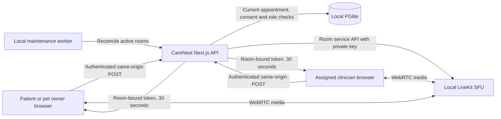

# LiveKit replaces Zoom — local implementation, 8 October 2026

This document supersedes earlier Zoom API/Meeting SDK setup instructions. CareNest now uses a local LiveKit server for in-app video. Google Meet remains an optional clinician account integration. No cloud project, LiveKit Cloud account, paid video subscription, public tunnel or cloud hosting deployment was created.

## What changed

- `/consult/[bookingId]` renders the LiveKit call screen inside CareNest. Patient and clinician appointment buttons open this screen.
- The default `provider.doctors.video_provider` is `livekit`. A clinician can choose `google` after connecting their Google account. Pending/confirmed video appointments block changing this preference, preventing an unprovisioned appointment from silently switching vendors.
- Zoom OAuth requests are rejected. Its embedded route and webhook return HTTP 410. No Zoom API calls remain in the implementation. Old Zoom rows are preserved as historical data; an existing legacy booking must be reviewed/rebooked rather than redirected silently.
- Google OAuth, Calendar conference reconciliation and scoped external join links continue to work. Credentials and owner consent are still required before a real Google account can be connected.
- LiveKit is a separate media process. The Next.js backend remains the authority for identity, consent, appointment state and room access.

## Local architecture

Signalling and administrative API use port 7880, WebRTC TCP uses 7881 and UDP uses 7882. Docker publishes all three to **127.0.0.1 only**. Inside the container LiveKit binds its listener normally, but host port publication does not expose it to the LAN. The image is pinned to `livekit/livekit-server:v1.13.7`, with a 512 MB container limit and one CPU. This is a development sizing choice, not a benchmark or production capacity claim.

The current website also binds to loopback. A physical phone cannot reach your computer through its own `127.0.0.1`. Phone/LAN testing needs a deliberate HTTPS origin, trusted certificate, reachable media addresses and firewall rules. Those changes have not been made. The responsive website call screen and native Expo app are separate deliverables; this change does not claim a native LiveKit call integration.

## Data types and structures

| Field or object | Type and constraint | Purpose |
|---|---|---|
| `provider.doctors.video_provider` | SQL `TEXT`, `NOT NULL`, `CHECK IN ('livekit','google')` | Explicit vendor preference; default LiveKit |
| `video_sessions.id` | Opaque UUID-prefixed SQL `TEXT` | Internal room record |
| `booking_id, revision` | Foreign-key `TEXT`, integer revision, unique pair | One session per immutable appointment revision |
| `provider` | SQL `TEXT`, application-validated `livekit` or `google`; legacy Zoom retained | Select the adapter without mixing account tokens |
| `request_ref` | Unique UUID `TEXT` | Stable creation identity across retries |
| `external_id` | Opaque `cn_` plus 32 hexadecimal characters | LiveKit room name, without patient name/phone/clinical details |
| `state` | Existing `PENDING`, `PROVISIONING`, `READY`, `CANCELLED` state values | Durable provisioning and cleanup state |
| Participant identity | HMAC of booking ID, revision and actor ID | Different scoped pseudonyms for patient and clinician |
| Join response | `{serverUrl, participantToken, expiresIn: 30}` | Browser memory only; no localStorage token persistence |
| Permission set | JWT video grant scoped to one room | Camera/microphone publishing and subscription; no room administration or recording grants |
| Active-room reconciliation | Set of two expected HMAC identities | Reject extra identities without comparing names |

Migration `0005-livekit-video` adds the preference and provider/external-ID index. Earlier applied migrations are unchanged. The unique booking/revision index is used for creation and current-room lookup; the external-ID index supports room reconciliation. Audit rows record actions and booking IDs, never join JWTs or API secrets.

## Authorization and lifecycle

1. A video booking requires the clinician to offer video, current verified clinician access, and explicit patient consent. LiveKit configuration must be present; Google requires that clinician’s active Google connection.
2. Confirmation reaches the existing durable outbox. The video adapter selects the current room vendor or clinician preference and prepares a stable opaque room name.
3. `POST /api/video/[bookingId]/livekit` requires a signed-in current user and an exact same-origin header. It accepts no arbitrary room name, identity or role from the caller.
4. The backend joins the booking, clinician, patient account, clinic and consent records. Both accounts must be active; the doctor must retain verified access and the clinic must remain active. Only the booking owner and assigned clinician qualify.
5. Joining opens 10 minutes before the scheduled start and closes 30 minutes after the scheduled end. SQL database time controls the window. The early allowance covers setup; the late allowance supports a delayed consultation. These are product defaults requiring clinic review before launch.
6. The server creates or reasserts the room before issuing a token, including when LiveKit previously removed an empty room. This preserves the two-participant cap. Creation uses the same name on retry, preventing duplicate rooms after uncertain network outcomes.
7. Before signing, a transaction rechecks current access and the room revision. The client gets a 30-second token with camera/microphone sources only, subscription enabled, and data/metadata updates disabled. A clinician token has no general room-admin grant.
8. Cancellation/rescheduling and consent revocation use the existing cleanup events. LiveKit sessions become unavailable in the database before network deletion. Failed deletion remains retryable because the external room reference is retained.
9. The maintenance worker checks LiveKit rooms and removes unrecognized participants. Cancelled, invalid, revoked or expired sessions are deleted. Future rooms can be physically removed while remaining eligible to reopen at their appointment time.

### Rate limits and their reasoning

Join-token issuance uses a rolling database-backed budget of **5 per account per 60 seconds**, shared across appointments. This supports an initial join, reconnection and the client’s 20-second access checks without allowing unlimited room creation/signing. A 429 response includes `Retry-After`. The client stores the token in component memory and starts with microphone/camera off; only the user’s controls request media access.

The existing local worker wakes every 5 seconds. This is an intended reconciliation cadence, **not a guaranteed revocation deadline**: backlog, failed network calls or a stopped worker can delay it. SDK server API requests time out after 8 seconds. Empty rooms expire after 300 seconds; rooms vacated by all participants use a 30-second departure timeout. These limits reclaim resources but do not replace authorization.

### Self-hosting limitation that must remain visible

An issued LiveKit token is a bearer credential. Self-hosted LiveKit does not offer Cloud’s instant token revocation. Token expiry controls initial connection, and an active connection can outlive that expiry. Deleting a room disconnects its participants, but a still-accepted token can recreate a room; the worker deletes retired rooms again. Browser access checks additionally disconnect the normal CareNest client after access changes. A modified client could ignore those checks. Do not represent this as instantaneous or mathematically bounded revocation, particularly while the worker is unavailable.

Before regulated production use, review this model and implement a stronger signalling admission/revocation boundary if immediate revocation is required. Also distinguish transport encryption from end-to-end encryption: this implementation does not configure LiveKit E2EE. The self-hosted media server is trusted. Recording and egress are not deployed or granted; chat/data and screen sharing are disabled in the interface and token permissions.

## Run, verify and stop

Run `npm run video:local` to prepare the local service. It verifies that Docker uses a local named-pipe/Unix-socket context, generates a random private key pair, writes its configuration under `.data/infrastructure/livekit`, and updates `.env.local` without printing credentials. It starts only the labelled CareNest container and rejects an existing container that does not match its managed loopback configuration. Restart the CareNest app afterwards to load the environment. Keep the config/key files private and backed up; changing keys invalidates outstanding tokens.

Run `node scripts/verify-livekit-local.mjs` for a synthetic two-participant network check. This uses the official Node realtime SDK, creates only its own `verify_` room, tests two connections and room deletion, then closes its synthetic clients and room. It does not access the camera, microphone or any real patient records.

Stop video with `docker stop carenest-local-livekit` when it is not needed. The container has a restart policy, so Docker Desktop can start it again after restart. The app can run without the media service, but video calls will fail until it is started. Existing Docker services were not modified.

Evidence is stored beside this document: `livekit-tests.txt`, `livekit-final-targeted-tests.txt`, `livekit-typecheck.txt`, `livekit-build.txt`, `livekit-local-verification.json`, and `livekit-full-tests.txt`. The complete regression run passed 201 tests; the final focused run passed 10 tests, including future-room reopening and loopback origin handling. The final production build passed and the website dependency audit reported zero known advisories. The local SDK check confirms room creation, two real synthetic connections and disconnection on deletion. It explicitly records that a real device camera/microphone call is still unverified. The website dependency audit and native app dependency audit must be read separately; the native prototype’s previous unresolved advisories still block its release.

Live HTTP checks exposed and fixed a local origin mismatch: Next.js can report `localhost` internally while the caller actually uses `127.0.0.1`. Local requests now recognize the actual loopback Host at the same port, without trusting forwarded headers or admitting foreign hosts. Private credentials are protected with Windows ACLs, including `.env.local`; the protection script now works in both Windows PowerShell and PowerShell 7. Browser visual verification remains blocked by automatic review of an unsupported internal browser-error page; server/API checks are not a substitute for a visual device test.

## Later AWS / Google Cloud placement

The app/API, database, workers and object storage can migrate as described in the existing detailed cloud plan. LiveKit adds a long-running SFU service requiring reachable WebRTC UDP/TCP, secure signalling and optional TURN. Do not place its media process in a request-only serverless function.

On AWS, use appropriately sized EC2 nodes, TLS termination and network load-balancer configuration compatible with signalling and media, plus Redis for a distributed deployment. On Google Cloud, use Compute Engine nodes or a carefully configured GKE deployment, compatible network load balancing and Redis/Memorystore. Capacity, node identity, draining, NAT/TURN and firewall behaviour require load and device tests on either cloud. No resources have been provisioned.

For cost modelling, assume two 700 kbps camera streams plus two 24 kbps audio streams in a 30-minute consultation. Relaying both directions produces roughly `2 × 724,000 × 1,800 ÷ 8 ÷ 1,000,000,000 = 0.326 GB` of media-server outbound traffic before protocol overhead, retries or screen sharing. This is an explicit scenario, not a measured default. Multiply completed call minutes and actual bitrates to estimate bandwidth, then add SFU instance hours, TURN relay traffic, load balancing and operations. The previous Zoom API licensing assumptions no longer apply. Neither AWS nor Google Cloud is universally cheaper; use the actual Indian region and measured traffic in the existing cost worksheet.

## Remaining work outside this replacement

Real Google OAuth registration/consent and a two-account Meet call, SMS sender/DLT and delivery setup, payment/business KYC, actual company/grievance details, professional clinical/privacy/prescribing approvals, licensed partners, ABDM contracts, native dependency remediation and native device release testing remain outstanding. This video replacement preserves the completed local human/pet, clinic, records, pharmacy, privacy and billing workflows; it does not invent external registrations or approve regulated operations.

## Primary references

- [LiveKit local server setup](https://docs.livekit.io/transport/self-hosting/local/)
- [Access tokens, permissions and self-hosted revocation behaviour](https://docs.livekit.io/frontends/reference/tokens-grants/)
- [Room API and deletion behaviour](https://docs.livekit.io/reference/other/roomservice-api/)
- [Official server releases](https://github.com/livekit/livekit/releases)
