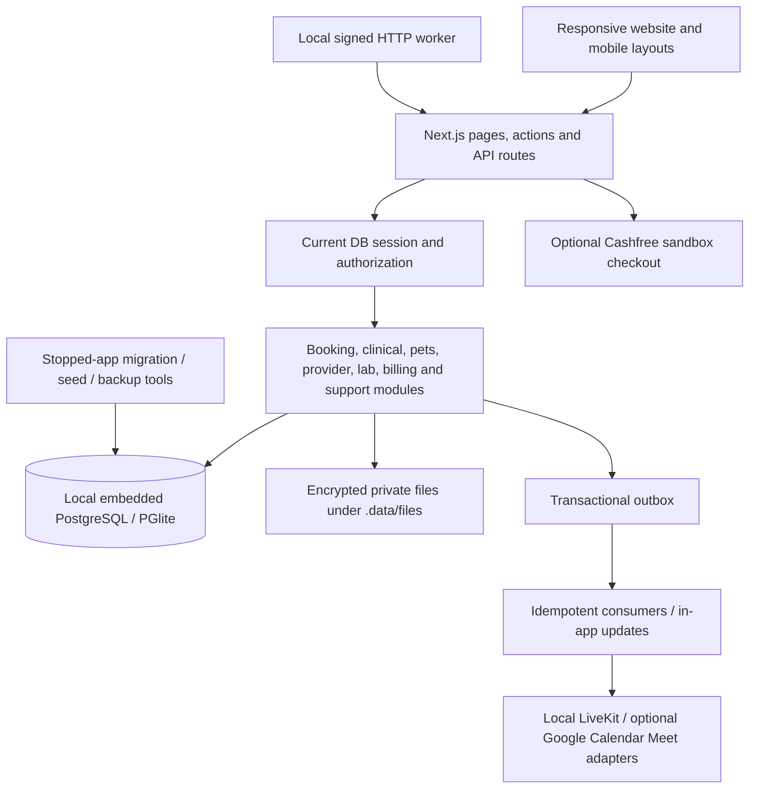

# CareNest local implementation and operating guide

Updated 8 October 2026. This is the guide for the implemented local application. The audit dated 6 October remains historical evidence; the cloud architecture documents remain future migration designs. No AWS, Google Cloud, hosted database, storage bucket or deployment was provisioned. Automatic symptom routing is disabled by default; ordinary text discovery still works. Only enable ENABLE_SYMPTOM_ROUTING after clinical review of its rules.

## Start and stop

From the project directory:

```powershell
npm install
npm run seed
npm run dev
```

Seeding is optional after the initial setup and must run with the application stopped. It adds explicitly labelled sample providers, areas, sample clinic membership, a sample lab package and seven days of appointment slots. It does not reset provider suspension or replace a real verified provider. For production-mode testing on your own computer:

```powershell
npm run build
npm start
```

Open `http://127.0.0.1:3000`. A different local port is supported: `npm run dev -- --port 3001`. The runner forces the embedded PostgreSQL database and binds to the loopback interface. Even if a DATABASE_URL exists in another environment file, this runner does not use it. Do not start multiple instances against `.data/pg`; a process marker blocks the normal second startup. Stop with Ctrl+C before running migration, seed, administrator or backup commands. A stale marker is removed only after its recorded process is confirmed absent.

Startup first applies ordered, checksummed migrations, then starts Next.js and a signed HTTP worker. The worker does not open another copy of the embedded database. It calls the application's internal worker endpoint every five seconds. The endpoint verifies timestamp, nonce and HMAC, rejects replays, expires old appointment holds, materializes calendars, schedules ten-minute appointment reminders, emits due pet reminders and drains events. AI delivery stays disabled. Explicitly configured Fast2SMS and email senders can deliver messages under their recipient, preference and message-count limits.

Phone sign-in requires a configured SMS/WhatsApp provider. The runner defaults to `SMS_PROVIDER=disabled` and `ALLOW_LOCAL_OTP=0`; it no longer automatically displays a demo code. The current private settings explicitly select the user-authorized Fast2SMS Quick SMS demo, capped at two OTP attempts per rolling day; a Smart OTP ID is needed only when switching to the cheaper approved-template route. Gmail demo delivery separately requires the sender's app password. See [DEMO_SMS_WHATSAPP_GMAIL_GOOGLE_SETUP.md](DEMO_SMS_WHATSAPP_GMAIL_GOOGLE_SETUP.md). An operator can explicitly opt into fictional local demo login with `SMS_PROVIDER=console` and `ALLOW_LOCAL_OTP=1`, only under `CARENEST_LOCAL_MODE=1`. Such codes do not prove phone ownership and cannot be reused after switching to real phone delivery. Do not expose this local runner through a public tunnel or change it into a public deployment.

## Sample users and operator access

| Local sample | Phone | Where to go |
| --- | --- | --- |
| Doctor: Dr. Ananya Deshmukh | 9000000001 | `/practice/requests` |
| Veterinarian: Dr. Neha Kulkarni | 9000000002 | `/practice/requests` |
| Sample lab operator | 9000000003 | `/staff/labs` |
| Patient | Any other locally tested valid ten-digit number | `/dashboard/patient` |

These are fictional sample identities and registrations. They are available only through the explicit local demo exception and must not be advertised as professionally verified doctors or real laboratory services. Sample video capability still requires a configured local LiveKit server, or a clinician-connected Google account when Google Meet is selected.

An administrator cannot be created through the public sign-in page:

```powershell
npm run admin:create
```

The command creates an individual local administrator with a generated password and authenticator secret. Enrollment details are saved in `.data/secrets/admin-local-admin-setup.txt` and are not printed. Open that file privately, enroll the secret in your authenticator, then sign in at `/admin` with username, password and current six-digit authenticator code. Store credentials in your password manager and remove the enrollment file after enrollment. Existing accounts are retained rather than reset by rerunning the command. Protect the workspace and `.data` with Windows account/file permissions; POSIX mode arguments alone are not a Windows access-control guarantee.

## Implemented architecture



This is a modular monolith. The PostgreSQL transaction boundary is deliberately shared between booking, reservation, consent, history, required audit and outbox writes. Modules are not separate network services. The database adapter already supports normal PostgreSQL transactions, but no remote database migration has occurred. A later deployment must replace local file storage, local process ownership, transport, operational controls and secrets management according to the future architecture documents.

## Data types, relationships and data structures

| Data | Representation and reason |
| --- | --- |
| Identity | Existing TEXT IDs remain compatible with the original project; newly created resources use a prefixed random UUID. A provider's public slug is distinct from its stable ID. |
| Money | BIGINT integer paise, parsed as decimal strings and calculated with BigInt. Rupee input converts through bounded decimal parsing, avoiding floating-point rounding. INR is explicit. |
| Appointment time | TIMESTAMPTZ `starts_at`/`ends_at`; calendar days use Asia/Kolkata. Relative labels are formatted when rendering, not stored as historical facts. |
| Birth/vaccination/closure day | DATE/calendar strings. Bounds and actual calendar validity are checked before writing. |
| Clinical content | Typed encounter/owner/clinician/revision columns plus validated, encrypted JSON content. Prescriptions use bounded medicine arrays rather than an unchecked JSON cast. |
| Pet identity | Owner FK, species allowlist, optional DOB/breed/microchip. Human family and pet references are mutually exclusive in an appointment. |
| Reservations | A slot stores `reserved_booking_id`, expiry and version. A user ID alone never identifies reservation ownership. |
| Audit/history | Append-only audit records; booking history has a unique booking/revision pair. Required audit failure rolls back or prevents the protected response. |
| Idempotency | Unique per-account request keys plus canonical request hashes. Replays return the same resource; different payloads cannot reuse the intent. |
| Events | Durable rows with payload version, effect key, lease token, availability timestamp and attempts. No in-memory queue is relied upon for committed work. |
| Rate budgets | Small timestamp arrays, pruned by their rolling window under row locks. A multi-key denial does not partially charge another budget. |
| Lookups | B-tree/unique indexes for IDs, ownership, request keys, provider/start and review keys; PostgreSQL full-text provider discovery; precomputed locality adjacency. |
| Files | Random object keys, checksum, owner/uploader and care-context metadata; AES-256-GCM ciphertext outside public assets. The browser never chooses a filesystem path. |
| Video credentials | AES-256-GCM tokens with context-bound encryption and refresh leases; one-time session-bound OAuth intent, state MAC and Google PKCE. |

Encryption uses a separate data encryption key from the authentication/HMAC key. Local keys are generated under `.data/secrets`; the v2 envelope uses a fresh nonce and authenticates its context. Changing or losing the storage key loses access to encrypted records and files. Backups must include keys. This is application-level field/file encryption; it is not a claim that every legacy database field or the entire disk is encrypted.

## Booking state and timing

1. A signed-in active account selects a future published slot, compatible consultation mode and owned subject, then gives appointment-sharing consent. Video also requires external-provider consent and a connected clinician account.
2. The server locks the requesting account and provider, validates current provider/clinic status and subject ownership, checks overlapping appointments, then commits a requested booking, exact reservation, consent, history, audit and event together.
3. A request holds its slot for **30 minutes, or until the slot starts if sooner**. This is a clinic-response window, not a claim that a doctor will respond in 30 minutes. Accounts can have at most three live pending requests. A clinic can decline; acceptance requires the same live reservation, request revision and verified practitioner.
4. Expiry releases only the old reservation and records `expired`. A stale confirmation or decline cannot touch the next patient's hold.
5. Cancellation requires an owned eligible future appointment that has not started. Its unpaid invoice becomes VOID. A paid invoice is not silently refunded; a separate financial review is required.
6. Rescheduling locks old and replacement slots in stable order. Replacement conflicts, closures or failures leave the original reservation intact. Successful rescheduling returns to requested status and needs clinic acceptance.
7. Patient check-in and clinician start are allowed near the appointment (60 minutes before through 60 minutes after its end). Attended/no-show are distinct. A started consultation cannot become a no-show; recorded actual start can support early completion.
8. A queue position exists only for today's confirmed, checked-in, currently owned reservation. ETA uses recent actual durations, carries a measurement timestamp and remains an estimate. No walk-in intake workflow or guaranteed arrival promise is claimed.

The 30-minute hold, three-pending cap and ±60-minute operational windows are explicit starting product policies. They balance clinic responsiveness, legitimate early arrival and hoarding prevention; tune them using observed acceptance/no-show data rather than hiding them in UI copy.

## Authentication and rate policies

| Action | Implemented policy | Why |
| --- | --- | --- |
| OTP expiry | 5 minutes | Bounds exposure of a captured challenge without forcing an immediate retry. |
| OTP guesses | Maximum 5 per challenge; atomic consume | Prevents concurrent attempts from extending the guessing budget or reusing a successful code. |
| OTP sends per phone | 1/60 seconds; 3/15 minutes; 5/hour; 10/day | Combines resend cooldown with medium/long-term abuse and spend bounds. |
| OTP sends per network | 20/hour | Reduces number-rotation abuse; proxy headers are trusted only under explicit TRUST_PROXY configuration. |
| OTP verify budget | 30/15 minutes | Adds endpoint-level bounds beyond the per-challenge guess counter. |
| Booking | 5/minute and 20/hour, with idempotent replay | Allows genuine browsing/form retries while limiting new reservation attempts. |
| Enquiries | 3/account/hour plus global budget | Prevents anonymous lead/AI spend abuse; local mode never invokes external AI. |
| Upload | 10/minute, 100/day; 10 MiB per file, 100 MiB/account | Bounds processing/storage, while owner quota writes serialize concurrent uploads. |
| Export | 2/hour | Bounds expensive whole-account extraction. |
| Support | 5/hour | Keeps repeated submissions manageable. |
| Privileged session | 8-hour absolute lifetime, 30-minute idle limit | Limits a stolen unattended clinical/staff session; background polling does not refresh idle activity. |
| Consumer session | 30 days | Lower-friction account access; current suspension is checked on every authentication read. |
| Worker lease | 60 seconds; up to 5 attempts | Bounded ownership and retry; effects must survive a lost acknowledgement. |
| Worker retry | Exponential seconds plus jitter, capped at 900 seconds | Recovers transient outages without hammering a vendor. |

Forwarded-header trust requires a correctly configured ingress if the app is later deployed. In untrusted local mode, a shared network bucket is conservative and can limit multiple test users. An elapsed cooldown does not reset challenge attempts. All production tuning still needs real traffic/load and delivery data.

## Clinical, files, labs and billing

An assigned, currently verified clinician accesses an actual encounter only with current sharing consent. The server resolves displayed identities. Records are keyed by encounter; changing the selected encounter does not reuse another patient's draft. Signed notes/prescriptions are immutable; amendments point to prior versions and cannot fork an already amended record through the service. Patient downloads independently resolve ownership, so older records are not inaccessible merely because they fell outside a recent list. Account exports include pet measurements and vaccination history. Clinical recipient IDs identify the actual child/pet separately from the account owner. Clinical forms carry independent save intent keys; retries return the same immutable record and a changed payload cannot reuse the key.

JPEG/PNG files are decoded with a pixel limit and normalized to PNG. SVG and unsupported formats are rejected. PDFs remain QUARANTINED unless a configured scanner succeeds. Quarantined evidence cannot approve a provider, complete a lab order or be downloaded as a clean result. An operator cannot mark a file safe through a public form. The optional scanner's availability and signatures remain operational responsibilities.

Provider onboarding persists drafts and registration evidence, then creates a review case. Approval requires an individual MFA administrator and explicit manual registration-check attestation. This does not automatically query a government register. Clinic schedules and closure dates are persisted. Laboratory publication requires verified partnership attestation or an explicitly labelled local sample. Lab staff must confirm, collect, process and attach an actual clean result before completion.

Offline billing records a clinic's stated cash/UPI/card receipt; it does not perform a transfer. Each receipt posts one financial effect and two equal integer ledger entries. Online payment adapters use server-owned invoice amounts, raw-body webhook signatures, inbox deduplication and authoritative provider payment checks. Browser checkout success does not confirm a medical appointment. Duplicate captures cannot repost the same payment; an additional captured order on an already settled invoice becomes an excess-payment refund review. Unapplied/excess captures post to a refund liability, rather than clinic revenue. Cancelling a lab order voids its unpaid invoice; a late capture leaves it void and records a refundable liability. Ambiguous create/refund outcomes are held for reconciliation rather than blindly retried.

## LiveKit and optional Google Meet setup

LiveKit is the default video provider. Zoom setup and API integration have been retired. See [the LiveKit implementation and verification report](LIVEKIT_LOCAL_VIDEO_IMPLEMENTATION.md) for room lifecycle, token scope, cancellation limits and the complete local setup.

Run `npm run video:local` with Docker Desktop available to configure the local LiveKit server. For an existing installation, start `carenest-local-livekit`, then run `npm run start:local`. Calls use the in-app `/consult/[bookingId]` page. The local server binds to loopback; a phone on Wi-Fi cannot connect to this installation without a separately reviewed network configuration.

Google Meet remains optional. Create a Google Auth Platform Web application client and enable Calendar API. Configure `GOOGLE_CLIENT_ID`, `GOOGLE_CLIENT_SECRET`, `APP_URL=http://localhost:3000` and `APP_ORIGIN=http://localhost:3000` privately in `.env.local`. Register both callbacks:

- `http://localhost:3000/api/auth/google/callback`
- `http://localhost:3000/api/integrations/google/callback`

Use a registered test user while the OAuth application is in Testing. Sign in as the clinician and connect Google at `/practice/integrations`; Calendar event access requires that clinician's consent. The worker reconciles pending Meet conferences using a deterministic event/request reference. OAuth credentials and refresh tokens stay server-side. Neither configuration nor the account chooser alone proves a completed sign-in or real Meet consultation.

Local LiveKit verification established two synthetic participants and disconnect on room deletion. Real camera/microphone testing remains outstanding. Google browser sign-in was attempted with locally configured credentials but stalled after account selection; no completed Google callback or live Meet call is claimed.

The join window is ten minutes before until thirty minutes after the appointment end. Current ownership, clinician eligibility, confirmation and consent are rechecked before issuing access. Removing a Google Calendar event does not guarantee revocation of shared Meet URLs or termination of an ongoing call; hosts must control admission and end calls through Google.

## Backup and restore

Stop the app, then run:

```powershell
npm run backup:local
```

The snapshot under `.data/backups/snapshot-<timestamp>` contains pg, private files, secrets and a manifest. It is sensitive data. Restore a snapshot by its directory name, with the app stopped:

```powershell
node scripts/backup-local.mjs --restore=snapshot-<timestamp>
```

The tool checks paths against the designated backup/data directories, takes a pre-restore snapshot and moves current directories aside before copying the chosen snapshot. It does not delete the prior database or keys. Keep enough free disk space for both the snapshot and displaced data. A failed partial restore requires restoring the saved prior directories before startup; do not delete them to force a retry. The task includes a successful local backup/restore rehearsal, not a guarantee of disaster recovery on a different machine.

## Verify and remaining external requirements

```powershell
npm test
npm run typecheck
npm run build
npm audit
```

Results and exact evidence are recorded in LOCAL_IMPLEMENTATION_LEDGER.md and adjacent validation logs. Actual-service tests cover transaction rollback, stale reservations, foreign subjects/encounters, OTP consumption, quotas/access, lab states, balanced finance, immutable estimate chains, queue day/current-reservation rules, worker leases and video reconciliation. PGlite serializes transactions; a later PostgreSQL deployment still needs multi-connection contention and load tests. Historical copied-query tests supplement these checks but do not prove the live services themselves.

Remaining launch work includes actual professional/partner verification, provider account and delivery tests, legally reviewed privacy/retention/consent policies and company/grievance details, operational incident response, real clinical rule review, accessibility/device coverage, public-ingress session/transport controls and verified restore procedures. The earlier plans also contain later distributed infrastructure, native mobile applications, walk-ins, ABHA/ABDM/insurer integrations and large-scale optimization; those are not represented as completed by this local implementation. The mobile result is a responsive web experience. Medical suitability and medicine safety are clinical decisions, not solved by validating a JSON shape.
