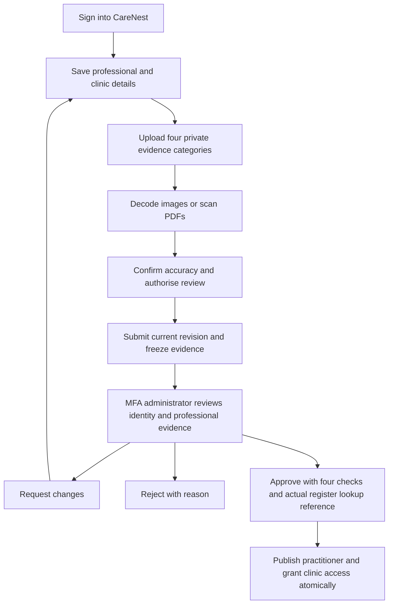

# CareNest MVP: doctor KYC, catalogue cleanup, LiveKit and QA

Updated 10 October 2026, Asia/Kolkata. This report describes the current local application and distinguishes implemented code from external setup and human validation.

## Verdict

**CareNest is a testable local prototype. It is not ready for a public healthcare launch.** The main blockers are real clinical supply, reviewed operating policies, messaging/settlement activation, the unfinished commercial fee model and testing with real people/devices. Another visual redesign will not resolve those blockers.

The local inventory contains **zero real provider profiles**, **no company settings**, and **no approved operating policies**. There are **15 active, explicitly labelled demo profiles**, one per supported specialty category. Six existing appointments remain linked to their original provider records, with zero orphaned bookings. Five surplus demonstration profiles were archived.

No AWS or Google Cloud hosting was deployed. Google OAuth, Gmail, Cashfree and Fast2SMS are external integrations, while the application/database/LiveKit server remain local.

## Changes implemented in this task

| Area | Previous gap | Result |
| --- | --- | --- |
| Doctor/veterinarian KYC | One clean attachment could satisfy submission; one checkbox could approve publication. | Four named evidence categories, applicant consent, current-case revision, frozen evidence snapshot and four explicit review checks. |
| Evidence integrity | Files could be uploaded to an already submitted application. | Uploads require an owned editable case. The exact submitted files are rechecked during approval. |
| Replacement documents | An older clean proof could hide a newly quarantined replacement. | Submission and the checklist use the newest document in each category. An unsafe replacement blocks that category. |
| Reviewer accountability | Free-text notes did not provide a complete structured decision record. | Reviewer, case revision, policy version, evidence IDs, decision, check results, register URL, lookup reference and reason are stored. |
| Duplicate professional identity | A new account could publish the same council/registration combination. | Normalised council/registration checks are serialized and block a second non-demo profile. Council aliases still require human review. |
| Publication | Approval needed stronger transactional guarantees. | Clinic, doctor profile, account role, membership, review record and audit commit together. Failure rolls back publication. |
| Directory location | Approved profiles omitted a known locality ID/name. | Approval connects the registered PIN to an existing locality, making supported areas discoverable in area searches. Unknown areas still need valid catalogue data. |
| PDF onboarding | With no scanner, PDF uploads stayed quarantined and could not complete KYC. | KYC offers JPEG/PNG while scanning is unavailable. PDF support is offered only when a scanner is configured. |
| Demo catalogue | Duplicate fixtures existed in several specialties. | One active demo per category; surplus profiles archived with financial/appointment history retained. Future seeding also limits new fixtures by category. |
| Sample credibility | Demo registration numbers could display a checkmark and medical structured data. | Demo profiles have no professional-verification checkmark, no medical JSON-LD and noindex/nofollow metadata. Sample labels remain visible. |
| Video offers | Unlinked demo providers could advertise video and fail after payment. | Unlinked fixtures no longer offer video. The backend rejects a video request without a current verified clinician account before creating its booking/payment hold. |
| Veterinary scope | The site advertised cattle/fish, but forms and the database rejected them. | Shared species definitions now support cattle/fish across pet profiles, provider applications, search, walk-ins and reviewed pharmacy inputs. |
| Email retry migration | Earlier ambiguous email records could be overlooked by a new delivery key. | Legacy unresolved email outcomes require review, and accepted legacy messages are not resent. |
| Product copy | Signup claimed payment went directly to clinics; privacy text said local messaging could not send real messages. | Copy now matches the implemented payment and explicitly enabled messaging flows. |

## Doctor and veterinarian KYC process

The workflow is available at `/join`; authenticated MFA administrators review it at `/admin/providers`.

### Required applicant evidence

1. **Government photo identity:** a suitable photo ID; unnecessary identifiers should be masked. Aadhaar is not required by this application.
2. **Professional registration:** registration with the appropriate medical, dental, veterinary or other professional council.
3. **Qualification/specialty evidence:** degrees supporting the specialty the applicant requests, including postgraduate evidence where applicable.
4. **Clinic affiliation/address:** evidence establishing where the applicant practises and their affiliation.

Documents are encrypted in private storage and are not public profile assets. Applicant ownership and authorised reviewer access are checked server-side. Images are decoded and re-encoded; PDFs without a successful configured scan remain quarantined. Previously quarantined PDFs must be reuploaded after a scanner is available; there is no background PDF-rescan service.

Submission records consent, policy version and the current case revision. Uploading a replacement while a case is submitted is blocked. Request-changes allows editing again; resubmission creates a new current revision and requires new consent.

### Required reviewer decision

Approval requires the reviewer to attest that:

- The photo identity matches the applicant.
- Registration is current and matches the appropriate professional register.
- Qualifications support the requested specialty.
- Clinic affiliation/address evidence matches the profile.

The actual register URL and lookup result/reference are also required. The record identifies the reviewer and the exact submitted evidence. Stale reviews, quarantined/missing evidence, duplicate registration and publication/audit failure do not publish a doctor.

**This is a manual professional verification workflow, not an automated government KYC or biometric-liveness service.** A qualified operator must perform the real checks. Four checked boxes without an actual review do not make a person a genuine practitioner.

Practo publicly describes collecting photo ID, council registration and degree evidence, checking council records and mapping degrees to appropriate specialties. CareNest now implements the underlying evidence/review controls, but it does not reproduce Practo's proprietary Bluebook or claim an automated government registry integration. [Practo verification description](https://help.practo.com/practo/practo-faq/)

Use the [NMC National Medical Register](https://nmr.nmc.org.in/search-doctor), the appropriate state/dental/other council, or the [Veterinary Council of India register](https://vci.dahd.gov.in/ivpr) for the actual profession. Missing or stale online information requires proper follow-up, not invented verification.

After approval, the practitioner can use the clinic workspace to publish schedules. Use the correct localities, actual fee and enabled visit modes. Ongoing licence monitoring, expiry/reverification and advanced anti-impersonation checks remain future work; the initial review must not be presented as permanent proof of validity.

## Retained demo categories

| Human care | Veterinary care |
| --- | --- |
| General Physician | Small Animal Practice |
| Cardiologist | Veterinary Surgeon |
| Dentist | Avian & Exotic Pets |
| Dermatologist | Veterinary Dermatology |
| ENT Specialist | Livestock & Cattle |
| Gynaecologist | |
| Ophthalmologist | |
| Orthopaedic | |
| Paediatrician | |
| Psychiatrist | |

These are fictional local workflow examples, not verified clinical supply. Archiving changes their listing status; old appointments, clinical references and financial history are retained. The main demonstration physician and veterinarian remain linked to their local test accounts. Other unlinked demo profiles do not advertise video hosting.

A stopped-app backup was taken before catalogue changes under `.data/backups`. Do not restore it casually: restoring also replaces newer local data. Seeding preserves existing suspensions and does not convert a real provider into a fixture.

## LiveKit verification

The managed local LiveKit container was running. Actual SDK checks against that server verified:

- Authenticated room creation.
- Two synthetic participants joining.
- **Audio and video received in both directions:** each participant received at least three audio and three video frames.
- Temporary test room deletion/cleanup.
- Recording was not enabled by these tests; no audio/video recordings were saved.

Evidence: [livekit-media-verification-2026-10-10.json](livekit-media-verification-2026-10-10.json). The reusable check is `node scripts/verify-livekit-media.mjs`.

Existing LiveKit unit/integration tests cover owner/clinician access, consent, join windows, short-lived grants, microphone/camera-only publication, revoked/foreign participants, cancellation, room cleanup and anonymous/cross-origin rejection.

**Not yet verified:** a consultation using physical cameras/microphones, two real devices/networks, poor connectivity, Bluetooth devices or mobile reconnection. Synthetic media proves transport, not human usability. Localhost/loopback links are not reachable from a separate phone. Remote-device testing needs an intentional secure network/domain setup; production needs the appropriate TLS/TURN/firewall configuration. [LiveKit deployment overview](https://docs.livekit.io/transport/self-hosting/)

## QA and refactoring evidence

- Full suite: **275 tests passed, zero failures**.
- After the final KYC/locality refinements, **18 focused checks passed, zero failures**.
- Production build and TypeScript validation passed.
- Production dependency audit: **zero known vulnerabilities** at the time of this check. This is not a penetration-test certification.
- Browser QA: **17 routes** rendered successfully at a 390px mobile viewport, with no JavaScript page errors or horizontal scrolling. Authentication gates for protected patient/provider routes worked. Cattle/fish filtering and demo noindex/label/checkmark behavior were checked.
- Backend tests cover KYC ownership, four-document requirement, encrypted files, PDF quarantine, consent, revisions, snapshot integrity, rollback, approval replay, duplicate registration, request-changes/rejection, catalogue idempotency, preserved history and veterinary species support.
- Provider validation, KYC metadata and species rules were extracted into shared modules. Application/review/upload forms were made readable. **346 unused lines** of static provider/veterinarian/patient-queue/medicine fixtures were removed from `lib/data.ts`.

The browser checks used an isolated unauthenticated browser. Signed-in KYC/payment/clinical flows were tested through the actual service/database test harness. No recruited patients/clinicians participated, and no actual professional documents were submitted. A human usability study and authenticated acceptance run are still needed.

Screenshots: [sample doctor](qa-mvp-demo-doctor.png), [cattle listing](qa-mvp-cattle-listing.png), [provider entry page](qa-mvp-provider-onboarding.png).

## What is left before the MVP can be called complete

### P0 — before a real paid pilot

| Required work | Owner | Completion evidence |
| --- | --- | --- |
| Onboard actual doctors/vets through the new KYC process | You + qualified verification reviewer | Real evidence checked, correct register lookup recorded, profile approved and clinician able to sign in. Current real-provider count is zero. |
| Establish company/operator details and reviewed policies | You + appropriate professional/legal reviewers | Real entity/grievance details and approved privacy, clinical/prescribing, consent and retention policies. Current company/policy records are absent. |
| Validate SMS signup/login on a real phone | You + Fast2SMS | OTP arrives, verifies once, expires, rate limits work, and the provider debit is checked. Quick SMS is capped for a demo; switch to an approved lower-cost OTP route for actual volume. |
| Activate WhatsApp confirmations and reminders | You + Fast2SMS/Meta | Business number ID and approved confirmation/reminder/transaction templates saved; opted-in real test phone receives the correct booking details and reminder. |
| Validate Google sign-in/linking and Gmail inbox delivery | You | Actual Google consent succeeds, the same account/history is used, and booking/test/reminder email arrives at its verified address. Gmail SMTP authentication was verified earlier; inbox delivery is still a separate test. |
| Finish doctor settlement setup | You + Cashfree | Correct sandbox authentication/whitelist or approved alternative, verified test beneficiary, completed test transfer and status reconciliation. Prior payout authentication was blocked; no successful doctor credit is claimed here. |
| Implement the agreed commercial invoice model | Development + you + accountant | Doctor fee, ₹50 CareNest service fee, applicable tax/processor treatment and doctor net amount are explicit. Clinic-owned booking waiver requires validated booking provenance and active subscription entitlement. Current invoices primarily use the doctor's fee; the promised margin model is not complete. |
| Validate payment failure, refund and dispute handling | You + development | Sandbox checkout/cancellation/failure/refund/retry evidence; cancellation rules, disputes and settlement-release policy reviewed for your operating model. |
| Run one real-device clinician/patient acceptance journey | You + test clinician/patient | Search → choose slot → sandbox pay → confirmed visit → reminders → two-device call → clinician completion → consultation history → reconciled test settlement. Use test care data. |
| Prepare access, backup and recovery operations | You + development | Individual MFA reviewers; backup/restore drill; protected local keys/files; error monitoring; verified ingress/proxy/IP limits before any public exposure. |

The ₹50 fee and clinic waiver need an actual server-side invoice/settlement implementation, not only pricing-page copy. Do not collect a clinician's full fee and treat it all as platform revenue. Do not guess tax treatment or advertise subscription entitlements that the checkout does not enforce.

### P1 — required for a reliable broader launch

- Publish on a secure accessible origin; configure hosted database/storage/backups and LiveKit TLS/TURN/egress/monitoring. Cloud migration remains a separate task.
- Use a production transactional email service and approved scalable SMS/WhatsApp routes with delivery/bounce/failure reconciliation.
- Configure a real PDF safety scanner if accepting PDF KYC/medical files; define operational handling for quarantined files.
- Test concurrent paid bookings, late payment/refund conflicts and outage recovery against the production PostgreSQL/storage stack.
- Build documented incident/support procedures, alerts and role/account recovery.
- Add periodic professional re-verification and credential/specialty-change review.
- Evaluate accessibility and usability with actual patients, clinicians and clinic staff; measure booking completion and missed appointments.
- Keep demonstration providers inaccessible in production and onboard legitimate provider supply for the service area.

### P2 — keep outside the first focused MVP

Clinic SaaS subscriptions/renewals/plan quotas, automated marketplace split settlement, virtual reception/call credits, pharmacy fulfilment, insurance/financing, ABDM/ABHA, large hardware bundles and extensive referral/marketing programs need real partner contracts and separate end-to-end delivery. Existing intake/screens are not proof those services are operational.

Practo breadth is not an MVP completion criterion. A dependable paid appointment with a genuinely verified clinician, working communication, clear pricing, safe records and a correct settlement is the first complete product to prove.

## Suggested acceptance checklist

1. A normal patient cannot read another patient's case, files, receipts or consultation.
2. A provider cannot publish before the four-evidence review, or change frozen evidence while awaiting review.
3. A rejected/unverified practitioner cannot enter the clinical workspace or accept clinical appointments.
4. Two simultaneous bookings cannot take the same slot; cancelled/failed payment cannot appear as a successful appointment.
5. The server's final invoice matches the approved pricing policy and expected clinician payout.
6. Confirmation/reminder messages contain the right current doctor, date, start/end time and safe account link, without clinical notes.
7. Cancellation, rescheduling, reminder opt-out and retries do not send obsolete/duplicate reminders.
8. Only patient and assigned clinician can join the active call; ending/revoking the consultation removes access.
9. Completing the visit records history without saving a call recording; no-show does not silently count as completed care.
10. A completed sandbox doctor transfer has authoritative provider evidence; unknown outcomes are reconciled without blindly paying twice.

The implementation tests cover many of these rules. Physical-device, provider-account, qualified-review and real-person acceptance evidence must still be supplied before treating the MVP as a public healthcare service.
