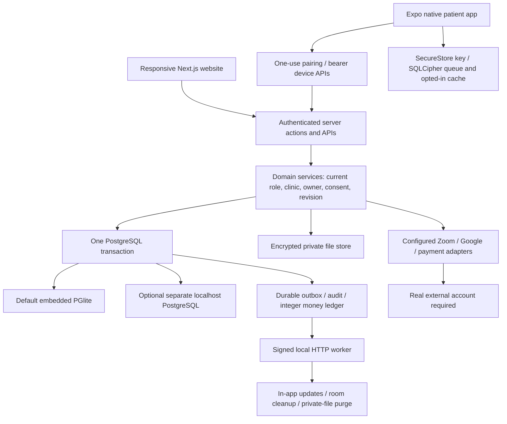

> 8 October 2026 update: LiveKit replaces Zoom API/Meeting SDK for local in-app calls. Google Meet remains optional. See [the LiveKit implementation and updated architecture](../implementation/LIVEKIT_LOCAL_VIDEO_IMPLEMENTATION.md). Earlier Zoom setup instructions below are historical and superseded.

# CareNest: remaining-work implementation and setup

Updated 8 October 2026. This document describes the actual local expansion, its evidence and its limits. The earlier audit, architecture blueprints and implementation ledger remain useful historical records; their old “remaining work” list is superseded by the status table here.

## Read this first

The website has a working local core and substantially more clinic, pharmacy, privacy and mobile functionality. It is **not ready to operate as a nationwide Practo competitor**. Software cannot supply real licensed practitioners, partner contracts, prescription review, government approvals, company identity or payment-provider KYC. No provider credentials or business details were supplied. The user subsequently identified an owner email; it is stored privately, without claiming verified possession or completed registration. No cloud infrastructure was provisioned, no real consultation was created, and no medical, insurance, financing or government approval was invented.

The correct competitive wedge remains a reliable local clinic and pet-care network: accurate availability, actual attendance, trustworthy providers, transparent receipts, controlled records and repeat visits. A larger feature list does not solve the absence of dependable supply and operations.

## What was implemented

| Workstream | Actual implementation | Limit / prerequisite |
|---|---|---|
| Reception and walk-ins | Encrypted clinic identity, actual arrival, assigned practitioner, encounter, invoice, queue states and private claim receipt | Active clinic membership; actual patient/guardian consent attestation |
| Claiming a clinic visit | One-use private receipt plus matching signed-in phone; no automatic linking by contact number | Local console OTP is development authentication, not live phone-verification evidence |
| Consultation concurrency | One practitioner cannot start another appointment or walk-in while an existing consultation remains in progress | Finish the actual current consultation; operational priority/ETA still needs calibration |
| Home visits | Owned encrypted addresses, immutable booking address snapshot, assignment, en-route/arrival/completion, revision checks | Practitioner must offer home visits and belong to an active clinic |
| Pharmacy | Licensed-partner review fields, reviewed catalogue, integer prices, inventory/reservations, owned prescription requests, professional safety review and fulfilment | No real pharmacy/pharmacist licences or partner authority supplied |
| Prescribing policy | Versioned professional review, explicit species and reviewer practice scope; restricted delivery requires explicit permission | Human qualification cannot approve a veterinary policy; real clinical approval remains required |
| Privacy | Owned consent withdrawal, privacy requests, operator review, restriction, contact erasure and policy-gated retained-content redaction | Actual legal policy, elapsed retention and resolved holds; these are operator attestations, not legal certification |
| Private-file erasure | Retention marks objects unavailable, durable worker deletes the checked encrypted object and audits completion | Metadata and backups have separate retention; deletion is not claimed until the worker succeeds |
| Public operator details | Company/grievance form and public policy display | Actual registered entity and contacts were not supplied; entered details are not marked independently verified |
| Notifications | Patient email/SMS opt-in and pet reminder preferences; external channels default off | Local mode sends no real email/SMS; live receipts and account reconciliation remain unvalidated |
| Native patient app | Expo source, blue/white cards and bottom navigation, pairing, appointments, discovery, pets, records and pending requests | Native device installation, real-device testing and release signing not completed |
| Offline mobile | SQLCipher intent queue and explicit opt-in encrypted 24-hour record snapshot; current server checks on sync | Encryption/runtime behavior has not been verified on physical devices; Expo Go is refused for the encrypted queue |
| Zoom SDK | Dedicated isolated web consultation view, on-click authorization, role-bound JWT, host-only ZAK, configured owner-account boundary | Actual SDK account and live call validation required; external-account OBF/review access is not implemented |
| Zoom webhooks | Raw-body HMAC, timestamp validation, host/room correlation and durable deduplication of meeting start/end events | A real provider webhook needs its required reachable HTTPS endpoint; none was exposed |
| Google Meet | Existing consented Calendar conferencing and authorized join links | Actual OAuth account/call validation missing; deleting Calendar events does not guarantee ending an active Meet conference |
| ABDM / coverage / financing | Owned encrypted intake, consent, operator review and generic human FHIR R4 source export | No live ABDM/ABHA, PM-JAY, insurer or lending adapter/certification; cases stay intake-only |
| Legacy records | Inventory/encryption and strict source-to-existing-encounter reconciliation | Ambiguous ownership remains quarantined; no encounter or patient relationship is guessed |
| Encryption rotation | Named v3 key envelopes, old-version reads, authenticated context, offline inventory and rotation command | Actual root data was inventoried, not rotated; backup and retained keys are essential |
| Clinical immutability | Normal edits remain forbidden; exact-body, one-use, audited maintenance permits support rotation/redaction | Embedded local DB owner is privileged; production must separate application and maintenance database roles |
| Windows private storage | DACL restriction to current account, SYSTEM and Administrators on `.data` and existing private subdirectories | This is local folder hardening, not an independent operating-system security audit |
| Local PostgreSQL testing | Real pooled connections, contended reservation, dump/restore and restart recovery in a separate synthetic container | No production capacity, HA failover or cloud recovery claim |

## Current local architecture

The default launcher binds to `127.0.0.1` and forces the embedded database even if a saved cloud `DATABASE_URL` exists. A separate local Docker test is an additional verification environment; it does not replace or migrate the patient database. The worker talks to the app through signed HTTP so it never opens a second embedded database process.

Keep the modular monolith. Splitting booking, invoices, ownership and consent into independent services now would make their transaction boundaries harder to maintain without improving your current business bottleneck. Introduce distributed infrastructure after measured demand justifies it, using the existing future AWS/GCP document.

## Data types and structures

New additive migrations are `0003-extended-local-workflows` and `0004-controlled-maintenance`. Earlier migration checksums remain unchanged. Both have been applied to the local database.

| Structure | Types / constraints | Why |
|---|---|---|
| `clinic.people` | Text ID and clinic/owner foreign keys; encrypted identity envelope; unique claim hash; expiry/consent timestamps | Represent genuine arrivals without silently creating or linking an application account |
| `clinic.walk_ins` | State whitelist; integer revision; unique `(clinic_id, request_key)`; request hash; `BIGINT` paise | Duplicate submission returns the original visit; changed content with the same intent is rejected |
| Encounter origin | Exactly one booking or walk-in; nullable patient account for unclaimed visits | Preserve clinical attribution while separating the care subject from its eventual account owner |
| Addresses | Structured validated fields inside an AES-GCM envelope; PIN format; owner FK | Limit access to the owner and authorized operational purpose; snapshots preserve the address agreed at booking |
| Home dispatch | Booking PK, clinic/staff FKs, explicit state and integer revision | Reject stale assignments or events; dispatch completion follows clinical attendance |
| Catalogue | Reviewed name/strength/form, `TEXT[]` species, policy FK and structured restrictions | Explicit subject support; no inferred human-to-pet drug compatibility |
| Inventory | Composite `(partner, medicine)` key; integer stock/reserved; `0 <= reserved <= stock`; paise price | Reserve all requested stock atomically and prevent negative balances |
| Pharmacy requests | Owner/Rx/partner/address references, encrypted address, request hash, revision and immutable line prices | Avoid trusting client totals or a foreign prescription; stop a changed intent from reusing an old order |
| Safety review | Exact signed record, current prescriber, explicit decision and encrypted findings | A different or amended prescription does not inherit an earlier clearance |
| Privacy request | Kind/state, encrypted details/decision, reviewer FK and target review date | Separate intake, human review and irreversible execution; the 30-day target is an internal workflow target, not a legal guarantee |
| Retention policy/holds | Versioned JSON periods, actual review reference, administrator/reviewer, user/resource holds | Never assume a universal Indian retention period; resolve obligations before redaction |
| Clinical maintenance permit | Exact old/new JSON bodies, operation, approver, policy/request references, 30-second expiry | Ordinary clinical edits still fail; a permitted envelope change cannot change ownership or other record metadata |
| Mobile pairing | Random 256-bit code, stored SHA-256 hash, five-minute expiry, one-use consume | Authorization comes from a signed-in account, without reusing a phone number as device identity |
| Device session | Random bearer token stored hashed; owner, expiry and revocation | Limit mobile APIs to the patient’s own data and allow immediate server-side revocation |
| Mobile intents | Unique `(user, intent_key)`, canonical payload hash, result JSON | Booking uses the same server reservation/idempotency rules; offline cancellation checks a current revision |
| Native storage | SecureStore session/key; SQLCipher queue/snapshot tables; timestamps and account ID | Refuse plaintext fallback, bind cached data to the paired account, and expire local copies |
| Partner intake | Whitelisted provider kind, encrypted payload, consent and expected revision | Recording an enquiry must not look like insurance eligibility, financing approval or government identity issuance |
| Webhook inbox | Provider/event composite uniqueness, validated host/room, minimal payload | Verify the signature on actual raw bytes and deduplicate effects without storing unnecessary participant information |

Use relational keys/checks for ownership, scheduling and money. Use JSON for reviewed policy content and typed clinical payloads, with validation and encryption before persistence. A JSON schema validator does not provide drug interaction or medical correctness validation.

## Important transitions

Walk-in: `WAITING → IN_PROGRESS → ATTENDED`, with `NO_SHOW`/`CANCELLED` available before start. Only the assigned current clinician can start/complete. Reception staff cannot sign clinical notes. The claim receipt is returned once; it is not stored in readable form.

Home dispatch: `UNASSIGNED → ASSIGNED → EN_ROUTE → ARRIVED → COMPLETED`. Cancellation belongs to the appointment workflow and updates dispatch too. A separate dispatch-only cancel cannot silently leave a payable active appointment. Completion requires the clinician to have recorded attendance.

Pharmacy: `REQUESTED → APPROVED → PACKED → DISPATCHED → DELIVERED`, with review rejection or eligible pre-dispatch cancellation. Approval checks current prescriber/safety review and rejects an amended source. Stock reservations use sorted medicine IDs. Collection requires professional pharmacy approval. Dispatch requires an actually settled or zero-fee invoice. The courier sees delivery information, not the prescription or medicine details. Sharing withdrawal removes operational access to patient details.

Privacy: request → operator review → approved operation. Restriction revokes sharing and mobile access. Account contact erasure requires reviewed policy, elapsed periods, no holds and resolved active care/professional assignments. Retained-content redaction is a separate irreversible step after the longer clinical/financial period, measured from the latest retained source or account erasure. Private objects are marked unavailable before worker deletion. Audit/financial metadata and backups are explicitly separate; this is **not** a claim that every copy in every system has been erased.

Legacy import: inventory/encrypt → pending source review → link only when original subject and clinician identifiers match an existing owned encounter. Imports are labelled as imports. An old unscoped document does not become a newly signed consultation just because it was linked.

## Rate limits, expiries and the reason for each

The original OTP/session/booking limits remain in `LOCAL_RUNBOOK.md` and the detailed architecture plan. Added limits are:

| Limit / duration | Value | Reason |
|---|---:|---|
| Clinic receipt claim | 7 days, one use | Give an actual visitor time to claim while limiting long-lived linking capability |
| Saved active addresses | 20 per account | Bound storage/listing and make accidental repeated submissions visible |
| Unclaimed clinic files | 1 GiB per clinic | Keep a bounded clinic allowance distinct from the existing 100 MiB per-account allowance |
| Pharmacy request lines | 1–20; 1–100 units each | Bound transaction size; quantities still need professional dispensing review |
| Inventory stock input | Integer 0–1,000,000 | Prevent invalid counts; reserved stock cannot be removed underneath existing orders |
| Mobile pairing creation | 5/account/hour | Limit repeated session creation without obstructing ordinary device setup |
| Pairing exchange | 60 total/hour, 256-bit code | Bound anonymous endpoint load; the code is not a guessable numeric OTP |
| Pairing validity | 5 minutes, one use | Reduce exposure of a copied setup code |
| Active mobile devices | 5/account | Keep revocation and account/device control manageable |
| Mobile session | 7 days; revocable | Limited patient-only scope; no clinician/staff capabilities are exposed by this token |
| Mobile reads | 120/account/minute | Permit refresh/navigation while bounding repeated record/list access |
| Mobile mutations | 20/account/minute | Allow retries and normal booking while bounding repeated reservation attempts |
| Offline pending requests | 20; expire after 24 hours | Avoid a large backlog of stale requests; availability is always checked again on sync |
| Offline record snapshot | Explicit opt-in; max 24 hours and never beyond device expiry | Useful during connectivity loss; cached status and prescriptions are visibly treated as potentially stale |
| SDK authorizations | 5/account/minute | Authorization involves provider network calls and should not be an unbounded signing endpoint |
| Zoom SDK JWT | 30 minutes | Zoom’s documented minimum; bound meeting number and participant/host role rather than issuing broad credentials |
| Webhook request timestamp | Within 5 minutes | Reject old/replayed signed requests; the durable inbox separately prevents repeated effects |
| Maintenance permit | 30 seconds, exact body, one use | Narrowly authorize a reviewed envelope rewrite/redaction rather than unlock arbitrary record updates |

The rate limiter uses PostgreSQL time and locks every affected budget row in deterministic order before charging any budget. A rejected combined policy does not consume an unrelated budget. This can coordinate processes sharing real PostgreSQL; the default embedded app still has one process owner. These values are initial operating limits, not measured production capacity promises.

## Provider accounts: prepared, not registered

Open `/admin/setup` after signing in as an MFA administrator. It shows configuration presence and exact next steps, without revealing secrets. Existing credentials, if present, are not labelled as successful live integration tests.

1. The owner email has now been provided and saved in private local setup storage. The real legal organization and account verification are still missing. Do not use an invented entity, borrowed doctor registration or someone else’s personal account.
2. Zoom: create the actual developer OAuth application, register `/api/integrations/zoom/callback`, request only needed user/meeting scopes and connect the practitioner from Practice → Integrations. SDK configuration is separate: enable only after recording the SDK owner account and validating real calls. Configure the signed webhook only on an appropriately reachable HTTPS endpoint.
3. Google: an actual developer project/OAuth web client and enabled Calendar API are necessary. Register `/api/auth/google/callback` and `/api/integrations/google/callback` against the chosen application origin. Complete the provider’s consent/verification process and connect the practitioner. This work has not provisioned Google Cloud hosting.
4. Razorpay: business registration/KYC, test keys, signed webhook, real test capture/refund and unknown-outcome reconciliation. Local mode rejects live collection keys. Offline receipts record money already received; they never transfer money.
5. Email/SMS: actual sender/domain, provider account and applicable sender/template approval. User preferences default off. OTP delivery remains a separate purpose. Real delivery receipts and approved retry/reconciliation procedures must be tested with the actual accounts.
6. ABDM/ABHA: organization sandbox registration and the current issued API contracts/profiles/consent requirements. The source export here is a generic FHIR R4 collection of human records; it is not a validated ABDM document profile, ABHA generation or production certification. Veterinary records are excluded.
7. Insurer/PM-JAY/financing: actual authorized partners, contracts, eligibility/claim or credit workflows and dispute/settlement operations. The current case workflow is intake only; it cannot approve coverage or a loan.

Real account creation can involve credential entry, identity checks, provider terms, KYC and financial commitments. Those owner-controlled steps were not completed. Preparing code is not equivalent to registering or approving a service.

## Running and maintaining it

Website: `npm run start:local` after `npm run build`, or `npm run dev` for development. Both keep the default app local. The runtime is currently available at `http://127.0.0.1:3000`.

Useful pages: `/staff/clinic`, `/staff/dispatch`, `/staff/pharmacy`, `/account/addresses`, `/account/claim`, `/account/privacy`, `/account/mobile`, `/account/pharmacy`, `/account/integrations`, `/admin/governance`, `/admin/clinical`, `/admin/setup`, `/admin/reconciliation`. Every private workflow checks current server-side identity/assignment, not a client-supplied role.

Stop the local app before maintenance. `npm run backup:local` creates a private database/files/secrets snapshot. Keep any externally configured authentication/encryption keys and named keyring with the backup; the `.data/secrets` copy cannot magically capture keys stored only in another system. `npm run encryption:inventory` validates readable envelopes without rotating them. Rotation needs configured named keys and an explicit `--execute`, after backup/review. Keep old keys until all backups requiring them are retired under approved retention. Migrations, backups and rotation use the local process marker to prevent conflicting ownership during maintenance.

`scripts/private-acl.ps1` audits the private directory DACLs; `-Apply` restricts them to the current Windows account, SYSTEM and Administrators. It writes the DACL only and does not require changing system-wide security policy.

`infra/local/compose.yaml` is an optional local PostgreSQL environment. `npm run verify:postgres` uses a different synthetic test container, not patient data. It verifies multiple connections, twenty contending requests, dump/restore and restart persistence, then removes the test container. A restart test is not multi-zone failover.

Native source is under `apps/mobile`. Use its README and `npm ci`, then type-check and a local native development build. Android requires the SDK/JDK/toolchain and actual emulator/device tests. iOS requires a Mac/Xcode/signing. No EAS/cloud build or app-store release was performed. The compiled Android JavaScript/Hermes export is not an APK or an installed-device test.

The native app refuses an unencrypted SQLite fallback. Offline record caching is off by default, requires an explicit device opt-in and uses the same SQLCipher store as pending intents. It checks account/expiry and detects substantial clock rollback, but it is not a claim of protection on a rooted or compromised device. Revocation cannot erase an offline device immediately; it clears local access/data when the client next connects or expires. Full native clinic/partner feature parity, hardware security/biometrics, push notifications and physical-device accessibility validation remain unfinished.

## Validation evidence

| Evidence | Result / meaning |
|---|---|
| `expanded-full-tests.txt` | 196 passed, zero failed |
| `expanded-targeted-tests.txt` | 49 focused service/security tests passed, including maintenance permits and SDK/webhook behavior |
| `expanded-file-workflow-tests.txt` | 13 file/workflow checks passed, including hold-aware, idempotent physical-object deletion |
| `expanded-final-workflow-tests.txt` | 22 current workflow checks passed, including blocking collection before pharmacy approval |
| `extended-final-tests.txt` | 9 workflow checks passed after explicit prescribing-species review was added |
| `expanded-build.txt`, `expanded-typecheck.txt` | Website production build and type checks pass |
| `mobile-typecheck.txt`, `mobile-export.txt` | Native source type-checks and Android Hermes bundle exports successfully; not an installed native binary |
| `expanded-root-audit.json` | Zero known advisories in the website dependency audit |
| `mobile-audit.json` | 15 high-severity dependency entries remain; details below |
| `postgres-verification.txt` | Four real connections; twenty contenders; one reservation; dump/restore and restart recovery verified |
| `expanded-local-migration.txt` | All four ordered local migrations applied |
| `encryption-inventory.txt` | Two current local envelopes readable; dry-run only, no root key rotation |
| `private-acl.txt` | Applied private directory DACL restrictions |
| `expanded-http-validation.json` | Public pages respond; private patient/staff pages redirect to sign-in; unauthenticated mobile state returns 401 |

Visual browser verification of this expansion was blocked by automatic browser review: selecting the previous tab encountered an unsupported browser-error protocol. No alternate browser surface was used to bypass that block. Earlier screenshots/`BROWSER_VALIDATION.md` describe the previous core, not new visual proof of this expansion.

## Native dependency issues that must not be hidden

The initial native audit reported 22 entries. Updating the UUID dependency through a pinned CommonJS-compatible override removed the seven moderate entries, and the bundle still exports. Fifteen high entries remain in dependency chains rooted in currently unpatched `braces` recursive-pattern handling and `node-forge` RSA signature verification. These are fifteen dependency entries, not fifteen independent new CareNest vulnerabilities.

The development server is localhost-only and OTA updates/signing are disabled in this prototype. These reduce exposed usage; they do not constitute an upstream fix. Do not run a blind forced downgrade to obsolete Expo/React Native releases merely because the audit proposes it. Treat native production release as blocked until a reviewed patched dependency set or separately tested mitigation is available.

Primary references: [braces advisory](https://github.com/advisories/GHSA-vfj7-8cjw-p6xm), [node-forge advisory](https://github.com/advisories/GHSA-86w9-cpqp-85rv), [UUID advisory](https://github.com/advisories/GHSA-w5hq-g745-h8pq), [Expo SQLCipher](https://docs.expo.dev/versions/v57.0.0/sdk/sqlite/), [Zoom SDK authorization](https://developers.zoom.us/docs/meeting-sdk/auth/), [Zoom SDK isolation](https://developers.zoom.us/docs/meeting-sdk/web/component-view/import-sdk/), [Zoom webhooks](https://developers.zoom.us/docs/api/webhooks/), [FHIR R4 Bundle](https://hl7.org/fhir/R4/bundle.html).

## What is genuinely still unfinished

- Actual provider account registration, verified ownership, credentials, terms/KYC, production approvals and real end-to-end calls/delivery/payment/refund tests.
- Zoom external-account SDK review/OBF access, active Meet conference termination, and complete provider delivery/financial reconciliation operations.
- Licensed real pharmacy/hospital/lab/insurer/financing partners; live ABDM/ABHA/PM-JAY adapters and certified profile/consent exchange.
- Professionally reviewed medicine catalogue/interactions/contraindications, species-specific clinical content and multilingual symptom navigation. Automatic symptom routing stays disabled; structural checks and recorded review are not clinical decision support.
- Legally approved company/privacy/retention rules, actual grievance contacts and a reviewed backup/third-party deletion process.
- Installed Android/iOS builds, full native feature parity, hardware/offline security and independent accessibility/device tests; the remaining native dependency advisories.
- Independent security review, realistic traffic/capacity and failure exercises, calibrated clinic queue operations and production maintenance/database-role separation.
- AWS/GCP hosting and managed/distributed services, deliberately excluded by your no-cloud instruction. Use the existing detailed migration/cost plan when that instruction changes.

These are explicit remaining requirements. A setup page, mock API response, successful build or manual checkbox is not evidence that the real-world requirement has been completed.

Account setup update: the authenticated Zoom profile matched the supplied owner email. Its Marketplace agreement was accepted with explicit owner authorization; the separate API license was not accepted. No Zoom developer credentials or CareNest Zoom call were configured. The user then chose LiveKit, so Zoom API setup was retired. Local LiveKit is running and two synthetic participants connected successfully; see the superseding LiveKit document above. Google account credentials and other partner registrations remain outstanding. The owner email remains in private local storage and the MFA administrator setup interface; the supplied full birth date has not been persisted or published.
